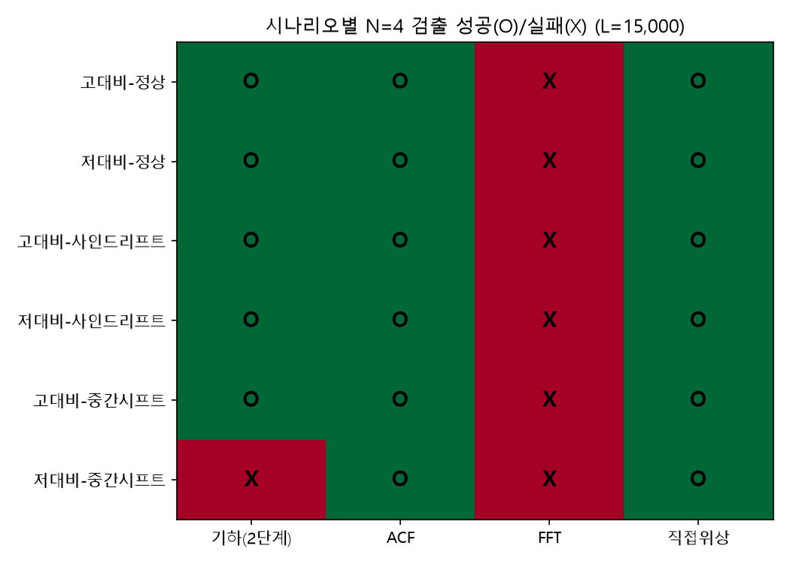

# 삼각형 기하학적 유사성 기반 시계열 반복주기(N) 검출 기법
### — 이동평균 윈도우 선정을 위한 탐구, 그리고 표준 기법과의 비교

---

## 초록 (Abstract)

제품 생산 간격(tact)은 여러 종류의 제품을 순환 생산하는 등의 이유로 큰 산포를 보이며, 그 자체로는 "대표적인 생산 간격이 얼마인가"를 말하기 어렵다. 이를 해결하기 위해 반복 주기 N을 찾아 그 윈도우로 이동평균을 취해 평탄화된 대표값을 산출하는 접근을 제안하며, 본 논문은 그 전제가 되는 **반복 주기 N을 데이터로부터 검출하는 방법**을 탐구한다.

초기 아이디어는 인덱스 n을 중심으로 N만큼 떨어진 세 점 A(n), B(n-N), C(n+N)이 이루는 삼각형의 **대칭 차이(R = |AB-AC|/(AB+AC))**와 **넓이(S)**가 N이 실제 주기와 일치할 때 모두 0에 가까워진다는 관찰에서 출발했다. R은 dx, dy가 섞여 "납작함"을 직접 반영하지 못하는 문제가 있어 내각 θ로 재정의하였고, S는 N에 대한 스케일 종속성이 확인되어 밑변(BC)으로 정규화한 **높이(H = 2S/|BC|)**로 전환하였다. R과 H를 하나의 스칼라로 통합하려는 시도에서 **κ = 1 + cosθ**를 검토하였으나 1/N²의 새로운 스케일 종속성이 확인되어 기각하고, 최종적으로 **R과 H를 결합한 2단계 판별 기준**(median 기반 1차 스캔 + mean·부트스트랩 신뢰구간 기반 2차 확인)을 채택하였다.

이 최종 방법을 실무 배치 규모(1만~1만5천)와 두 가지 비정상성(사인파 드리프트, 중간 레벨 시프트) 조건에서 검증한 뒤, **표준 시계열 기법인 자기상관함수(ACF)와, 기하학을 전혀 쓰지 않는 직접 위상비교**와 정면으로 성능을 비교하였다. 그 결과 ACF와 직접 위상비교가 구현 복잡도는 훨씬 낮으면서도 검출 견고성은 동등하거나 더 우수함을 확인하였다. 즉 기하학적 접근은 문제를 탐구하고 여러 함정(스케일 종속성, 과잉 정규화, 강건성-검출력 트레이드오프)을 발견·해결하는 **사고 과정으로서는 가치가 있었으나, 실전 배포용 알고리즘으로는 표준 기법에 밀린다**는 것이 본 논문의 최종 결론이다.

---

## 1. 서론

제품 생산 실적 로그는 다음과 같은 구조를 가진다.

| no | time | tact |
|---|---|---|
| 1 | time₁ | Null |
| 2 | time₂ | time₂ − time₁ |
| ... | ... | ... |
| n | timeₙ | timeₙ − timeₙ₋₁ |

여기서 time은 개별 제품의 생산 완료 시각, tact는 연속된 두 제품 간 생산 간격이다. 한 설비에서 여러 종류의 제품을 순환 생산하는 경우 등, tact가 큰 산포를 보이는 경우가 실무에서 흔하다. 예를 들어 `10, 0.1, 5, 0.1, 10, 0.1, 5, 0.1 ...` 처럼 제품별 생산 소요시간이 반복되는 패턴이라면, 이 값을 그대로 "생산 간격"이라 보고하기는 곤란하다 — 매 순간 값이 10이었다가 0.1이었다가 하므로, **하나의 안정적인 대표값**을 어떻게 산출할지가 실무적인 고민이다.

이 문제에 대한 해법으로, tact가 주기 N을 두고 반복된다면 **그 주기 N을 윈도우로 하는 이동평균**을 적용해 값을 평탄화하고, 그 평탄화된 값을 대표 지표(평탄화 지수)로 쓸 수 있다는 아이디어에서 출발한다. 이동평균의 윈도우 크기를 주기 N과 맞추면, 위상에 따라 들쭉날쭉하던 값이 매끄러운 대표값으로 수렴한다.

따라서 **본 논문의 목표는 이동평균에 사용할 반복 주기 N을 데이터로부터 자동으로 검출하는 방법을 찾는 것**이다. 실제 생산 데이터는 이보다 훨씬 큰 산포를 가지는 경우가 많아, 반복 주기가 존재하더라도 육안으로는 식별하기 어려운 경우가 대부분이다. 설령 육안으로 어느 정도 주기성이 감지되더라도, 이를 주관적 판단이 아닌 **정량적 수치로 객관화하여 제시**할 수 있다는 데 이 탐구의 실질적 의의가 있다.

---

## 2. 문제 정의

- 입력: 시계열 (xₙ, yₙ), 단 xₙ = timeₙ (누적 시각), yₙ = tactₙ = xₙ − xₙ₋₁
- 목표: yₙ이 주기 N으로 반복되는 패턴을 가질 때, 그 N을 탐지 (이동평균 윈도우로 사용하기 위함)
- 제약: N을 사전에 알 수 없으므로 N = 1, 2, 3, ... 후보를 순차 탐색해야 함
- 판별 기준 후보: N이 실제 주기(혹은 그 배수)와 일치할수록 "패턴이 반복된다"는 증거가 강해야 함

---

## 3. 초기 아이디어: 변 길이 대칭 차이(R)와 넓이(S)

### 3.1 아이디어

시계열 산포도 위에서, 인덱스 n을 기준으로 다음 세 점을 정의한다.

- A = (xₙ, yₙ)
- B = (xₙ₋ₙ, yₙ₋ₙ) — n보다 N만큼 이전 점
- C = (xₙ₊ₙ, yₙ₊ₙ) — n보다 N만큼 이후 점

만약 N이 실제 반복 주기와 일치하면, yₙ₋ₙ ≈ yₙ ≈ yₙ₊ₙ (같은 위상에서 값이 반복)이므로 세 점 A, B, C는 **거의 일직선 상에 놓인, 매우 납작한 이등변 삼각형**을 이룬다. 이때:

- **R = |AB−AC| / (AB+AC)** → 0에 수렴 (A가 B, C로부터 대칭적 위치, 즉 이등변)
- **S (삼각형 ABC의 면적)** → 0에 수렴 (세 점이 일직선에 가까움)

반대로 N이 주기와 무관하면 세 점은 뾰족한 삼각형을 이루어 R은 0에서 벗어나고 S는 커진다. **R과 S가 둘 다 작을수록 N이 같은 위상을 가리키는 진짜 주기(혹은 그 배수)일 가능성이 높다**는 것이 출발점이다.

### 3.2 수식

§2의 yₙ = xₙ − xₙ₋₁ 정의를 N번 telescoping하면, x의 차분은 y의 구간합으로 그대로 치환된다.

$$\Sigma^-_N(n) = \sum_{i=n-N+1}^{n} y_i = x_n - x_{n-N}, \qquad \Sigma^+_N(n) = \sum_{i=n+1}^{n+N} y_i = x_{n+N} - x_n$$

이를 대입하면 |AB|, |AC|, R, S를 x 없이 y만으로 표현할 수 있다.

$$|AB| = \sqrt{\left(\Sigma^-_N(n)\right)^2+(y_{n-N}-y_n)^2}, \quad |AC| = \sqrt{\left(\Sigma^+_N(n)\right)^2+(y_{n+N}-y_n)^2}$$

$$R = \frac{|AB-AC|}{AB+AC}$$

$$S = \frac{1}{2}\left|\Sigma^-_N(n)\,(y_{n+N}-y_n) + \Sigma^+_N(n)\,(y_{n-N}-y_n)\right|$$

---

## 4. 문제점과 해결: R의 재정의, S의 스케일 종속성 → H

### 4.1 R의 각도(θ) 재정의

R(대칭 차이)은 dx, dy가 섞여 들어가 "납작함"을 직접적으로 반영하지 못하는 문제가 있다. 예컨대 A가 B, C로부터 거리상 대칭이어도(R≈0) 세 점이 뾰족한 이등변삼각형을 이룰 수 있어, R만으로는 "일직선에 가까운가"를 보장하지 못한다. 이를 보완하기 위해 A에서의 내각 θ를 도입한다.

$$\cos\theta = \frac{\vec{AB}\cdot\vec{AC}}{|AB||AC|} = \frac{-\Sigma^-_N(n)\,\Sigma^+_N(n) + (y_{n-N}-y_n)(y_{n+N}-y_n)}{|AB||AC|}$$

N이 주기와 일치할수록 θ → π(180°)에 수렴한다 (A, B, C가 일직선). θ는 5절에서 결합지수 κ를 구성하는 재료로 다시 쓰인다.

### 4.2 S의 스케일 종속성 (이론적 분석)

N이 커지면 |AB|, |AC|(변의 길이)가 함께 커지므로, 삼각형이 "납작"하더라도 S의 절대 크기 자체가 N에 종속적으로 증가할 수 있다. N이 실제 주기의 정배수(N, 2N, 3N, ...)일 때, y값 차이(dy)는 주기 성분이 상쇄되고 노이즈 성분만 남아 N과 무관한 크기(O(1))를 유지하는 반면, Σ⁻ₙ(n), Σ⁺ₙ(n)(각각 N개의 tact 합)은 대수의 법칙에 의해 N에 비례해 커진다(Σ⁻ₙ(n) ≈ Σ⁺ₙ(n) ≈ N·d, d는 tact의 평균값). 이를 넓이 식에 대입하면:

$$S \approx \frac{1}{2}Nd\,|{\Delta y_B + \Delta y_C}|$$

즉 **S는 N에 대해 선형으로 증가**한다. 서로 다른 N 후보의 S를 그대로 비교하면, "주기와 무관하게 N이 작을수록 S가 작아 보이는" 왜곡이 발생하여 올바른 비교가 불가능하다.

### 4.3 실증

동일한 합성 데이터(N=4 반복 패턴 `(10.0,1.3333),(0.1,0.0133),(5.0,0.6667),(0.1,0.0133)`, 10만 샘플, 노이즈 포함)에 대해 10회 독립 시행(시드 고정 없음) 후 N=4, 8, 12, 16에서의 대표값(median) S, 밑변 |BC|, 높이 H를 측정하였다. 대표값은 이상치에 강건하도록 평균(mean) 대신 median으로 통일한다(6.2절에서 이 선택의 트레이드오프를 다룬다).

| N | median S | S/N | median \|BC\| | \|BC\|/N | median H |
|---|---|---|---|---|---|
| 4 | 0.5508 | 0.1377 | 30.3986 | 7.5997 | 0.03605 |
| 8 | 1.1055 | 0.1382 | 60.7817 | 7.5977 | 0.03632 |
| 12 | 1.6495 | 0.1375 | 91.1684 | 7.5974 | 0.03607 |
| 16 | 2.1999 | 0.1375 | 121.5620 | 7.5976 | 0.03612 |

S/N, |BC|/N이 N에 관계없이 상수로 유지되는 것이 확인되어, 앞선 이론적 분석(S, |BC| 모두 N에 선형 비례)이 실증적으로 뒷받침되었다. **S를 원시(raw) 값 그대로 N 후보 간 비교 지표로 사용할 수 없으며, 정규화가 필요하다.**

### 4.4 H로의 전환: 정의와 N-불변성

넓이 S를 밑변 |BC|로 정규화한 **삼각형의 높이(H)**를 지표로 채택한다. |BC| 역시 BCx = x_{n+N}-x_{n-N} = Σ⁺ₙ(n)+Σ⁻ₙ(n)이므로 y만으로 표현된다.

$$H = \frac{2S}{|BC|} = \frac{\left|\Sigma^-_N(n)\,(y_{n+N}-y_n) + \Sigma^+_N(n)\,(y_{n-N}-y_n)\right|}{\sqrt{\left(\Sigma^-_N(n)+\Sigma^+_N(n)\right)^2+(y_{n+N}-y_{n-N})^2}}$$

N이 실제 주기의 정배수일 때, Σ⁻ₙ(n) ≈ Σ⁺ₙ(n) ≈ Nd이므로 S ~ Nd·|Δy|, |BC| = Σ⁻ₙ(n)+Σ⁺ₙ(n) ~ 2Nd이며, 따라서:

$$H = \frac{2S}{|BC|} \approx \frac{2\cdot Nd\,|\Delta y_B+\Delta y_C|/2}{2Nd} = \frac{|\Delta y_B+\Delta y_C|}{2}$$

**N이 완전히 약분되어 사라진다.** 즉 H는 정배수 조건 하에서 N에 무관하게 노이즈 크기 수준으로 수렴하는 반면, N이 주기와 무관한 경우에는 dy에 주기 성분이 그대로 남아 H가 유의미하게 커진다. 이 성질 덕분에 서로 다른 N 후보 간 H 값을 직접 비교하는 것이 타당해지며, 4.3절 표에서 실증적으로도 확인되었다(median H가 N=4~16에서 0.036 부근으로 일정).

---

## 5. 결합 판별 기준과 결합지수 κ

### 5.1 R+H 결합 판별 기준

단일 지표만으로는 우연에 의한 오탐 가능성이 있으므로, 다음 두 조건을 함께 사용한다.

1. **형태 조건 (Shape condition)**: R = |AB-AC|/(AB+AC) ≈ 0 (또는 θ ≈ π) → 삼각형이 이등변에 가까움 (A가 B, C로부터 대칭적 위치에 있음을 보장 → 위상 정렬 확인)
2. **평탄도 조건 (Flatness condition)**: H ≈ 0 (임계값 이하) → 세 점이 실질적으로 일직선

두 조건을 모두 만족하는 N 후보를 "주기 정합(candidate period)"으로 판정한다.

### 5.2 알고리즘

```
입력: tact 배열 y[0..L-1], time 배열 x[0..L-1], 최대 탐색 주기 N_max
출력: 추정 주기 N*

1. for N in 1..N_max:
     H(N) = median(H_n for n in [N, L-N))   # H_n: 인덱스 n에서의 높이. median은 이상치에 강건(6.2절)
     R(N) = median(R_n for n in [N, L-N))   # R_n: 인덱스 n에서의 대칭 차이 (|AB-AC|/(AB+AC))
2. 비주기 구간 대비 H(N)이 임계값 이하로 유의미하게 낮아지고, R(N)이 0에 근접하는
   가장 작은 N을 N*로 선택 (전역 최솟값이 아닌, 오름차순 스캔 중 첫 정합점을 채택)
3. N*를 반환
```

**주의**: 전역 최솟값(global argmin)으로 탐색할 경우, N*의 정배수(2N*, 3N*, ...)도 통계적으로 유사한 H값을 보이므로 노이즈에 의해 배수가 최솟값으로 오탐될 수 있다. 따라서 반드시 **작은 N부터 순차 탐색하여 첫 정합점에서 종료**하는 전략을 사용한다.

**참고**: 위 알고리즘은 median 기반이라 이상치에는 강건하지만, 주기 내 위상 값들이 서로 가까운(저대비) 데이터에서는 검출력이 부족할 수 있다(6.2절). 6.2절에서는 이 알고리즘이 반환한 N* 하나만 mean+부트스트랩 신뢰구간으로 재확인하는 2단계 확장을 제안한다.

### 5.3 결합지수의 모색: κ = 1 + cosθ

5.1절의 판별 기준은 R(또는 θ)과 H라는 **두 개의 별도 조건**을 동시에 검사해야 한다. 하나의 스칼라 지표로 두 조건(이등변 형태 + 평탄도)을 동시에 포착할 수 있다면 탐색 로직이 단순해진다는 동기에서, θ 하나로부터 두 조건을 모두 반영하는 지표를 모색하였다.

N이 실제 주기와 일치하면 θ → π이므로 cosθ → −1이다. 이때 자연스러운 후보는 다음과 같이 정의된다.

$$\kappa = 1 + \cos\theta$$

κ는 θ = π(원하는 완전 정합 케이스)일 때 0, θ = 0(퇴화된 반대 방향 케이스)일 때 2로 수렴한다. sinθ = 2S/(|AB||AC|)와 비교하면, sin(π−x) = sin(x)이므로 sinθ는 θ ≈ 0과 θ ≈ π를 구분하지 못하는 반면, **κ(즉 cosθ)는 두 경우를 부호로 구분**한다는 이론적 장점이 있어 R과 H를 대체할 유력한 단일 지표 후보로 검토되었다. (검증 결과는 7.2절 참고 — 결론부터 말하면 기각되었다.)

---

## 6. 성능 검증 방법: median이냐 mean이냐

### 6.1 검증 전략: 정배수 vs 비배수 비교

지표(H, κ 등)의 성능을 검증하는 기본 전략은, 참 주기의 **정배수(4, 8, 12, ...)**에서 지표 값이 낮고, **정배수가 아닌 N(2, 6, 10, ...)**에서는 값이 유의미하게 높은지를 비교하는 것이다. 두 그룹의 대표값 비율(판별비 = 비배수 대표값 / 정배수 대표값)이 클수록 판별력이 좋은 지표로 본다. 이때 "대표값"으로 median을 쓸지 mean을 쓸지는 결과에 큰 영향을 준다 — 이 절에서 그 트레이드오프를 먼저 규명한다.

### 6.2 대표값 선택: median이냐 mean이냐

**이상치 강건성 관점**: 실측 생산 데이터에는 설비 정지, 자재 대기 등으로 인한 비정상적 생산 지연(스파이크)이 섞일 수 있다. 동일 패턴·동일 기본 노이즈에 이상치 유무만 다르게 주입해 페어 비교한 결과, **median 기반 집계는 최대 10% 수준의 이상치 오염에도 N 판정이 전혀 흔들리지 않아(H, κ 모두 0건의 판정 변화) 강건함이 확인**되었다. 반면 mean 기반 집계는 5~10% 오염에서 판정 정확도가 크게 저하되었다(H 기준 최대 120/120 → 20/120). 이 결과만 보면 median이 명백히 우세하다.

**그러나 검출력 관점에서는 반대다.** 6.1절에서 정의한 판별비를 median 기준으로 실제 계산해보면(패턴 (10, 0.1, 5, 0.1)), H의 판별비는 2.06배에 그친다(7.2절 표 참고) — 동일 데이터를 mean 기준으로 계산하면 5.07배로, median보다 뚜렷하게 크다. 이는 H의 분포가 심하게 오른쪽으로 치우쳐 있어, median이 "전형적인" 값만 보고 mean이 잡아내던 꼬리 쪽 대비를 놓치기 때문이다.

이 트레이드오프가 실전에서 얼마나 치명적인지 확인하기 위해, 주기 내 교대되는 두 "큰" 위상 값이 서로 가까운(저대비) 패턴 (10, 0.1, **9**, 0.1)에서 median과 mean의 판별력을 비교하였다.

**[이미지 01]** 위상 대비에 따른 median 판별비 비교


| 패턴 | median H 판별비 | median R 판별비 |
|---|---|---|
| 고대비 (10, 0.1, 5, 0.1) | 2.06배 | 3.21배 |
| 저대비 (10, 0.1, 9, 0.1) | 1.03배 | 1.20배 |

저대비 패턴에서는 median 기준 판별력이 사실상 사라진다. 원인은 이 합성 패턴이 "큰 값, 작은 값"이 교대되는 구조라서, 어떤 짝수 후보 N을 쓰든 같은 홀짝(위상) 구조를 공유하기 때문이다 — 진짜 주기가 4일 때 N=2 후보는 A(phase0)를 B, C(둘 다 phase2)와 비교하게 되는데, phase0과 phase2 값이 가까우면(10 vs 9) 이 "틀린" N=2도 우연히 평탄해 보인다. **R과 H가 서로 다른 종류의 오차를 잡아내는 게 아니라, 둘 다 같은 신호(phase0과 phase2 값의 차이)에 의존하기 때문에 결합해도 서로를 보완하지 못한다.**

이 신호가 데이터 부족 때문에 안 잡히는 것인지 확인하기 위해, 샘플 수(L)를 늘려가며 median H(N=2)−median H(N=4) 차이의 부트스트랩 95% 신뢰구간(두 그룹 각각 복원추출로 재표본해 통계량 차이를 n_boot회 반복 계산하고, 그 분포의 하위/상위 2.5% 지점을 구간으로 삼는 방법 — 구간이 0을 포함하지 않으면 유의미)이 0을 포함하지 않는지 확인하였다.

**[이미지 02]** 샘플 수(L)에 따른 신뢰구간 수렴


| L | 차이(N2−N4) | 95% 신뢰구간 | 유의미 |
|---|---|---|---|
| 10,000 | +0.0019 | [−0.0072, +0.0132] | 아니오 |
| 15,000 | +0.0026 | [−0.0048, +0.0117] | 아니오 |
| 50,000 | +0.0024 | [−0.0015, +0.0064] | 아니오 |
| 100,000 | +0.0016 | [−0.0011, +0.0042] | 아니오 |
| 1,000,000 | +0.0012 | [+0.0003, +0.0020] | **예** |

신호는 실재하지만(L=1,000,000에서 확인됨), **median 기반으로는 실무 배치 규모(1만~1만5천)는 물론 10만 개로도 통계적으로 확신할 수 없다.**

**해결책은 mean으로 돌아가는 것이다.** H 분포가 오른쪽으로 치우쳐 있다는 것은, 대부분의 개별 삼각형에서는 노이즈가 phase0-phase2 차이를 가려버리지만 **일부** 삼각형에서는 노이즈가 우호적으로 작용해 진짜 차이를 뚜렷하게 드러낸다는 뜻이다. median은 이 소수의 신호를 무시하지만, mean은 그대로 반영한다. 실제 배치 규모(L=10,000, 15,000)에서 median과 mean 각각으로 신뢰구간을 계산하였다.

**[이미지 03]** 실제 배치 규모에서 mean vs median 신뢰구간 비교


| L | 통계량 | 차이(N2−N4) | 95% 신뢰구간 | 유의미 |
|---|---|---|---|---|
| 10,000 | median | +0.0019 | [−0.0068, +0.0127] | 아니오 |
| 10,000 | **mean** | **+0.1251** | **[+0.0983, +0.1524]** | **예** |
| 15,000 | median | +0.0026 | [−0.0045, +0.0109] | 아니오 |
| 15,000 | **mean** | **+0.1214** | **[+0.1001, +0.1434]** | **예** |

mean은 1만 개만으로도 뚜렷하게 유의미했다. 다만 mean은 앞서 확인했듯 소수의 이상치에 취약하다. **결론: median(강건·저비용)과 mean+부트스트랩(고검출력)을 각자 최적의 역할에 배치하는 2단계 설계를 채택한다.**

1. **1단계 (넓게 훑기)**: 5.2절 알고리즘 그대로, median 기반으로 N=1..N_max를 저비용으로 스캔해 후보 N*를 얻는다.
2. **2단계 (하나만 정밀 확인)**: 후보 N* 하나에 대해서만, N*와 배수 관계가 아닌 N 중 "가장 헷갈리는"(median H가 가장 낮은) N을 배경으로 골라 mean + 부트스트랩 신뢰구간으로 재검증한다. 신뢰구간이 0을 포함하지 않고 방향이 기대대로면 N*를 최종 확정(confirmed)한다.

이 2단계 설계의 구체적인 검증 결과는 7.4절에서 다룬다.

---

## 7. 실험 및 검증

### 7.1 S의 스케일 종속성 vs H의 N-불변성 재확인

N=4, 8, 12, 16(모두 참 주기의 정배수)에 대해 시드를 고정하지 않고 10회 독립 시행하여 median H의 분포를 비교하였다. 4.3절의 표에서 보인 바와 같이 S와 |BC|는 N에 선형 비례하여 증가했으나, H는 N에 무관하게 일정하였다(0.0360 ~ 0.0363). 이는 4.4절의 이론적 유도와 정합한다. **함의**: 참 주기의 정배수들끼리는 H 값으로 서로 구분되지 않는 것이 오히려 이론적으로 정상이며, 문제가 되는 것은 "정배수를 비주기로 오판하는 것"이 아니라 "정배수 중 가장 작은 값을 선택하는 탐색 전략"이다 (5.2절 참조). 이후 실험에서는 **S를 더 이상 후보 지표로 사용하지 않는다.**

### 7.2 R, H, κ 판별력 비교 — κ 기각

N=4 반복 패턴(고대비, seed=42)으로 10만 개 샘플을 생성하여 N=2, 4, 6, 8, 10, 12에서 H, κ를 계산하였다.

**[이미지 04]** H, κ 분포 Box plot (N별)


| N | median H | std H | max H | median κ | std κ | max κ |
|---|---|---|---|---|---|---|
| 2 | 0.0755 | 2.6483 | 11.0496 | 0.000277 | 0.362084 | 1.395448 |
| **4** | **0.0365** | 0.7638 | 6.8800 | **0.000012** | 0.019305 | 0.419763 |
| 6 | 0.0819 | 2.6561 | 11.4780 | 0.000028 | 0.059230 | 0.387367 |
| **8** | **0.0367** | 0.7663 | 6.7152 | **0.000003** | 0.004836 | 0.095823 |
| 10 | 0.0748 | 2.6586 | 11.5614 | 0.000008 | 0.022096 | 0.143756 |
| **12** | **0.0366** | 0.7619 | 6.7878 | **0.000001** | 0.002120 | 0.038765 |

| 지표 | 정배수 median | 비배수 median | 판별비 |
|---|---|---|---|
| H | 0.0366 | 0.0755 | 2.06배 |
| κ | 0.000003 | 0.000028 | **9.47배** |

같은 N 하나를 고정했을 때 κ의 판별력은 H보다 약 4.6배 더 뚜렷하다. 그러나 N을 바꿔가며 κ의 절대 크기를 비교하면 이야기가 달라진다. 동일 조건(N=4 반복 패턴, 10회 독립 시행)에서 median κ를 측정한 결과:

| N | median H | median κ |
|---|---|---|
| 4 | 0.03605 | 0.000012 |
| 8 | 0.03632 | 0.000003 |
| 12 | 0.03607 | 0.000001 |
| 16 | 0.03612 | 0.000001 |

median H는 N에 무관하게 상수로 유지되었으나, **median κ는 N이 커질수록 급격히 감소**하였다(N=4 대비 (N/4)²로 나누면 대략 일치 — κ가 1/N²에 비례). 각 항의 스케일을 직접 분해하면 원인이 드러난다(seed=42, median 기준):

| N | S/N | \|AB\|/N | \|AC\|/N | BC/N | sinθ·N | κ·N² | median H |
|---|---|---|---|---|---|---|---|
| 4 | 0.1389 | 3.8023 | 3.8023 | 7.5980 | 0.0195 | 0.000190 | 0.03649 |
| 8 | 0.1405 | 3.7990 | 3.7990 | 7.5981 | 0.0194 | 0.000189 | 0.03673 |
| 12 | 0.1394 | 3.7989 | 3.7989 | 7.5973 | 0.0194 | 0.000189 | 0.03661 |
| 16 | 0.1396 | 3.7990 | 3.7990 | 7.5941 | 0.0194 | 0.000188 | 0.03665 |

S, |AB|, |AC|, BC는 모두 **정확히 N¹에 비례**해서 커진다. H = 2S/BC는 분자·분모가 둘 다 N¹이므로 N이 정확히 약분되어 사라진다. 반면 κ(≈ sin²θ/2, θ≈π 근방 전개)는 sinθ = 2S/(|AB||AC|)를 한 번 더 제곱한 형태다. sinθ의 분모 |AB|·|AC|는 두 변의 곱이므로 **N²**로 커지는데, 분자 S는 N¹로만 커지므로 sinθ ~ 1/N (표의 sinθ·N이 상수인 것으로 확인)이고, κ ~ sin²θ ~ **1/N²**가 된다. 즉 κ는 "N¹ 넓이"를 "N² 크기의 정규화 분모"로 나눈 뒤 제곱까지 한 셈이어서, H가 확보했던 정규화 차수의 균형이 깨진 **과잉 정규화(over-normalization)**가 원인이다.

**결론**: κ는 **고정된 N 하나에서의 판별력**은 H보다 우수하지만, 1/N² 스케일 종속성 때문에 **서로 다른 N 후보를 비교해야 하는 5.2절 탐색 알고리즘에는 사용할 수 없다**. 이는 4절에서 S를 기각했던 것과 동일한 범주의 결함을 (반대 방향으로) 재도입한 것이다. **κ는 기각하고, 최종 지표 조합은 R(또는 θ)과 H로 유지한다.**

### 7.3 실측 데이터에서의 잔여 한계

실제 생산 tact 데이터(드리프트 및 미세 노이즈 포함)에서 동일 앵커점 기준 N=4, N=8을 비교한 결과:

| N | \|AB\| | \|AC\| | \|BC\| | S | H | sinθ |
|---|---|---|---|---|---|---|
| 4 | 13.295 | 15.912 | 29.207 | 0.1579 | 0.0108 | 0.0015 |
| 8 | 27.848 | 31.151 | 58.999 | 0.0611 | 0.0021 | 0.0001 |

이 사례에서는 H가 오히려 감소했으나, 별도 사례(다른 앵커점)에서는 N이 2배가 될 때 H가 약 6.1배 증가하는 경우도 관찰되었다(0.222 → 1.366). 이는 실측 데이터에 존재하는 국소적 드리프트(추세)가 "정배수 조건에서 dy가 상쇄된다"는 이론적 가정을 깨뜨리기 때문으로 분석된다. 즉 **H는 순수 정상적(stationary) 주기 신호에서는 N-불변이지만, 실측 데이터의 비정상성(non-stationarity)에 대해서는 완전히 자유롭지 않다.** 이 한계는 8절에서 표준 기법과의 비교를 통해 더 구체적으로 드러난다.

### 7.4 R+H 2단계 파이프라인 검증

6.2절에서 설계한 2단계 절차(median 1차 스캔 + mean·부트스트랩 2차 확인)를 저대비 패턴(L=15,000)에 실제로 적용하였다.

- 1단계(median): N* = **4** (정확히 검출)
- 2단계(mean+부트스트랩, 배경 N=14 — 진짜 주기 4와 배수 관계가 아니면서 가장 헷갈리는 후보): 차이 = +0.1248, 95% 신뢰구간 = [+0.1036, +0.1473] → **확인(confirmed) = 예**

median만으로는 흔들렸을 저대비 사례에서도, 2단계 확인을 거치면 통계적으로 뒷받침된 확신을 가지고 N=4를 채택할 수 있다.

---

## 8. 다른 방법 제안: ACF와 직접 위상비교

### 8.1 근본적인 질문: 기하학이 꼭 필요한가

지금까지의 R, S, H, κ는 모두 (xₙ, yₙ)을 2차원 점으로 놓고 그 사이의 거리·각도·넓이를 재는 **기하학적 구성물**이다. 그러나 주기성 검출 자체는 시계열 분석에서 이미 표준적으로 다뤄지는 문제이며, yₙ이 규칙적인 인덱스 n으로 나열된 수열이라는 점에서 **xₙ(누적 시각) 없이 yₙ만으로도** 다음과 같은 표준 기법을 바로 적용할 수 있다.

- **자기상관함수(ACF)**: yₙ과 yₙ₊ₖ의 상관계수를 lag k별로 계산 — 진짜 주기 N에서 피크가 뜬다.
- **FFT/파워 스펙트럼**: 주파수 영역에서 1/N에 해당하는 피크를 찾는다.
- **직접 위상비교**: n mod N으로 그룹지어, 후보 N을 2배씩 정밀화하며 실제로 유의한 세분화가 있는지 직접 비교한다 (아래 8.2절에서 상세히 정의).

이 절에서는 R+H 2단계 기하학적 방법과 이 표준 기법들을 정면으로 비교한다.

### 8.2 성능 비교

**비교 대상**

- **기하(2단계)**: 5~7절에서 완성한 R+H median 1차 스캔 + mean·부트스트랩 2차 확인
- **ACF**: lag 1..N_max의 자기상관 중 상위 20% 이내의 첫 국소최댓값 채택 (5.2절과 동일한 순차 탐색 철학)
- **FFT**: 파워 스펙트럼에서 가장 강한 피크의 주파수를 주기로 환산 (배음 보정 없는 단순 버전)
- **직접 위상비교**: N=1에서 시작해 M=2N으로 배가시켜 나가며, 같은 N-위상에 속하는 두 M-서브위상(y[i::M], y[i+N::M])의 평균이 부트스트랩으로 유의하게 다른지 검사 — 유의하면 M으로 세분화, 아니면 종료. 기하학적 변환을 전혀 쓰지 않는다.

**시나리오**: 참 주기 4, L=15,000(실무 배치 규모) 고정. 고대비 (10,0.1,5,0.1) / 저대비 (10,0.1,9,0.1) 두 패턴 x 정상(stationary) / 사인파 드리프트(진폭 3, 주기 2000) / 중간 레벨 시프트(n=L/2에서 (10,0.1,9,0.1)→(12,0.1,11,0.1) 등으로 이동) 세 조건 = 6개 시나리오.

**[이미지 05]** 시나리오별 N=4 검출 성공/실패



| 시나리오 | 기하(2단계) | ACF | FFT | 직접 위상비교 |
|---|---|---|---|---|
| 고대비-정상 | 4 (확인✓) | 4 | 2 ✗ | 4 |
| 저대비-정상 | 4 (확인✓) | 4 | 2 ✗ | 4 |
| 고대비-사인드리프트 | 4 (확인✓) | 4 | 2 ✗ | 4 |
| 저대비-사인드리프트 | 4 (확인✓) | 4 | 2 ✗ | 4 |
| 고대비-중간시프트 | 4 (확인✓) | 4 | 2 ✗ | 4 |
| **저대비-중간시프트** | **6 (확인✗)** | **4** | 2 ✗ | **4** |

**ACF와 직접 위상비교는 6개 시나리오 전부 정확히 N=4를 찾았다.** 저대비+중간시프트라는 가장 어려운 조합에서도 흔들리지 않았다. 반면 **기하학적 2단계 방법은 이 시나리오에서 실패**했다 — 1단계(median H 스캔)가 레벨 시프트에 흔들려 N=6을 후보로 뽑았고, 2단계는 이를 "확인 실패"로 정직하게 걸러냈지만 최종적으로 옳은 답(4)을 내지는 못했다.

### 8.3 FFT의 옥타브 오류 (참고)

FFT는 6개 시나리오 전부에서 N=2를 답했다 — 이는 FFT 자체의 결함이라기보다, "큰 값, 작은 값이 교대"하는 패턴 구조상 스펙트럼의 2차 조화파(period=2, 큰값·작은값의 단순 교대)가 기본파(period=4, 두 "큰" 위상의 미세한 차이)보다 강하기 때문에 생기는 **옥타브 오류(octave error)**다. 오디오 피치 검출에서 흔히 겪는 문제와 동일한 종류이며, 단순 최대 피크 방식이 아니라 배음 구조를 고려한 보정이 있어야 공정하게 비교할 수 있다. 이번 비교에서는 보정 없는 단순 버전만 확인했으므로, FFT에 대한 최종 판단은 유보한다.

### 8.4 결론: 가성비 vs 사고 과정의 의의

구현 복잡도로 보면 뚜렷한 차이가 있다.

- **ACF**: ~10줄. `mean-centering` 후 lag별 상관계수 계산이 전부. 조정할 파라미터도 임계값 하나뿐.
- **직접 위상비교**: 배열 슬라이싱(`y[i::M]`)과 부트스트랩 재사용이 전부. 기하학 지식이 전혀 필요 없다.
- **기하학적 2단계**: 벡터 내적/외적, R·S·H·θ·κ·sinθ 등 여러 지표와 예외 처리, 청크 분할·백분위 임계값·국소최솟값·폴백 로직을 갖춘 탐색 함수, "가장 헷갈리는 배경"을 찾는 확인 함수까지 — 훨씬 많은 코드와, 이 형태에 도달하기까지 S 기각 → κ 기각 → R 재정의 → median/mean 트레이드오프까지 **여러 차례의 시행착오**가 필요했다.

**성능은 대등하거나 오히려 기하학적 방법이 한 시나리오에서 뒤처졌는데, 구현·설계 비용은 기하학적 방법이 압도적으로 크다.** 실전에 배포할 알고리즘을 하나만 고른다면 ACF 또는 직접 위상비교가 합리적인 선택이다.

다만 기하학적 접근이 무가치했던 것은 아니다. "세 점으로 삼각형을 만들어 납작한지 본다"는 그림은 문제를 처음 설명하고 직관을 잡는 데 유용했고, 그 직관에서 출발해 S의 스케일 종속성, κ의 과잉 정규화, R·H의 상관된 실패, median/mean의 강건성-검출력 트레이드오프를 하나씩 발견하고 고쳐나간 과정 자체가 **통계적 사고를 기르는 좋은 학습 경로**였다. 요컨대 기하학적 방법은 **탐구·교육 자료로는 의의가 있지만, 최종 배포 알고리즘으로는 표준 기법에 자리를 내주는 것이 합리적**이라는 것이 이 절의 결론이다.

---

## 9. 결론

제품 생산 간격을 이동평균으로 평탄화하기 위한 전제로서, 반복 주기 N을 검출하는 방법을 탐구하였다. 삼각형 기하학에서 출발해 넓이(S)의 스케일 종속성을 발견하고 높이(H)로 전환했으며, R과 H를 하나로 합치려는 시도(κ)가 반대 방향의 스케일 종속성(1/N²)을 낳는다는 것을 확인해 기각하였다. 이어서 검증 방법 자체를 점검하는 과정에서 median(강건하지만 저대비 데이터에서 검출력 부족)과 mean(검출력은 높지만 이상치에 취약)의 트레이드오프를 발견하고, median 1차 스캔 + mean·부트스트랩 2차 확인의 2단계 설계로 절충하였다.

그러나 이 최종 방법을 실무 배치 규모와 비정상성 조건에서 표준 기법(ACF, 직접 위상비교)과 정면으로 비교한 결과, **표준 기법이 구현 복잡도는 훨씬 낮으면서 견고성은 동등하거나 더 우수함**을 확인하였다(8절). 따라서 **실전에 배포할 알고리즘으로는 ACF 또는 직접 위상비교를 권장**하며, 본 논문에서 전개한 기하학적 탐구는 문제의 본질(스케일 종속성, 정규화, 강건성-검출력 트레이드오프)을 이해하고 검증 방법론을 단련하는 **사고 실험이자 학습 자료로서의 가치**로 자리매김한다. 실측 데이터의 비정상성에 대한 잔여 취약점(7.3절), FFT의 옥타브 오류 보정(8.3절), 그리고 표준 기법들의 더 넓은 조건에서의 정량 평가는 향후 과제로 남는다.

---

## Appendix A. 기호 정리

| 기호 | 의미 |
|---|---|
| xₙ | n번째 누적 시각 (time) |
| yₙ | n번째 간격 시간 (tact) |
| N | 검출하고자 하는 반복 주기 (후보) |
| A, B, C | 각각 (xₙ,yₙ), (xₙ₋ₙ,yₙ₋ₙ), (xₙ₊ₙ,yₙ₊ₙ) |
| Σ⁻ₙ(n) | n 직전 N개 tact의 합 (= xₙ−xₙ₋ₙ), 정의는 3.2절 참고 |
| Σ⁺ₙ(n) | n 직후 N개 tact의 합 (= xₙ₊ₙ−xₙ), 정의는 3.2절 참고 |
| R | 대칭 차이, R=\|AB-AC\|/(AB+AC) |
| θ | A에서의 내각 |
| S | 삼각형 ABC의 넓이 (7.1절에서 채택 여부 판단 후 이후 미사용) |
| H | 밑변 BC 기준 높이, H=2S/\|BC\| |
| sinθ | 2S/(\|AB\|\|AC\|), 완전 정규화 대안 지표 |
| κ | 결합 지수, κ=1+cosθ (7.2절에서 기각) |
| 부트스트랩 신뢰구간 | 복원추출 재표본으로 통계량 차이의 95% 신뢰구간을 추정하는 방법 (6.2절) |
| N* | 1차(median) 스캔의 추정 주기 후보 (5.2절) |
| ACF | 자기상관함수, lag별 yₙ과 yₙ₊ₖ의 상관계수 (8절) |
| 직접 위상비교 | n mod N 그룹의 원본 y값을 기하학 없이 직접 비교하는 방법 (8절) |

---

## Appendix B. 검증 코드 생성을 위한 Claude Code 프롬프트

> 아래 프롬프트를 그대로 Claude Code에 전달하여 본 논문의 실험(4.3, 6~8절)을 재현하는 검증 코드를 생성할 수 있다.

```
[목표]
"삼각형 기하학적 유사성 기반 시계열 반복주기(N) 검출 기법" 논문의 실험을
전부 재현하는 Python 검증 스크립트를 작성해줘.

[데이터 구조]
- x: 누적 시각(time), 1차원 numpy 배열
- y: 간격 시간(tact), y[n] = x[n] - x[n-1], 1차원 numpy 배열

[구현해야 할 함수]
1. generate_periodic_tact(L, pattern_params, seed=None)
   - pattern_params: [(mean, std), ...] 길이 P인 리스트 (P = 주기)
   - index i의 tact는 정규분포 N(pattern_params[i % P][0], pattern_params[i % P][1])에서 샘플링
   - 하한 0.001로 클리핑, 소수점 3자리 반올림 (간격은 음수 불가, 실측 데이터 자릿수 흉내)
   - 반환: y (tact 배열), x = cumsum(y) (time 배열)

2. triangle_metrics(x, y, N) -> dict
   - 인덱스 n을 N..len(x)-N-1 범위에서 벡터화하여 다음을 모두 계산:
     A=(x[n],y[n]), B=(x[n-N],y[n-N]), C=(x[n+N],y[n+N])
     |AB|, |AC|, |BC| (유클리드 거리)
     R = |AB-AC|/(AB+AC)  (대칭 차이, 0에 가까울수록 대칭)
     S = 0.5*|cross(AB, AC)|  (외적 기반 넓이)
     H = 2*S/|BC|
     theta = arccos(dot(AB,AC)/(|AB||AC|)), cos_theta, sin_theta = 2*S/(|AB|*|AC|)
     kappa = 1 + cos_theta
   - 각 항목을 numpy 배열로 반환 (길이 = len(x)-2N)

3. bootstrap_diff_ci(a, b, stat_fn=np.mean, n_boot=1000, alpha=0.05) -> (point, lo, hi, significant)
   - a, b 각각 복원추출 재표본으로 stat_fn(b)-stat_fn(a)를 n_boot회 계산해
     95% 백분위 구간을 반환. 구간이 0을 포함하지 않으면 유의미로 판정

4. find_period(x, y, N_max, n_trials=5) — median 기반 1차 스캔
   - N=1..N_max를 오름차순 스캔하며 median H(N) 계산 (n_trials개 연속 구간으로
     나눠 구간별 median을 구한 뒤 다시 median)
   - "국소 최솟값이면서 하위 20% 이내"인 첫 N을 반환 (없으면 "직전 대비 50%
     하락하는 국소최솟값", 그마저 없으면 전역 최솟값)

5. find_period_confirm(x, y, N_candidate, N_max, stat_fn=np.mean, n_boot=1000) — 2차 확인
   - N_candidate와 배수 관계가 아닌 N 중 median H가 가장 낮은(가장 헷갈리는) N을
     배경으로 골라 bootstrap_diff_ci로 재검증
   - {candidate, background_N, diff, ci, confirmed} 반환

6. find_period_two_stage(x, y, N_max, n_trials=5, confirm_stat_fn=np.mean)
   - find_period()로 1차 후보를 구하고 find_period_confirm()으로 2차 확인
   - {N_star, confirmation} 반환

7. find_period_acf(y, N_max) — ACF 기반: lag 1..N_max 자기상관 중 상위 20%
   이내의 첫 국소최댓값 채택

8. find_period_fft(y, N_max) — FFT 파워 스펙트럼 최대 피크의 주파수를 주기로 환산

9. find_period_direct_phase(y, N_max, n_boot=500) — 직접 위상비교: N=1에서 시작해
   M=2N으로 배가시키며, 같은 N-위상의 두 M-서브위상(y[i::M], y[i+N::M]) 평균이
   bootstrap_diff_ci로 유의하게 다르면 M으로 세분화, 아니면 종료

[실험 1: S의 N-선형성 검증 (4.3절)]
- pattern_params = [(10.0,1.3333),(0.1,0.0133),(5.0,0.6667),(0.1,0.0133)] (주기 4)
- L=100,000, N_list=[4,8,12,16], 시드 고정 없이 10회 반복 후 median으로 대표값 산출
- N별 median(S), median(|BC|), median(H) 표로 출력
- S/N과 |BC|/N이 N에 무관하게 상수(오차 1% 이내)로 유지되는지, median H가
  N에 무관하게 상수(오차 1% 이내)로 유지되는지 assert로 검증

[실험 2: R, H, κ 판별력 비교 (7.2절)]
- 동일 데이터(seed=42)에서 N=[2,4,6,8,10,12]에 대해 H, κ의 median/std/max 계산,
  표로 출력. N별 H, κ 분포를 Box plot(서브플롯 2개)으로 시각화,
  image/이미지_04_H_kappa_박스플롯.png로 저장
- 정배수(4,8,12)의 median H가 비배수(2,6,10)의 median H보다 낮은지(방향성)
  assert로 검증 (median 기준 판별비는 3배에 못 미칠 수 있음 — 실측치를 그대로
  보고할 것)
- κ에 대해서도 동일 계산 후 판별비가 H보다 큰지 assert. κ*N²가 N=[4,8,12,16]에서
  오차 5% 이내로 일정한지 assert (1/N² 스케일 종속성 확인 → 통과 자체가 κ의
  한계를 실증하는 것)

[실험 3: 위상 대비 민감도와 median/mean 트레이드오프 (6.2절)]
- 고대비 [(10.0,1.3333),(0.1,0.0133),(5.0,0.6667),(0.1,0.0133)]과 저대비
  [(10.0,1.3333),(0.1,0.0133),(9.0,1.2000),(0.1,0.0133)] 패턴을 seed=42,
  L=100,000으로 생성해 N=[2,4,6,8,10,12]에서 median H, median R의 판별비 비교.
  막대그래프를 image/이미지_01_위상대비별_판별비.png로 저장
- 저대비 패턴에서 L=[10000,15000,50000,100000,1000000]로 늘려가며 median
  H(N=2)-H(N=4) 차이의 부트스트랩 95% 신뢰구간을 계산, forest plot을
  image/이미지_02_샘플수별_신뢰구간_수렴.png로 저장
- 같은 저대비 패턴, L=[10000,15000]에서 median과 mean 각각으로 신뢰구간 비교
  (median은 유의미하지 않고 mean은 유의미함을 assert로 검증), forest plot을
  image/이미지_03_평균vs중앙값_신뢰구간_비교.png로 저장
- find_period_two_stage를 저대비 패턴(L=15,000)에 적용해 N*=4가 검출되고
  confirmed=True인지 assert로 검증

[실험 4: 표준 기법과의 성능 비교 (8절)]
- generate_periodic_tact_with_drift(L, pattern, drift_amp, drift_period, seed):
  사인파 드리프트(평균에 drift_amp*sin(2*pi*idx/drift_period) 추가)가 섞인 데이터 생성
- generate_periodic_tact_with_midshift(L, pattern_before, pattern_after, seed):
  인덱스 L//2 지점에서 패턴 중심값이 바뀌는 데이터 생성
- 고대비/저대비 x 정상/사인드리프트(진폭 3, 주기 2000)/중간시프트(예:
  (12,0.1,7,0.1), (12,0.1,11,0.1)로 이동) = 6개 시나리오, L=15,000
- 각 시나리오에서 find_period_two_stage, find_period_acf, find_period_fft,
  find_period_direct_phase를 실행해 결과를 표로 출력
- ACF와 직접 위상비교가 6개 시나리오 전부에서 N=4를 검출하는지 assert
- 시나리오 x 방법 검출 성공/실패를 색상 그리드로 시각화,
  image/이미지_05_방법별_시나리오별_검출결과.png로 저장

[출력물]
- 콘솔에 모든 표를 정렬된 형태로 출력
- 모든 그림은 스크립트 위치 기준 image/ 폴더를 생성해 그 안에
  이미지_NN_설명.png (NN은 논문 등장 순서에 따른 2자리 번호) 형식으로 저장
- matplotlib 한글 깨짐 방지를 위해 rcParams["font.family"]에 "Malgun Gothic" 등
  한글 폰트를 지정
- 각 실험의 assert 결과(성공/실패)를 명시적으로 출력

[주의사항]
- 모든 배열 연산은 for 루프 대신 numpy 벡터화로 작성 (단, 부트스트랩 반복과
  위상비교의 N 배가 루프는 예외)
- 각 함수에 docstring으로 수식과 파라미터 설명 포함
- 실행 가능한 단일 .py 파일로 작성
```
