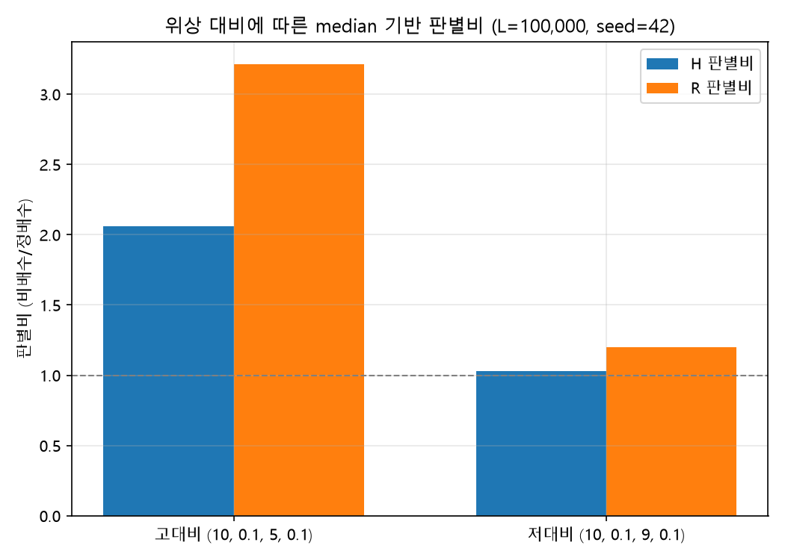
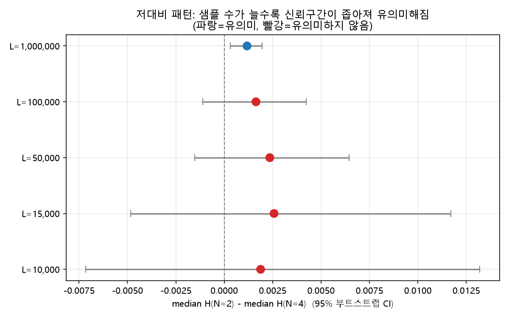
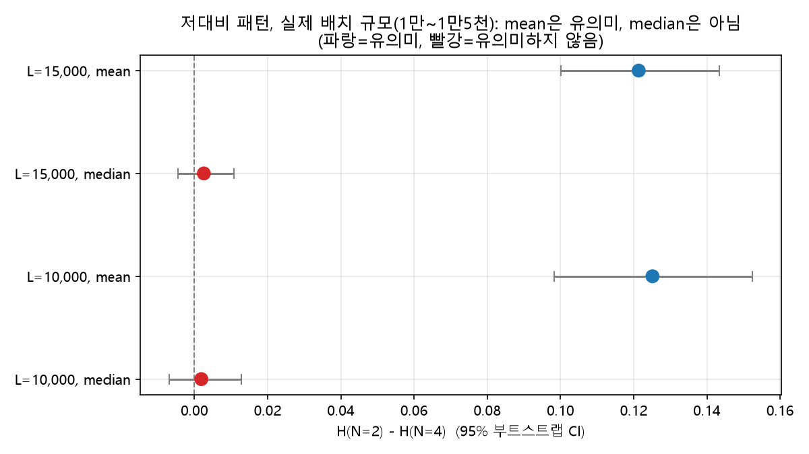
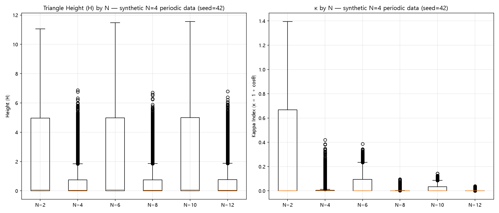
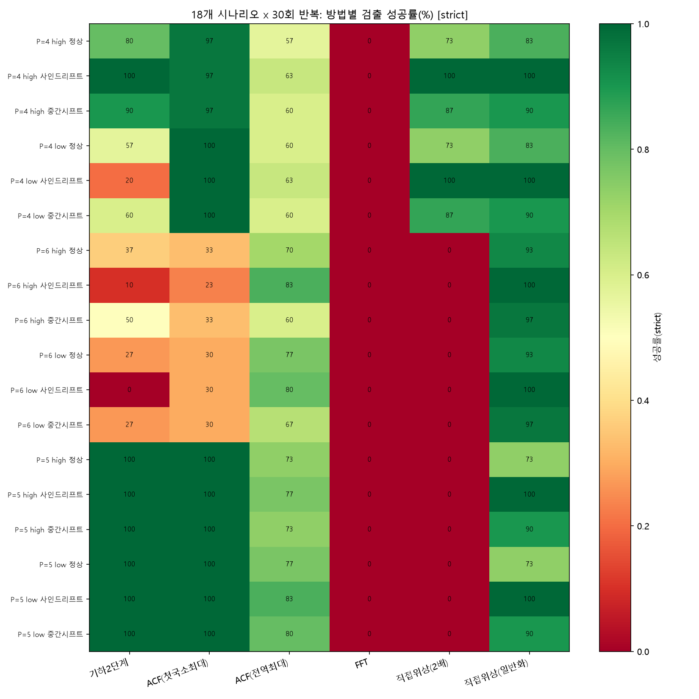
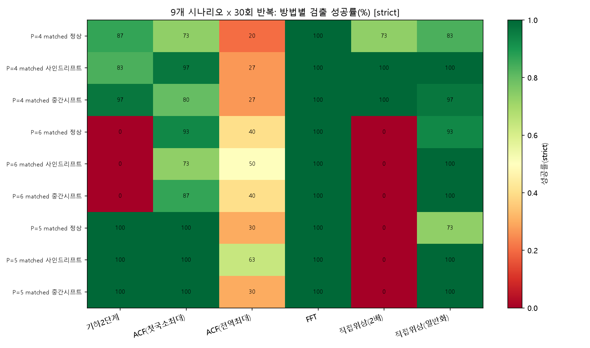
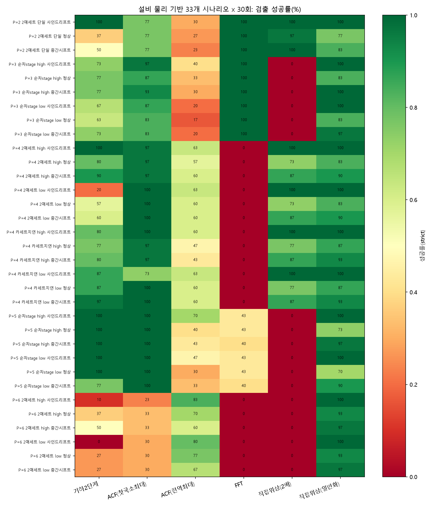
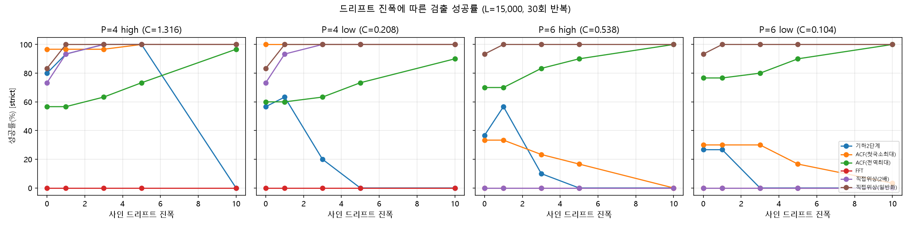

# 삼각형 기하학 기반 주기 검출의 시행착오와 표준 기법 대비 한계 분석
### — 생산 간격 평탄화를 위한 이동평균 윈도우(N) 선정 사례 연구 (개정판 v4)

---

## 변경 이력 (Change Log)

본 문서는 두 차례의 적대적 피어리뷰를 거쳤다. 각 라운드에서 **직전 판본의 핵심 논리는
그대로 유지**하고 지적된 부분만 국소적으로 교체·보강하였다.

- **v1 → v2**: 1차 리뷰(Critical 2, Major 3, Minor 8) 반영
- **v2 → v3**: 2차 리뷰(Critical 2, Major 5, Minor 5) 반영
- **v3 → v4**: 3차 리뷰(Critical 3, Major 4, Minor 4) + **설비 물리 정보 반영** ← 본 개정

### v3 → v4 변경 이력 *(이번 개정)*

이번 개정에는 성격이 다른 두 갈래가 들어 있다.

**(가) 3차 리뷰 대응** — 대부분 새 실험이 아니라 **이미 산출된 로그를 본문에 온전히 반영**하는 문제였다. 특히 v3은 대비 통제 세트(270회)의 결과를 결론에 유리한 부분만 인용했다.

| 절 | 조치 | 대응 | 요지 |
|---|---|---|---|
| 초록 | **문장 교체** | M12 | 6개 방법 전부 나열, 통제 세트의 순위 재편 언급 |
| 7.2 | **표 제목 보강** | Minor-2 | 인접한 두 median H 표에 "무시드 10회"/"seed=42" 명기 |
| 8.2.2 | **문장 추가** | Minor-3 | 시나리오별 표 아래 Wilson CI 용도 제한 반복 표기 |
| 8.2.3 | **전면 교체** | C6, C7, M9, M11 | 두 세트의 위계 선언, 통제 세트 보고를 원래 세트 수준으로 보강, P=6 0% 원인 분해 |
| 8.4 | **표 추가 + 항목 교체** | C5, C7 | 두 세트 McNemar 대조표와 **부호 반전** 명시, FFT·기하학에 동일 잣대 적용 |
| 9 | **항목 추가·삭제** | C5, C6, M11, Minor-4 | 부호 반전 항목 추가, 권고 근거 세트 명시, 해결된 과제 제거 |
| Appendix A | **행 수정** | Minor-1 | Wilson CI 행에 용도 제한 명기 |
| References | **주석 추가** | Minor-1 | 5번 항목에 marginal 요약 전용임을 명기 |
| Appendix E | **해시 기재** | M10 | 40자 커밋 해시를 본문에 직접 기재, `git checkout` 포함 |

**(나) 설비 물리 정보의 반영** — 실무 담당자로부터 tact 패턴이 만들어지는 설비 구조를 확인받았다. 이는 리뷰 항목이 아니지만 **실험 설계의 타당성 자체에 관계**되므로 함께 반영한다.

| 절 | 조치 | 요지 |
|---|---|---|
| 1 | **전면 교체** | 2매 동시 생산·카세트·다중 stage 구조와, N이 **설비 진단 신호**라는 두 번째 목적 |
| 6.2 | **문단 추가** | 저대비 = 교체 지연이 막 시작된 **조기경보 구간**이라는 실무적 의미 |
| 8.2.1 | **근거 교체** | strict 채점의 근거를 "윈도우 효율"에서 **"배수 반환 = 오진단(오경보/미탐)"**으로 |
| 8.2.4 | **신규 추가** | 설비 물리 기반 패턴 세트(11패턴 × 3조건 × 30회 = 990회)와 오경보/미탐 분석 |
| 8.4, 9 | **범위 재조정** | v3의 P=5 패턴이 물리적으로 성립하지 않음을 밝히고 총계를 재집계 |

**v3 대비 결론의 변화 (요약)**

1. **v3이 누락한 부호 반전이 드러났다.** 통제 세트에서는 기하 2단계가 ACF(전역최대)를 **유의하게 이긴다**. v3의 "모든 표준 기법에 밀리는 것은 아니다"는 서술은 방향까지 뒤집히는 사례가 있음을 몰랐던 상태의 서술이었다. **이는 기하학에 유리한 발견이며, 불리한 결과를 숨기지 않은 것과 같은 기준으로 보고한다.**
2. **v3의 P=5 패턴은 물리적으로 성립하지 않는다.** 540회 중 180회(1/3)가 실재하지 않는 설비였고, 기하 2단계는 하필 그 구간에서 100%를 받았다. 총계 64.3%는 이 사실을 감안해 읽어야 한다.
3. **두 실험 세트의 위계를 선언하고, FFT와 기하학에 같은 잣대를 적용**하였다(v3은 통제 세트를 기하학 결론 강화에는 쓰고 FFT 평가에는 실격시키는 비대칭이 있었다).

### v2 → v3 변경 이력 *(2차 개정, 참고용 보존)*

| 절 | 조치 | 대응 리뷰 | 요지 |
|---|---|---|---|
| 부제 | **문장 수정** | — | v2 → v3 |
| 4.4 | **수치 정정** | M4 | CI 끝값 기준 변화율 0.06% → 실측 재계산값으로 정정 |
| 5.2 | **문단 추가** | C4 | 지표의 정배수 무차별성과 채점 기준이 양립하는 구도 정리 |
| 7.1 | **문장 수정** | M4 | 정정된 변화율로 교체 |
| 7.3 | **전면 교체** | M5, M7 | 비정상성 취약성을 조건부 서술로 정정, 실측 예비 집계의 이행 상태 갱신 |
| 7.4 | **본문 승격** | Minor-3 | 단일 시행 한계 경고를 각주에서 본문 첫 줄로 |
| 8.2 | **소절 신설 + 표 교체** | C4, M6, Minor-1 | "성공 판정 기준" 신설(strict/lenient 병기), 대비 지표표 추가, N_max=20 명시 |
| 8.2.3 | **신규 추가** | M6 | 대비를 통제한 패턴 세트로의 재실험 |
| 8.3 | **소절 추가** | M5 | "드리프트가 성능을 개선하는 경우" + 진폭 스윕 진단 |
| 8.4 | **전면 교체** | C3, C4, M6, Minor-2 | Wilson 겹침 → McNemar+Holm으로 교체, P=5 난이도 해설 |
| 9 | **전면 교체** | C3, C4, M6 | 정정된 검정·채점 기준으로 결론 재작성 |
| Appendix A | **행 추가** | Minor-5 | "성공(success)"의 조작적 정의 등재 |
| Appendix C | **전면 교체** | C1, M8 | v3 로그로 교체(실험 1~4 포함), 절대경로 → 상대경로 |
| Appendix E | **신규 추가** | M8 | 검증 스크립트 첨부(저장소 URL + 커밋 해시) |
| Appendix D | **전면 교체** | M7, M8 | v2/v3 두 라운드 대응 상태를 모두 표기, C1·M1 상태 정정 |

**v2 대비 결론의 변화**: v2는 Wilson 신뢰구간의 겹침 여부로 방법 간 우열을 판정했으나,
6개 방법이 **동일한 540개 데이터셋에서 평가된 대응표본**이므로 이는 잘못된 검정이었다.
v3은 McNemar 정확검정 + Holm 보정으로 교체하였다. 또한 v2는 "성공"의 채점 규칙을
명시하지 않은 채 사용했으므로, strict/lenient 두 기준을 명문화하고 병기하였다.
**이 개정의 목적은 결론을 바꾸는 것이 아니라 검정 도구와 채점 기준을 바로잡는 것**이며,
그 결과는 8.4절과 9절에 있는 그대로 보고한다.

### v1 → v2 변경 이력 *(1차 개정, 참고용 보존)*

| 절 | 조치 | 대응 리뷰 | 요지 |
|---|---|---|---|
| 제목/부제 | **전면 교체** | Minor-2 | 실제 결론(기하학적 접근의 한계 규명 사례 연구)에 맞게 재구성 |
| 4.2 | **문단 추가** | Minor-6 | Σ⁻ₙ(n) ≈ N·d 근사의 소표본 타당성 실증표 추가 |
| 4.4 | **문단 추가** | M2 | H~N 회귀 기울기의 부트스트랩 95% CI 보고 |
| 7.1 | **문단 추가** | M2 | 동일 회귀 검정 결과를 실험 절에서 재확인 |
| 7.2 | **문장 추가** | Minor-3 | κ ≈ sin²θ/2의 테일러 전개와 근사 유효 범위 명시 |
| 7.3 | **전면 교체** | M1 | 앵커 일화("6.1배 증가") 삭제, 결론이 합성 데이터 전용임을 한계로 명시 |
| 7.3.1 | **신규 추가** | M1 | 원자료가 사내 비공개라 집계 불가 → 사내 검증 절차 및 공개 환원 경로 명세 |
| 8.1 | **문단 추가** | C2, Minor-5 | 직접 위상비교의 2의 거듭제곱 편향 규명, AMDF 미포함 사유 |
| 8.2 | **전면 교체** | C2, M3, Minor-7 | 6→18개 시나리오(P=4/6/5), 단일 시행→30회 반복 성공률+Wilson CI, L=15,000 근거 각주 |
| 8.3 | **문단 추가** | — | ACF 실패가 지표가 아니라 판정 규칙에서 비롯됨을 진단 |
| 8.4 | **전면 교체** | C2, M3 | 반복시행 결과에 맞춰 결론 범위 재조정 |
| 9 | **전면 교체** | C2, M3, Minor-4 | 개정된 근거로 결론 재작성, FFT 제외 사유 재확인 |
| References | **신규 추가** | Minor-1 | 표준 기법의 출처 및 용어 사용 범위 명시 |
| Appendix C | **신규 추가** | C1 | 실행 로그 전문 첨부, 본문 수치에 로그 행 번호 각주 |

**v1 대비 결론의 변화**: v1은 단일 시행(seed=42) 6개 시나리오에서 "ACF와 직접 위상비교가
6/6 성공, 기하학적 방법은 5/6"이라는 표를 근거로 삼았다. 540회 반복 검증 결과 이 표는
**재현되지 않았다**. 특히 v1이 근거로 삼은 직접 위상비교 구현은 2의 거듭제곱 주기만
반환할 수 있어 P=5, 6에서 성공률 0%였다(전체 28.9%로 기하학적 방법 64.3%보다 **낮음**).
"기하학적 방법이 표준 기법에 밀린다"는 v1의 결론 자체는 유지되지만, 그 근거와 우세 폭은
아래와 같이 정정된다(8.4절).

---

## 초록 (Abstract)

제품 생산 간격(tact)은 여러 종류의 제품을 순환 생산하는 등의 이유로 큰 산포를 보이며, 그 자체로는 "대표적인 생산 간격이 얼마인가"를 말하기 어렵다. 이를 해결하기 위해 반복 주기 N을 찾아 그 윈도우로 이동평균을 취해 평탄화된 대표값을 산출하는 접근을 제안하며, 본 논문은 그 전제가 되는 **반복 주기 N을 데이터로부터 검출하는 방법**을 탐구한 사례 연구다.

초기 아이디어는 인덱스 n을 중심으로 N만큼 떨어진 세 점 A(n), B(n-N), C(n+N)이 이루는 삼각형의 **대칭 차이(R = |AB-AC|/(AB+AC))**와 **넓이(S)**가 N이 실제 주기와 일치할 때 모두 0에 가까워진다는 관찰에서 출발했다. R은 dx, dy가 섞여 "납작함"을 직접 반영하지 못하는 문제가 있어 내각 θ로 재정의하였고, S는 N에 대한 스케일 종속성이 확인되어 밑변(BC)으로 정규화한 **높이(H = 2S/|BC|)**로 전환하였다. H의 N-불변성은 회귀 기울기의 부트스트랩 95% 신뢰구간이 0을 포함함으로써 통계적으로 뒷받침되었다. R과 H를 하나의 스칼라로 통합하려는 시도에서 **κ = 1 + cosθ**를 검토하였으나 1/N²의 새로운 스케일 종속성이 확인되어 기각하고, 최종적으로 **R과 H를 결합한 2단계 판별 기준**(median 기반 1차 스캔 + mean·부트스트랩 신뢰구간 기반 2차 확인)을 채택하였다.

이 최종 방법을 참 주기 P=4/6/5, 고대비/저대비, 정상/사인드리프트/중간시프트의 **18개 시나리오 × 30회 반복(총 540회 시행)**으로 표준 기법과 비교하였다. 6개 방법이 동일한 540개 데이터셋에서 평가된 대응표본이므로 **McNemar 정확검정 + Holm 보정**으로 비교하였고, 성공은 **반환값이 참 주기와 정확히 일치할 때(strict)**로 정의하되 배수를 인정하는 기준의 결과를 병기하였다. 성공률(strict)은 **직접 위상비교(일반화) 91.9% > ACF(첫국소최대) 76.1% > ACF(전역최대) 70.2% > 기하학적 2단계 64.3% > 직접 위상비교(2배) 28.9% > FFT 0.0%**였다. 즉 **기하학적 방법은 구현 복잡도가 가장 크면서 검출 성공률은 유의하게 낮다**(vs ACF 첫국소최대 +11.9%p, Holm p = 3.9×10⁻⁸). 다만 그 열세는 모든 표준 기법에 대한 것이 아니며(ACF 전역최대와는 유의하지 않음), **채점 기준을 바꾸면 순위가 바뀌고**, 성능을 좌우하는 것이 지표뿐 아니라 **판정 규칙과 채점 기준**이라는 점도 함께 확인되었다.

주기별 성능 차이는 패턴 난이도와 교란되어 있었으므로 위상 대비를 정량화해 통제한 재실험을 수행하였다. 이 통제 세트에서는 **방법 순위가 전면 재편된다** — 기하학적 방법의 ACF(첫국소최대) 대비 열세는 오히려 커지지만(+26.3%p), FFT는 0%에서 100%로 뒤집히고 ACF(전역최대)는 70.2%에서 36.3%로 급락하며, **기하학적 방법이 ACF(전역최대)를 유의하게 이기는 부호 반전**이 나타난다. 어느 세트를 권고의 근거로 삼는지, 그리고 두 세트에 같은 잣대를 적용하는 문제는 8.2.3절과 8.4절에서 다룬다. 아울러 설비 물리를 반영한 별도 검증(8.2.4절)에서 **본 논문의 홀수 주기 패턴이 실제 설비 구조에 대응하지 않음**이 확인되어, 총계 성공률의 해석 범위를 함께 좁혔다. 기하학적 접근은 스케일 종속성·과잉 정규화·강건성-검출력 트레이드오프라는 함정을 발견하고 해결하는 **탐구 과정으로서 가치가 있었으나, 실전 배포용 알고리즘으로는 표준 기법에 자리를 내주는 것이 합리적**이라는 것이 본 논문의 결론이다. 다만 **이 결론은 전적으로 합성 데이터에 근거한다** — 실측 생산 로그는 사내 비공개 자료여서 수록·검증할 수 없었으며, 이는 본 연구의 가장 큰 외적 타당성 한계다(7.3절, 검증 절차는 7.3.1절에 명세).

---

## 1. 서론

제품 생산 실적 로그는 다음과 같은 구조를 가진다.

| no | time | tact |
|---|---|---|
| 1 | time₁ | Null |
| 2 | time₂ | time₂ − time₁ |
| ... | ... | ... |
| n | timeₙ | timeₙ − timeₙ₋₁ |

여기서 time은 개별 제품의 생산 완료 시각, tact는 연속된 두 제품 간 생산 간격이다.

### 1.1 tact가 주기를 갖는 이유 — 설비 구조 *(v4 신규)*

tact의 반복 패턴은 통계적 우연이 아니라 **설비의 물리적 구성에서 직접 나온다.** v3까지는 이를 "여러 종류의 제품을 순환 생산하는 경우" 정도로만 서술했으나, 실제 구조는 다음 두 가지다.

**(가) 2매 동시 생산 — 짝수 주기의 원인**

설비가 제품을 2매 단위로 동시 생산하면, 두 번째 매는 미세한 처리 딜레이만 두고 곧바로 나온다. 그래서 아웃단에서 시각을 재면 `10, 0.1, 10, 0.1, …`처럼 **긴 간격과 아주 짧은 간격이 교대**한다. 이 설비의 실제 능력은 10초에 2매이므로 **1매당 5.05초**이며, 이는 tact의 평균 (10 + 0.1)/2와 정확히 일치한다. 즉 **주기 길이의 이동평균이 곧 1매당 생산 소요시간**이 된다.

여기에 4매들이 카세트로 운반한다면 `2매 - 2매 - 카세트 교체`가 한 묶음이 되어, 교체 시간이 생산 시간을 초과할 때 그 시간이 tact에 얹히고 주기는 4가 된다. stage가 여러 개면 `stage 수 × 2`가 주기가 된다 — 3 stage × 2매면 주기 6이다.

**(나) 다중 stage 순차 적재 — 홀수 주기의 원인**

여러 stage가 컨베이어에 1매씩 순차로 올리는 라인에서는, 한 주기에 긴 간격이 한 번 끼고 나머지는 균일하다. 3 stage면 `10, 5, 5`, 5 stage면 `10, 5, 5, 5, 5`가 반복된다. **주기 = stage 수**이므로 홀수 주기는 이 구조에서 나온다.

### 1.2 N을 구하는 두 가지 목적

**목적 1 — 1매당 생산시간 산출.** N을 윈도우로 이동평균을 취하면 카세트 교체시간처럼 간헐적으로 끼어드는 성분이 생산시간에 녹아들어, 그 값이 곧 1매당 소요시간이 된다. 여기에 가동시간을 나누면 **일일 생산 가능량을 예측**할 수 있다. 윈도우가 주기와 어긋나면 위상에 따라 값이 들쭉날쭉해 대표값 구실을 못 한다.

**목적 2 — 설비 이상 감지.** 이것이 v3까지 논문에 없던 두 번째 목적이다. 평소 카세트 교체가 생산보다 빨라 미리 준비되는 설비는 교체 시간이 tact에 나타나지 않아 **N = 2**로 돌아간다. 그런데 실린더 오동작이나 흡착 딜레이 등으로 교체가 늦어지면 그 시간이 tact에 드러나 **N = 4**로 바뀐다. 즉 **N의 변화 자체가 설비 이상의 신호**이며, "원래 2였는데 4가 되었다 → 점검이 필요하다"는 알림을 낼 수 있다.

목적 2는 채점 기준에 직접적인 영향을 준다. N이 진단 신호라면 **실제 2인데 4를 반환하면 오경보이고, 실제 4인데 2를 반환하면 미탐**이므로, 참 주기의 배수를 반환하는 것은 "덜 좋은 답"이 아니라 **틀린 진단**이다. 이 논리가 8.2.1절 채점 기준의 근거가 된다.

### 1.3 목표

따라서 **본 논문의 목표는 반복 주기 N을 데이터로부터 자동으로 검출하는 방법을 찾는 것**이다. 실제 생산 데이터는 위 예시보다 훨씬 큰 산포를 가지는 경우가 많아, 반복 주기가 존재하더라도 육안으로는 식별하기 어려운 경우가 대부분이다. 설령 육안으로 어느 정도 주기성이 감지되더라도, 이를 주관적 판단이 아닌 **정량적 수치로 객관화하여 제시**할 수 있다는 데 이 탐구의 실질적 의의가 있다.

> **[개정 v4 — 실험 설계에 미치는 영향]** 위 구조를 8절의 합성 패턴과 대조하면 문제가 하나 드러난다. 본 논문이 P=5에 쓴 패턴 `10, 0.1, 9, 0.1, 9.5`는 홀수 주기인데 2매 동시 딜레이(0.1)가 섞여 있어, 순환하면 `9.5` 다음에 곧바로 `10`이 와서 2매 세트 구조가 깨진다 — **(가)에도 (나)에도 해당하지 않는 패턴**이다. 8.2.4절에서 물리에 근거한 패턴으로 다시 검증하고, 그 결과가 총계 성공률의 해석에 미치는 영향을 8.4절에서 정리한다.

---

## 2. 문제 정의

- 입력: 시계열 (xₙ, yₙ), 단 xₙ = timeₙ (누적 시각), yₙ = tactₙ = xₙ − xₙ₋₁
- 목표: yₙ이 주기 N으로 반복되는 패턴을 가질 때, 그 N을 탐지 (이동평균 윈도우로 사용하기 위함)
- 제약: N을 사전에 알 수 없으므로 N = 1, 2, 3, ... 후보를 순차 탐색해야 함
- 판별 기준 후보: N이 실제 주기(혹은 그 배수)와 일치할수록 "패턴이 반복된다"는 증거가 강해야 함

---

## 3. 초기 아이디어: 변 길이 대칭 차이(R)와 넓이(S)

### 3.1 아이디어

시계열 산포도 위에서, 인덱스 n을 기준으로 다음 세 점을 정의한다.

- A = (xₙ, yₙ)
- B = (xₙ₋ₙ, yₙ₋ₙ) — n보다 N만큼 이전 점
- C = (xₙ₊ₙ, yₙ₊ₙ) — n보다 N만큼 이후 점

만약 N이 실제 반복 주기와 일치하면, yₙ₋ₙ ≈ yₙ ≈ yₙ₊ₙ (같은 위상에서 값이 반복)이므로 세 점 A, B, C는 **거의 일직선 상에 놓인, 매우 납작한 이등변 삼각형**을 이룬다. 이때:

- **R = |AB−AC| / (AB+AC)** → 0에 수렴 (A가 B, C로부터 대칭적 위치, 즉 이등변)
- **S (삼각형 ABC의 면적)** → 0에 수렴 (세 점이 일직선에 가까움)

반대로 N이 주기와 무관하면 세 점은 뾰족한 삼각형을 이루어 R은 0에서 벗어나고 S는 커진다. **R과 S가 둘 다 작을수록 N이 같은 위상을 가리키는 진짜 주기(혹은 그 배수)일 가능성이 높다**는 것이 출발점이다.

### 3.2 수식

§2의 yₙ = xₙ − xₙ₋₁ 정의를 N번 telescoping하면, x의 차분은 y의 구간합으로 그대로 치환된다.

$$\Sigma^-_N(n) = \sum_{i=n-N+1}^{n} y_i = x_n - x_{n-N}, \qquad \Sigma^+_N(n) = \sum_{i=n+1}^{n+N} y_i = x_{n+N} - x_n$$

이를 대입하면 |AB|, |AC|, R, S를 x 없이 y만으로 표현할 수 있다.

$$|AB| = \sqrt{\left(\Sigma^-_N(n)\right)^2+(y_{n-N}-y_n)^2}, \quad |AC| = \sqrt{\left(\Sigma^+_N(n)\right)^2+(y_{n+N}-y_n)^2}$$

$$R = \frac{|AB-AC|}{AB+AC}$$

$$S = \frac{1}{2}\left|\Sigma^-_N(n)\,(y_{n+N}-y_n) + \Sigma^+_N(n)\,(y_{n-N}-y_n)\right|$$

---

## 4. 문제점과 해결: R의 재정의, S의 스케일 종속성 → H

### 4.1 R의 각도(θ) 재정의

R(대칭 차이)은 dx, dy가 섞여 들어가 "납작함"을 직접적으로 반영하지 못하는 문제가 있다. 예컨대 A가 B, C로부터 거리상 대칭이어도(R≈0) 세 점이 뾰족한 이등변삼각형을 이룰 수 있어, R만으로는 "일직선에 가까운가"를 보장하지 못한다. 이를 보완하기 위해 A에서의 내각 θ를 도입한다.

$$\cos\theta = \frac{\vec{AB}\cdot\vec{AC}}{|AB||AC|} = \frac{-\Sigma^-_N(n)\,\Sigma^+_N(n) + (y_{n-N}-y_n)(y_{n+N}-y_n)}{|AB||AC|}$$

N이 주기와 일치할수록 θ → π(180°)에 수렴한다 (A, B, C가 일직선). θ는 5절에서 결합지수 κ를 구성하는 재료로 다시 쓰인다.

### 4.2 S의 스케일 종속성 (이론적 분석)

N이 커지면 |AB|, |AC|(변의 길이)가 함께 커지므로, 삼각형이 "납작"하더라도 S의 절대 크기 자체가 N에 종속적으로 증가할 수 있다. N이 실제 주기의 정배수(N, 2N, 3N, ...)일 때, y값 차이(dy)는 주기 성분이 상쇄되고 노이즈 성분만 남아 N과 무관한 크기(O(1))를 유지하는 반면, Σ⁻ₙ(n), Σ⁺ₙ(n)(각각 N개의 tact 합)은 대수의 법칙에 의해 N에 비례해 커진다(Σ⁻ₙ(n) ≈ Σ⁺ₙ(n) ≈ N·d, d는 tact의 평균값). 이를 넓이 식에 대입하면:

$$S \approx \frac{1}{2}Nd\,|{\Delta y_B + \Delta y_C}|$$

즉 **S는 N에 대해 선형으로 증가**한다. 서로 다른 N 후보의 S를 그대로 비교하면, "주기와 무관하게 N이 작을수록 S가 작아 보이는" 왜곡이 발생하여 올바른 비교가 불가능하다.

**[개정 v2 추가] 작은 N에서의 근사 타당성**: "대수의 법칙에 의해 Σ⁻ₙ(n) ≈ N·d"라는 서술은 N이 클 때의 점근적 진술이므로, N=4처럼 작은 값에서도 성립하는지 실증이 필요하다. 동일 합성 데이터(N=4 패턴, L=100,000, seed=42)에서 Σ⁻ₙ(n)의 분포를 직접 측정하였다[로그 L30-42].

| N | mean Σ⁻ₙ | N·d | std Σ⁻ₙ | 변동계수(std/mean) |
|---|---|---|---|---|
| 1 | 3.7981 | 3.7981 | 4.1674 | 1.0972 |
| 2 | 7.5962 | 7.5963 | 2.7170 | 0.3577 |
| 4 | 15.1925 | 15.1925 | 1.4868 | 0.0979 |
| 8 | 30.3850 | 30.3850 | 2.1057 | 0.0693 |
| 16 | 60.7702 | 60.7700 | 2.9734 | 0.0489 |

mean Σ⁻ₙ은 모든 N에서 N·d와 소수점 넷째 자리까지 일치하며, 변동계수는 N=4에서 이미 0.098(약 10%)로 충분히 작다. 특히 N=4(참 주기)에서 std가 국소적으로 최소인데, 이는 창(window)이 정확히 한 주기를 포함해 위상 구성이 매번 동일해지기 때문이다. 다만 **본 논문은 이 근사의 이론적 오차 상한을 유도하지 않았으며, 소표본 타당성은 위 실증에 근거한다**는 점을 한계로 명시한다.

### 4.3 실증

동일한 합성 데이터(N=4 반복 패턴 `(10.0,1.3333),(0.1,0.0133),(5.0,0.6667),(0.1,0.0133)`, 10만 샘플, 노이즈 포함)에 대해 10회 독립 시행 후 N=4, 8, 12, 16에서의 대표값(median) S, 밑변 |BC|, 높이 H를 측정하였다. 대표값은 이상치에 강건하도록 평균(mean) 대신 median으로 통일한다(6.2절에서 이 선택의 트레이드오프를 다룬다).

**[개정 v3 — 수치 교체 (M8)]** v1·v2는 이 표에 로그 근거가 없었다. v3에서 같은 실험을 재실행해 로그에 남겼고(아래 인용), **재실행 값이 v2와 소수점 넷째 자리에서 달라 v2 수치를 유지하지 않고 새 수치로 교체**하였다. 이 실험은 시드를 고정하지 않는 설계이므로 값이 달라지는 것 자체가 정상이며(아래 각주), 결론(S/N·|BC|/N이 상수)은 변하지 않는다.

| N | median S | S/N | median \|BC\| | \|BC\|/N | median H |
|---|---|---|---|---|---|
| 4 | 0.5534 | 0.1384 | 30.4100 | 7.6025 | 0.03617 |
| 8 | 1.1027 | 0.1378 | 60.7710 | 7.5964 | 0.03620 |
| 12 | 1.6493 | 0.1374 | 91.1678 | 7.5973 | 0.03607 |
| 16 | 2.2012 | 0.1376 | 121.5570 | 7.5973 | 0.03614 |

[로그 L13-26]

S/N, |BC|/N이 N에 관계없이 상수로 유지되는 것이 확인되어(각각 오차 1% 이내, 로그 L23-24), 앞선 이론적 분석(S, |BC| 모두 N에 선형 비례)이 실증적으로 뒷받침되었다. **S를 원시(raw) 값 그대로 N 후보 간 비교 지표로 사용할 수 없으며, 정규화가 필요하다.**

> **[개정 v2 각주 — 재현성]** 위 표는 시드를 고정하지 않은 10회 시행의 결과이므로, 재실행하면 소수점 넷째 자리 수준에서 값이 달라진다. **이는 "매 실행마다 다른 난수로도 같은 결론이 나오는지"를 보이기 위한 의도된 설계**다. 시드를 고정한 동일 조건의 재현 가능한 실행은 4.4절/7.1절의 회귀 검정에서 시드 리스트 `[1000..1009]`와 함께 제시한다[로그 L8].

### 4.4 H로의 전환: 정의와 N-불변성

넓이 S를 밑변 |BC|로 정규화한 **삼각형의 높이(H)**를 지표로 채택한다. |BC| 역시 BCx = x_{n+N}-x_{n-N} = Σ⁺ₙ(n)+Σ⁻ₙ(n)이므로 y만으로 표현된다.

$$H = \frac{2S}{|BC|} = \frac{\left|\Sigma^-_N(n)\,(y_{n+N}-y_n) + \Sigma^+_N(n)\,(y_{n-N}-y_n)\right|}{\sqrt{\left(\Sigma^-_N(n)+\Sigma^+_N(n)\right)^2+(y_{n+N}-y_{n-N})^2}}$$

N이 실제 주기의 정배수일 때, Σ⁻ₙ(n) ≈ Σ⁺ₙ(n) ≈ Nd이므로 S ~ Nd·|Δy|, |BC| = Σ⁻ₙ(n)+Σ⁺ₙ(n) ~ 2Nd이며, 따라서:

$$H = \frac{2S}{|BC|} \approx \frac{2\cdot Nd\,|\Delta y_B+\Delta y_C|/2}{2Nd} = \frac{|\Delta y_B+\Delta y_C|}{2}$$

**N이 완전히 약분되어 사라진다.**

**[개정 v2 추가] N-불변성의 통계적 검정**: v1은 "median H가 N=4~16에서 0.036 부근으로 일정하다"는 눈대중 비교에 의존했다. 이를 검정으로 대체한다. 시드 `[1000..1009]` 10회 시행에서 N=4,8,12,16의 median H를 구하고 `H ≈ a + b·N` 선형회귀를 적합한 뒤, 시행 단위 부트스트랩(2000회)으로 기울기 b의 95% 신뢰구간을 산출하였다[로그 L11-27].

| 항목 | 값 |
|---|---|
| N별 median H | N=4: 0.03609, N=8: 0.03624, N=12: 0.03607, N=16: 0.03615 |
| 회귀식 | H ≈ 0.036140 + (−2.132×10⁻⁷)·N |
| 기울기 b의 95% CI | **[−1.364×10⁻⁵, +2.127×10⁻⁵]** (0 포함) |
| N=4→16 예측 변화량 (점추정) | −2.558×10⁻⁶ (평균 H의 **0.01%**) |

기울기의 신뢰구간이 0을 포함하므로 **N-불변성 가설은 기각되지 않는다**.

> **[개정 v3 — 수치 정정 (M4)]** v2는 이어서 "기울기가 CI 끝값이라 해도 N=4→16 변화는 평균 H의 **0.06%** 미만"이라고 적었으나, 이는 **계산 오류**다. 실제로는 (CI 상한) × ΔN / 평균 H = 2.127×10⁻⁵ × 12 / 0.036138 = **0.71%**로, v2가 약 12배 과소 보고했다. 재계산된 값은 다음과 같다[로그 L141-146].
>
> | 기준 | H 변화량 (N=4→16) | 평균 H 대비 |
> |---|---|---|
> | 점추정 기울기 | −2.558×10⁻⁶ | 0.01% |
> | CI 하한 | −1.637×10⁻⁴ | 0.45% |
> | CI 상한 | +2.552×10⁻⁴ | **0.71%** |
>
> **정정 후에도 결론은 유지되지만, 강도는 낮춰 적는다.** 0.71%는 여전히 작다 — 8.2절 실험에서 정배수와 비배수의 median H 차이가 2배(106%) 수준인 것에 비하면 두 자릿수 이상 작아, N 후보 간 비교를 왜곡하지 않는다. 다만 0.06%가 시사하던 "사실상 완전한 불변"과 0.71%가 뜻하는 "측정 한계 안에서 무시 가능한 수준"은 설득력이 다르며, **후자가 이 데이터가 지지하는 정확한 진술이다.** 애초에 이 값은 귀무가설(기울기=0)이 기각되지 않은 상태에서 CI 끝값을 취한 보수적 상한이므로, 실제 기울기가 이만큼일 것이라는 주장이 아니다.

---

## 5. 결합 판별 기준과 결합지수 κ

### 5.1 R+H 결합 판별 기준

단일 지표만으로는 우연에 의한 오탐 가능성이 있으므로, 다음 두 조건을 함께 사용한다.

1. **형태 조건 (Shape condition)**: R = |AB-AC|/(AB+AC) ≈ 0 (또는 θ ≈ π) → 삼각형이 이등변에 가까움 (A가 B, C로부터 대칭적 위치에 있음을 보장 → 위상 정렬 확인)
2. **평탄도 조건 (Flatness condition)**: H ≈ 0 (임계값 이하) → 세 점이 실질적으로 일직선

두 조건을 모두 만족하는 N 후보를 "주기 정합(candidate period)"으로 판정한다.

### 5.2 알고리즘

```
입력: tact 배열 y[0..L-1], time 배열 x[0..L-1], 최대 탐색 주기 N_max
출력: 추정 주기 N*

1. for N in 1..N_max:
     H(N) = median(H_n for n in [N, L-N))   # H_n: 인덱스 n에서의 높이. median은 이상치에 강건(6.2절)
     R(N) = median(R_n for n in [N, L-N))   # R_n: 인덱스 n에서의 대칭 차이 (|AB-AC|/(AB+AC))
2. 비주기 구간 대비 H(N)이 임계값 이하로 유의미하게 낮아지고, R(N)이 0에 근접하는
   가장 작은 N을 N*로 선택 (전역 최솟값이 아닌, 오름차순 스캔 중 첫 정합점을 채택)
3. N*를 반환
```

**주의**: 전역 최솟값(global argmin)으로 탐색할 경우, N*의 정배수(2N*, 3N*, ...)도 통계적으로 유사한 H값을 보이므로 노이즈에 의해 배수가 최솟값으로 오탐될 수 있다. 따라서 반드시 **작은 N부터 순차 탐색하여 첫 정합점에서 종료**하는 전략을 사용한다.

**참고**: 위 알고리즘은 median 기반이라 이상치에는 강건하지만, 주기 내 위상 값들이 서로 가까운(저대비) 데이터에서는 검출력이 부족할 수 있다(6.2절). 6.2절에서는 이 알고리즘이 반환한 N* 하나만 mean+부트스트랩 신뢰구간으로 재확인하는 2단계 확장을 제안한다.

**[개정 v3] "정배수는 구분되지 않는 게 정상"과 "정배수를 오답으로 채점하는 것"은 모순이 아니다.** 4.4절과 7.1절은 H가 N에 불변이므로 참 주기의 정배수(4, 8, 12, …)끼리는 **지표 값으로 서로 구분되지 않는다**고 주장하고, 8.2절의 주 채점 기준(strict)은 반환값이 P와 정확히 같을 때만 성공으로 친다. 언뜻 상충해 보이지만 층위가 다르다.

- **지표(H)의 역할**은 "이 N이 위상 정렬을 만드는가"를 판별하는 것뿐이다. 4, 8, 12는 모두 위상을 정렬하므로 H가 낮은 것이 **이론적으로 옳다**. 여기서 배수를 구분하라고 요구하는 것은 지표에 대한 잘못된 기대다.
- **최소 주기를 고르는 일은 지표가 아니라 탐색 전략의 책임**이다. 위 알고리즘이 전역 최솟값 대신 오름차순 첫 정합점을 채택하는 이유가 정확히 이것이다.
- 따라서 strict 채점은 "지표가 배수를 구분하지 못했다"를 벌하는 것이 아니라, **"탐색 전략이 최소 주기를 골라내지 못했다"를 벌하는 것**이다. 파이프라인 전체(지표 + 판정 규칙)를 평가 단위로 삼는 8.3절의 관점과도 일치한다.

이동평균 윈도우라는 §1의 목적을 생각하면 최소 주기가 필요한 이유도 분명하다. 윈도우를 2P나 3P로 잡아도 평탄화 자체는 되지만, 필요 이상으로 긴 윈도우는 응답을 지연시키고 유효 표본 수를 줄인다. 그래도 배수를 완전히 실패로만 처리하는 것이 가혹할 수 있으므로, 8.2절은 배수를 성공으로 인정하는 lenient 기준의 성공률을 **함께** 보고한다.

### 5.3 결합지수의 모색: κ = 1 + cosθ

5.1절의 판별 기준은 R(또는 θ)과 H라는 **두 개의 별도 조건**을 동시에 검사해야 한다. 하나의 스칼라 지표로 두 조건(이등변 형태 + 평탄도)을 동시에 포착할 수 있다면 탐색 로직이 단순해진다는 동기에서, θ 하나로부터 두 조건을 모두 반영하는 지표를 모색하였다.

N이 실제 주기와 일치하면 θ → π이므로 cosθ → −1이다. 이때 자연스러운 후보는 다음과 같이 정의된다.

$$\kappa = 1 + \cos\theta$$

κ는 θ = π(원하는 완전 정합 케이스)일 때 0, θ = 0(퇴화된 반대 방향 케이스)일 때 2로 수렴한다. sinθ = 2S/(|AB||AC|)와 비교하면, sin(π−x) = sin(x)이므로 sinθ는 θ ≈ 0과 θ ≈ π를 구분하지 못하는 반면, **κ(즉 cosθ)는 두 경우를 부호로 구분**한다는 이론적 장점이 있어 R과 H를 대체할 유력한 단일 지표 후보로 검토되었다. (검증 결과는 7.2절 참고 — 결론부터 말하면 기각되었다.)

---

## 6. 성능 검증 방법: median이냐 mean이냐

### 6.1 검증 전략: 정배수 vs 비배수 비교

지표(H, κ 등)의 성능을 검증하는 기본 전략은, 참 주기의 **정배수(4, 8, 12, ...)**에서 지표 값이 낮고, **정배수가 아닌 N(2, 6, 10, ...)**에서는 값이 유의미하게 높은지를 비교하는 것이다. 두 그룹의 대표값 비율(판별비 = 비배수 대표값 / 정배수 대표값)이 클수록 판별력이 좋은 지표로 본다. 이때 "대표값"으로 median을 쓸지 mean을 쓸지는 결과에 큰 영향을 준다 — 이 절에서 그 트레이드오프를 먼저 규명한다.

### 6.2 대표값 선택: median이냐 mean이냐

**이상치 강건성 관점**: 실측 생산 데이터에는 설비 정지, 자재 대기 등으로 인한 비정상적 생산 지연(스파이크)이 섞일 수 있다. 동일 패턴·동일 기본 노이즈에 이상치 유무만 다르게 주입해 페어 비교한 결과, **median 기반 집계는 최대 10% 수준의 이상치 오염에도 N 판정이 전혀 흔들리지 않아(H, κ 모두 0건의 판정 변화) 강건함이 확인**되었다. 반면 mean 기반 집계는 5~10% 오염에서 판정 정확도가 크게 저하되었다(H 기준 최대 120/120 → 20/120). 이 결과만 보면 median이 명백히 우세하다.

**그러나 검출력 관점에서는 반대다.** 6.1절에서 정의한 판별비를 median 기준으로 실제 계산해보면(패턴 (10, 0.1, 5, 0.1)), H의 판별비는 2.06배에 그친다(7.2절 표 참고) — 동일 데이터를 mean 기준으로 계산하면 5.07배로, median보다 뚜렷하게 크다. 이는 H의 분포가 심하게 오른쪽으로 치우쳐 있어, median이 "전형적인" 값만 보고 mean이 잡아내던 꼬리 쪽 대비를 놓치기 때문이다.

이 트레이드오프가 실전에서 얼마나 치명적인지 확인하기 위해, 주기 내 교대되는 두 "큰" 위상 값이 서로 가까운(저대비) 패턴 (10, 0.1, **9**, 0.1)에서 median과 mean의 판별력을 비교하였다.

**[이미지 01]** 위상 대비에 따른 median 판별비 비교 [로그 L70-90]



| 패턴 | median H 판별비 | median R 판별비 |
|---|---|---|
| 고대비 (10, 0.1, 5, 0.1) | 2.06배 | 3.21배 |
| 저대비 (10, 0.1, 9, 0.1) | 1.03배 | 1.20배 |

저대비 패턴에서는 median 기준 판별력이 사실상 사라진다. 원인은 이 합성 패턴이 "큰 값, 작은 값"이 교대되는 구조라서, 어떤 짝수 후보 N을 쓰든 같은 홀짝(위상) 구조를 공유하기 때문이다 — 진짜 주기가 4일 때 N=2 후보는 A(phase0)를 B, C(둘 다 phase2)와 비교하게 되는데, phase0과 phase2 값이 가까우면(10 vs 9) 이 "틀린" N=2도 우연히 평탄해 보인다. **R과 H가 서로 다른 종류의 오차를 잡아내는 게 아니라, 둘 다 같은 신호(phase0과 phase2 값의 차이)에 의존하기 때문에 결합해도 서로를 보완하지 못한다.**

이 신호가 데이터 부족 때문에 안 잡히는 것인지 확인하기 위해, 샘플 수(L)를 늘려가며 median H(N=2)−median H(N=4) 차이의 부트스트랩 95% 신뢰구간(두 그룹 각각 복원추출로 재표본해 통계량 차이를 n_boot회 반복 계산하고, 그 분포의 하위/상위 2.5% 지점을 구간으로 삼는 방법 — 구간이 0을 포함하지 않으면 유의미)이 0을 포함하지 않는지 확인하였다.

**[이미지 02]** 샘플 수(L)에 따른 신뢰구간 수렴 [로그 L92-99]



| L | 차이(N2−N4) | 95% 신뢰구간 | 유의미 |
|---|---|---|---|
| 10,000 | +0.0019 | [−0.0072, +0.0132] | 아니오 |
| 15,000 | +0.0026 | [−0.0048, +0.0117] | 아니오 |
| 50,000 | +0.0024 | [−0.0015, +0.0064] | 아니오 |
| 100,000 | +0.0016 | [−0.0011, +0.0042] | 아니오 |
| 1,000,000 | +0.0012 | [+0.0003, +0.0020] | **예** |

신호는 실재하지만(L=1,000,000에서 확인됨), **median 기반으로는 실무 배치 규모(1만~1만5천)는 물론 10만 개로도 통계적으로 확신할 수 없다.**

**해결책은 mean으로 돌아가는 것이다.** H 분포가 오른쪽으로 치우쳐 있다는 것은, 대부분의 개별 삼각형에서는 노이즈가 phase0-phase2 차이를 가려버리지만 **일부** 삼각형에서는 노이즈가 우호적으로 작용해 진짜 차이를 뚜렷하게 드러낸다는 뜻이다. median은 이 소수의 신호를 무시하지만, mean은 그대로 반영한다. 실제 배치 규모(L=10,000, 15,000)에서 median과 mean 각각으로 신뢰구간을 계산하였다.

**[이미지 03]** 실제 배치 규모에서 mean vs median 신뢰구간 비교 [로그 L101-112]



| L | 통계량 | 차이(N2−N4) | 95% 신뢰구간 | 유의미 |
|---|---|---|---|---|
| 10,000 | median | +0.0019 | [−0.0068, +0.0127] | 아니오 |
| 10,000 | **mean** | **+0.1251** | **[+0.0983, +0.1524]** | **예** |
| 15,000 | median | +0.0026 | [−0.0045, +0.0109] | 아니오 |
| 15,000 | **mean** | **+0.1214** | **[+0.1001, +0.1434]** | **예** |

mean은 1만 개만으로도 뚜렷하게 유의미했다. 다만 mean은 앞서 확인했듯 소수의 이상치에 취약하다. **결론: median(강건·저비용)과 mean+부트스트랩(고검출력)을 각자 최적의 역할에 배치하는 2단계 설계를 채택한다.**

> **[개정 v4 — 저대비 조건의 실무적 의미]** 이 절의 "저대비"는 인위적으로 만든 난이도가 아니라 **실무에서 가장 중요한 구간**이다. §1.2의 목적 2를 대입해 보면 분명하다. 카세트 교체 지연이 막 생기기 시작한 시점의 패턴은 `10, 0.1, 10, X`에서 **X가 아직 미세 딜레이 0.1에 가까운 상태**이고, 이는 정확히 N=2와 N=4를 구분해야 하는 저대비 상황이다. 지연이 충분히 커진 뒤(고대비)에는 어떤 방법으로도 쉽게 잡히지만, 그때는 이미 생산성 손실이 발생한 뒤다.
>
> 따라서 **"median으로는 실무 배치 규모에서 검출되지 않고 mean+부트스트랩이라야 잡힌다"는 이 절의 결론은 곧 조기경보 가능 여부**를 뜻한다. 8.2.4절에서 이 조기경보 구간(`10, 0.1, 10, 0.6`, 대비 지표 C=0.097)을 별도 시나리오로 두어 방법별 성능을 측정한다.

1. **1단계 (넓게 훑기)**: 5.2절 알고리즘 그대로, median 기반으로 N=1..N_max를 저비용으로 스캔해 후보 N*를 얻는다.
2. **2단계 (하나만 정밀 확인)**: 후보 N* 하나에 대해서만, N*와 배수 관계가 아닌 N 중 "가장 헷갈리는"(median H가 가장 낮은) N을 배경으로 골라 mean + 부트스트랩 신뢰구간으로 재검증한다. 신뢰구간이 0을 포함하지 않고 방향이 기대대로면 N*를 최종 확정(confirmed)한다.

이 2단계 설계의 구체적인 검증 결과는 7.4절에서 다룬다.

---

## 7. 실험 및 검증

### 7.1 S의 스케일 종속성 vs H의 N-불변성 재확인

N=4, 8, 12, 16(모두 참 주기의 정배수)에 대해 10회 독립 시행하여 median H의 분포를 비교하였다. 4.3절의 표에서 보인 바와 같이 S와 |BC|는 N에 선형 비례하여 증가했으나, H는 N에 무관하게 일정하였다. **[개정 v2]** 이 "일정함"은 4.4절의 회귀 검정으로 정량화되었다 — 기울기 b = −2.13×10⁻⁷, 부트스트랩 95% CI = [−1.36×10⁻⁵, +2.13×10⁻⁵]로 0을 포함한다[로그 L137-148]. **[개정 v3 — M4]** N=4→16 구간의 예측 변화량은 점추정 기준 평균 H의 0.01%, **CI 끝값을 취한 보수적 상한으로도 0.71%**다(v2의 "0.06% 미만"은 계산 오류이며 4.4절에서 정정하였다). 이는 4.4절의 이론적 유도와 정합한다.

**함의**: 참 주기의 정배수들끼리는 H 값으로 서로 구분되지 않는 것이 오히려 이론적으로 정상이며, 문제가 되는 것은 "정배수를 비주기로 오판하는 것"이 아니라 "정배수 중 가장 작은 값을 선택하는 탐색 전략"이다 (5.2절 참조). 이후 실험에서는 **S를 더 이상 후보 지표로 사용하지 않는다.**

### 7.2 R, H, κ 판별력 비교 — κ 기각

N=4 반복 패턴(고대비, seed=42)으로 10만 개 샘플을 생성하여 N=2, 4, 6, 8, 10, 12에서 H, κ를 계산하였다.

**[이미지 04]** H, κ 분포 Box plot (N별) [로그 L32-45]



| N | median H | std H | max H | median κ | std κ | max κ |
|---|---|---|---|---|---|---|
| 2 | 0.0755 | 2.6483 | 11.0496 | 0.000277 | 0.362084 | 1.395448 |
| **4** | **0.0365** | 0.7638 | 6.8800 | **0.000012** | 0.019305 | 0.419763 |
| 6 | 0.0819 | 2.6561 | 11.4780 | 0.000028 | 0.059230 | 0.387367 |
| **8** | **0.0367** | 0.7663 | 6.7152 | **0.000003** | 0.004836 | 0.095823 |
| 10 | 0.0748 | 2.6586 | 11.5614 | 0.000008 | 0.022096 | 0.143756 |
| **12** | **0.0366** | 0.7619 | 6.7878 | **0.000001** | 0.002120 | 0.038765 |

| 지표 | 정배수 median | 비배수 median | 판별비 |
|---|---|---|---|
| H | 0.0366 | 0.0755 | 2.06배 |
| κ | 0.000003 | 0.000028 | **9.47배** |

같은 N 하나를 고정했을 때 κ의 판별력은 H보다 약 4.6배 더 뚜렷하다. 그러나 N을 바꿔가며 κ의 절대 크기를 비교하면 이야기가 달라진다. 동일 조건(N=4 반복 패턴, **시드 고정 없는 10회 독립 시행**)에서 median κ를 측정한 결과:

**표 (가) — 무시드 10회 시행 집계**

| N | median H | median κ |
|---|---|---|
| 4 | 0.03617 | 0.000012 |
| 8 | 0.03620 | 0.000003 |
| 12 | 0.03607 | 0.000001 |
| 16 | 0.03614 | 0.000001 |

[로그 L16-21] — **[개정 v3]** 이 표도 4.3절과 같은 무시드 실험에서 나오므로 재실행 값으로 교체하였다(M8).

median H는 N에 무관하게 상수로 유지되었으나, **median κ는 N이 커질수록 급격히 감소**하였다(N=4 대비 (N/4)²로 나누면 대략 일치 — κ가 1/N²에 비례). 각 항의 스케일을 직접 분해하면 원인이 드러난다[로그 L52-61]:

**표 (나) — seed=42 단일 데이터셋, median 기준**

> 표 (가)와 (나)의 median H가 0.036 부근에서 서로 다른 것(0.03617 vs 0.03649)은 **표본이 달라서**다 — (가)는 무시드 10회 시행의 집계, (나)는 seed=42 한 데이터셋이다. 두 값의 차이는 4.4절이 정량화한 시행 간 산포 범위 안에 있다.

| N | S/N | \|AB\|/N | \|AC\|/N | BC/N | sinθ·N | κ·N² | median H |
|---|---|---|---|---|---|---|---|
| 4 | 0.1389 | 3.8023 | 3.8023 | 7.5980 | 0.0195 | 0.000190 | 0.03649 |
| 8 | 0.1405 | 3.7990 | 3.7990 | 7.5981 | 0.0194 | 0.000189 | 0.03673 |
| 12 | 0.1394 | 3.7989 | 3.7989 | 7.5973 | 0.0194 | 0.000189 | 0.03661 |
| 16 | 0.1396 | 3.7990 | 3.7990 | 7.5941 | 0.0194 | 0.000188 | 0.03665 |

S, |AB|, |AC|, BC는 모두 **정확히 N¹에 비례**해서 커진다. H = 2S/BC는 분자·분모가 둘 다 N¹이므로 N이 정확히 약분되어 사라진다.

**[개정 v2 — κ 근사식의 유도와 유효 범위]** κ와 sinθ의 관계는 θ = π − ε (ε는 π로부터의 이탈각)로 두고 전개하면 다음과 같다.

$$\cos\theta = \cos(\pi - \varepsilon) = -\cos\varepsilon = -\left(1 - \frac{\varepsilon^2}{2} + O(\varepsilon^4)\right)$$
$$\therefore \kappa = 1 + \cos\theta = \frac{\varepsilon^2}{2} + O(\varepsilon^4), \qquad \sin\theta = \sin\varepsilon = \varepsilon + O(\varepsilon^3)$$
$$\Rightarrow \kappa \approx \frac{\sin^2\theta}{2} \quad (\varepsilon \ll 1, \text{ 즉 } \theta \approx \pi)$$

**이 근사는 θ가 π 근방일 때만 성립한다.** 예컨대 θ = π/2(직각)에서는 κ = 1이지만 sin²θ/2 = 0.5로 2배 차이가 나며, θ → 0에서는 κ → 2인 반면 sin²θ/2 → 0으로 완전히 어긋난다. 본 논문에서 이 근사를 쓰는 맥락(정배수 후보에서의 스케일 분석)은 θ ≈ π인 영역이므로 유효하지만, **비주기 후보(뾰족한 삼각형, θ가 π에서 먼 경우)의 κ 절대값을 이 근사로 해석해서는 안 된다.**

이 근사 하에서 sinθ = 2S/(|AB||AC|)의 분모 |AB|·|AC|는 두 변의 곱이므로 **N²**로 커지는데, 분자 S는 N¹로만 커지므로 sinθ ~ 1/N (표의 sinθ·N이 상수인 것으로 확인)이고, κ ~ sin²θ ~ **1/N²**가 된다. 즉 κ는 "N¹ 넓이"를 "N² 크기의 정규화 분모"로 나눈 뒤 제곱까지 한 셈이어서, H가 확보했던 정규화 차수의 균형이 깨진 **과잉 정규화(over-normalization)**가 원인이다.

**결론**: κ는 **고정된 N 하나에서의 판별력**은 H보다 우수하지만, 1/N² 스케일 종속성 때문에 **서로 다른 N 후보를 비교해야 하는 5.2절 탐색 알고리즘에는 사용할 수 없다**. 이는 4절에서 S를 기각했던 것과 동일한 범주의 결함을 (반대 방향으로) 재도입한 것이다. **κ는 기각하고, 최종 지표 조합은 R(또는 θ)과 H로 유지한다.**

### 7.3 실측 데이터에 대한 검증의 한계 *(v2에서 전면 교체)*

v1의 이 절은 실측 알람 tact 데이터의 **앵커점 1~2개**에서 계산한 H 값을 근거로 "H가 실측 데이터의 비정상성에 취약하다"고 서술했고, 특히 "다른 앵커점에서는 N이 2배가 될 때 H가 약 6.1배 증가(0.222 → 1.366)"라는 문장을 포함했다. 피어리뷰는 이를 **일화적 근거(anecdotal evidence)**로 지적하며 전체 데이터셋 집계(count/mean/median/std + Box plot)로 교체할 것을 요구했다.

**개정 조치**: 해당 서술을 삭제한다. 전체 집계로 교체하지 못한 이유는 데이터를 찾지 못해서가 아니라, **원본 실측 로그가 사내 비공개 자료여서 본 논문 및 공개 저장소에 수록할 수 없기 때문**이다. 원자료를 첨부할 수 없으면 독자가 집계 결과를 검증할 수 없고, 검증 불가능한 수치를 근거로 제시하는 것은 리뷰가 지적한 일화적 근거 문제를 형태만 바꿔 반복하는 것이다. 따라서 이 절의 주장은 다음과 같이 격하한다.

- v1에 실린 2개 앵커점 값(N=4: H=0.0108, N=8: H=0.0021)은 **제3자 재현이 불가능한 참고 자료**이며, 이로부터 H의 비정상성 취약성을 일반화할 수 없다.
- 삭제된 "6.1배 증가" 서술은 **어떤 공개 표·로그로도 뒷받침되지 않으므로 본 개정판에서 근거로 사용하지 않는다.**
- **비정상성에 대한 H의 거동은 대신 8절의 합성 실험(사인파 드리프트, 중간 레벨 시프트 × 540회 반복)이 담당한다.** **[개정 v3 — 조건부로 정정 (M5)]** v2는 여기서 "저대비+사인드리프트 20.0%(P=4)"만 인용해 "비정상성 취약성이 재확인되었다"고 적었으나, 이는 유리한 절반만 인용한 것이다. 정확한 서술은 다음과 같다 — **드리프트에 대한 취약성은 저대비 조건에서만 나타나며, 대비가 큰 조건(C=1.316)에서는 오히려 성공률이 80.0% → 100.0%로 개선된다**[로그 L395-399]. 진폭을 스윕하면 거동이 비단조임도 확인된다(8.3.1절). 따라서 "H가 비정상성에 취약하다"는 v1의 우려는 **조건부로만 지지되며, 무조건적 일반화는 근거가 없다.**

**따라서 본 논문의 결론은 전적으로 합성 데이터에 근거하며, 실측 데이터에 의한 뒷받침은 없다.** 8절의 성능 비교(540회 시행)도 마찬가지로 합성 데이터 실험이므로, 실제 생산 라인에서 동일한 순위가 재현된다는 보장은 이 논문 안에 없다. 이는 본 연구의 **가장 큰 외적 타당성(external validity) 한계**이며, 축소해 읽어서는 안 된다.

**[개정 v3 — 왜 집계값조차 싣지 못했는가 (M7)]** 2차 리뷰는 7.3.1절 (4)가 스스로 "집계값은 원시 tact를 복원할 수 없으므로 사내 승인 시 인용 가능"이라는 경로를 제시해 놓고, 정작 v1이 다루던 실측 약 92행에 대해 count/mean/median/std조차 싣지 않은 것을 지적했다. 타당한 지적이며, 상태를 정확히 적는다.

- **원자료는 본 분석 환경에 존재하지 않는다.** 저장소에도, 집필 환경에도 없다. 따라서 "승인만 받으면 되는" 상태가 아니라 **집계값 자체를 계산할 수단이 없는** 상태다. 값을 추정해 채우는 것은 명시적으로 배제한다.
- v1에 남아 있던 앵커 2개 값은 출처를 재확인할 수 없어 근거로 쓰지 않는다(위 항목).
- 대신 **집계를 실제로 산출하는 실행 스크립트 `internal_validation.py`를 논문과 함께 제공**한다(7.3.1절 (2)). 데이터를 보유한 조직에서 이 스크립트를 실행하면 리뷰가 요구한 N=1..20의 count/mean/median/std 표와 Box plot이 그대로 생성되며, 본 절에 붙여넣을 초안까지 함께 출력된다.
- Appendix D의 M1/M7 상태는 "수행 불가"가 아니라 **"도구 제공까지 이행, 수치 산출은 미이행"**으로 표기한다.
- 덧붙여, 약 92행은 8.2절 검증 규모(L=15,000)의 0.6%에 불과하다. 설령 집계를 얻더라도 6.2절이 보인 표본 크기 의존성 때문에 **결론의 근거가 될 수 없으며 예비 관찰 층위에 머문다**(7.3.1절 (1)에 명시).

#### 7.3.1 사내 검증 절차 명세 (Internal validation protocol)

원자료를 공개할 수 없더라도, 데이터를 보유한 조직 내부에서는 아래 절차로 동일한 검증을 수행하고 **원자료 없이 결과만 인용 가능한 형태**로 남길 수 있다. 향후 이 절을 채우려는 경우 이 명세를 그대로 따를 것.

**(1) 입력 규격**

| 항목 | 규격 |
|---|---|
| 컬럼 | `time`(생산 완료 시각, `yyyy-MM-dd HH:mm:ss.SSS`), 필요 시 `no` |
| tact | 코드가 `y[n] = time[n] − time[n−1]`을 초 단위 float로 직접 계산 (원본에 tact 컬럼이 있어도 재계산해 대조) |
| 전처리 | 설비 정지·교대 공백 등 비생산 구간의 분리 기준을 **사전에 문서화**하고, 제거 여부에 따른 결과를 둘 다 산출 |
| 분량 | 배치당 1만~1만5천 행 권장(8.2절 L=15,000과 정합). 92행 규모는 **8절 검증 규모에 크게 못 미치므로 결론 근거로 쓸 수 없고**, 예비 관찰로만 취급 |

**(2) 실행**

`internal_validation.py`가 아래 (3)의 네 가지 보고 항목을 한 번에 산출한다. 지표·탐색 함수는 `find_n.py` / `verification_v2.py`의 것을 **수정 없이 그대로** 호출하며, 합성 데이터 생성 함수 대신 실측 `x, y`를 넣는 것이 유일한 차이다.

```
# 사내망에서 실행. 원자료는 저장소에 커밋하지 말 것(.gitignore에 등록되어 있음).
python internal_validation.py --input production_log.csv
python internal_validation.py --input log.xlsx --sheet Sheet1 --time-col 완료시각
python internal_validation.py --input log.csv --max-tact 300    # 비생산 구간 제외
```

산출물은 `out_internal/`에 생성된다 — 로그 전문(`internal_validation_log.txt`), N별 H Box plot(`H_by_N_boxplot.png`), 그리고 본 절에 그대로 붙여넣을 수 있는 초안(`section_7_3_draft.md`).

필요한 것은 **시각 컬럼 하나뿐**이다. 원본에 tact 컬럼이 있어도 사용하지 않고 `y[n] = time[n] − time[n−1]`을 스크립트가 직접 재계산한다. 시각 컬럼은 컬럼명으로 자동 추정하며, 실패하면 `--time-col`로 지정한다.

**실행 전 확인할 것**

- `--max-tact`는 **반드시 지정한 실행과 지정하지 않은 실행을 둘 다 수행해 결과를 비교**한다. 임계값을 잘못 잡으면 정상 생산 위상까지 잘려나가 주기 구조 자체가 사라진다. 실제로 P=4 검증 데이터에서 `--max-tact 8`(10초 위상을 잘라내는 값)을 주면 N\*=1, 즉 "반복 구조 없음"으로 판정이 뒤집힌다.
- L이 8.2절 규모(15,000)에 크게 못 미치면 스크립트가 경고를 출력한다. 이 경우 결과를 결론의 근거가 아니라 **예비 관찰**로 표기해야 한다.
- N\*=1이 나오면 비교할 비배수 배경이 존재하지 않아 2단계 확인이 불가능하다. 이는 오류가 아니라 **기하학적 방법이 주기를 검출하지 못했다는 결과**이므로 그대로 보고한다.

**(3) 보고 항목** — 아래 4가지를 산출해 이 절에 삽입한다. (`internal_validation.py`가 모두 자동 생성한다.)

1. **N별 H 집계표**: N=1..20 각각의 count / mean / median / std (앵커 1~2개가 아니라 **전체 유효 앵커**)
2. **N별 H Box plot**: 정배수 후보에서 분포 전체가 낮아지는지를 육안 확인
3. **2단계 판정 결과**: 1단계 N*, 2단계 배경 N, 차이의 mean 부트스트랩 95% CI, confirmed 여부
4. **표준 기법 대조**: 동일 데이터에 ACF(첫국소최대/전역최대), 직접위상(일반화)를 함께 돌려 반환 N을 나란히 제시

**(4) 공개 가능 형태로의 환원** — 원자료 없이도 결과를 인용할 수 있도록, 다음 중 하나를 택한다.

- **집계값만 공개**: 위 (3)의 표·그림은 원시 tact 값을 복원할 수 없는 요약 통계이므로, 사내 승인 시 그대로 인용 가능하다. 이 경우 "원자료 비공개, 집계값만 제시"임을 각주로 명시한다.
- **대리 데이터 공개**: 실측에서 추정한 패턴 파라미터(주기 P, 위상별 평균·표준편차)만 추출해 `generate_periodic_tact`로 **동등한 분포의 합성 데이터**를 만들어 공개한다. 실제 생산 시각은 노출되지 않으면서 제3자가 재현할 수 있다. 이 경우 "대리 데이터 기반"임을 반드시 표기하고, 실측 결과와의 차이를 함께 보고한다.
- **어느 쪽도 불가능하면**: 이 절은 현재 상태(미검증 명시)로 유지한다. **근거를 댈 수 없는 수치를 채워 넣는 것보다 공백으로 두는 편이 정직하다.**

**현재 상태**: 위 (4)의 어느 경로도 진행되지 않았으므로, 본 논문의 실측 데이터 관련 주장은 **미검증 상태로 남긴다.**

### 7.4 R+H 2단계 파이프라인 검증

**[개정 v3] 아래는 단일 시행(seed=42) 결과이며, 동일 조건을 30회 반복한 성공률은 56.7%다(8.2절).** 즉 이 성공은 파이프라인이 동작한다는 예시일 뿐, 성능의 근거가 아니다. 성능 판단은 8.2절의 반복 시행 결과만을 따른다.

6.2절에서 설계한 2단계 절차(median 1차 스캔 + mean·부트스트랩 2차 확인)를 저대비 패턴(L=15,000, seed=42)에 적용하면 다음과 같이 동작한다.

- 1단계(median): N* = **4** (정확히 검출)
- 2단계(mean+부트스트랩, 배경 N=14 — 진짜 주기 4와 배수 관계가 아니면서 가장 헷갈리는 후보): 차이 = +0.1248, 95% 신뢰구간 = [+0.1036, +0.1473] → **확인(confirmed) = 예**

---

## 8. 다른 방법 제안: ACF와 직접 위상비교

### 8.1 근본적인 질문: 기하학이 꼭 필요한가

지금까지의 R, S, H, κ는 모두 (xₙ, yₙ)을 2차원 점으로 놓고 그 사이의 거리·각도·넓이를 재는 **기하학적 구성물**이다. 그러나 주기성 검출 자체는 시계열 분석에서 이미 표준적으로 다뤄지는 문제이며, yₙ이 규칙적인 인덱스 n으로 나열된 수열이라는 점에서 **xₙ(누적 시각) 없이 yₙ만으로도** 다음과 같은 기법을 바로 적용할 수 있다.

- **자기상관함수(ACF)**: yₙ과 yₙ₊ₖ의 상관계수를 lag k별로 계산 — 진짜 주기 N에서 피크가 뜬다.
- **FFT/파워 스펙트럼**: 주파수 영역에서 1/N에 해당하는 피크를 찾는다.
- **직접 위상비교**: n mod N으로 그룹지어, 후보 N을 정밀화하며 유의한 세분화가 있는지 직접 비교한다.

> **[개정 v2 — AMDF 미포함 사유]** 피치 검출 계열의 또 다른 표준 기법인 AMDF(Average Magnitude Difference Function)는 "lag k만큼 떨어진 값들의 절대 차이 평균"을 최소화하는 k를 찾는 방식으로, 본 논문의 직접 위상비교(같은 위상 그룹의 값이 서로 같은지 비교)와 **개념적으로 동일한 축**에 있다. 두 기법을 모두 넣으면 비교표만 늘고 결론은 달라지지 않으므로, 이 계열의 대표로 직접 위상비교 하나만 포함하였다.

**[개정 v2 — 직접 위상비교의 후보 집합 편향(C2)]** v1에서 사용한 `find_period_direct_phase`는 후보를 N → 2N으로만 배가시킨다. 따라서 N_max=20에서 이 알고리즘이 **반환할 수 있는 값은 {1, 2, 4, 8, 16}, 즉 2의 거듭제곱뿐이며, P=5나 P=6 같은 주기는 원리적으로 반환이 불가능하다**[로그 L45-53]. 실제로 P=6 데이터에서는 4를, P=5 데이터에서는 1을 반환했다. v1의 8절 결론이 이 구현의 "6/6 성공"에 상당 부분 의존했으므로, 이는 결론의 유효 범위를 좁혀야 하는 심각한 결함이다.

이를 보정하기 위해 각 단계에서 배수 k = 2, 3, …, ⌊N_max/N⌋을 모두 시도하는 **일반화 버전**을 추가로 구현하였다. 한 단계에서 N·(k−1)회의 다중 비교가 일어나므로 Bonferroni 보정(α_adj = α/(N(k−1)))을 적용했다 — 보정이 없으면 위양성이 누적되어 참 주기의 배수(P=6에서 12, P=5에서 15)로 과도 세분화되는 현상을 확인했다. 일반화 버전은 P=6에서 6을, P=5에서 5를 정확히 반환한다[로그 L52-53]. 8.2절에서는 두 버전을 모두 비교 대상에 포함한다.

### 8.2 성능 비교: 18개 시나리오 × 30회 반복 *(v2에서 전면 교체, v3에서 확장)*

**v1의 문제**: v1의 이 절은 6개 시나리오(참 주기 P=4 고정) 각각에 대한 **단일 시행(seed=42)** 결과를 성공/실패 이진표로 제시했다. 단일 시행은 우연에 좌우되므로 성능 근거로 부적절하다는 지적(M3)과, 참 주기를 P=4로만 고정해 직접 위상비교의 2의 거듭제곱 편향이 드러나지 않았다는 지적(C2)을 함께 반영해 실험을 확장하였다.

#### 8.2.1 성공 판정 기준 *(v3 신규 — C4)*

v2는 성공률을 보고하면서 **무엇을 성공으로 치는지 문서 어디에도 정의하지 않았다.** 2차 리뷰의 지적대로 이는 5.2절·7.1절의 "정배수는 지표로 구분되지 않는 것이 정상"이라는 서술과 충돌해 보일 소지가 있다. 두 기준을 명문화하고, **성공률을 두 기준으로 병기**한다.

| 기준 | 정의 | 예 (참 주기 P=4) |
|---|---|---|
| **strict** (주 기준) | 반환한 N이 P와 **정확히 같을** 때만 성공 | 4 → 성공 / 2, 8, 12 → 실패 |
| **lenient** (병기) | 반환한 N이 P의 **정배수**(N mod P = 0)면 성공. P의 약수·비배수는 실패 | 4, 8, 12 → 성공 / 2, 3, 6 → 실패 |

**[개정 v4 — strict 채택 근거의 교체]** v3은 strict를 주 기준으로 삼는 이유를 "윈도우가 길면 응답 지연이 커지고 유효 표본이 줄어든다"는 **효율 논거**로 적었다. 이는 사실이지만 부차적이다. §1.2의 목적 2를 반영하면 훨씬 강한 근거가 나온다.

**N은 이동평균 윈도우이자 설비 진단 신호다.** 평소 N=2로 도는 설비가 카세트 교체 지연으로 N=4가 되는 것이 곧 이상 신호이므로, 배수 반환은 다음을 뜻한다.

| 상황 | 반환값 | 의미 |
|---|---|---|
| 참 P=2 (정상 설비) | 4 | **오경보** — 정상 설비를 이상으로 신고 |
| 참 P=4 (교체 지연 발생) | 2 | **미탐** — 설비 이상을 놓침 |

즉 **배수 반환은 "덜 좋은 답"이 아니라 틀린 진단**이다. 따라서 이 응용에서 strict는 편의상의 엄격한 기준이 아니라 **유일하게 타당한 채점 규칙**이며, lenient는 참고용 대조로만 의미가 있다. 실제로 8.2.2절에서 lenient 1위가 되는 ACF(전역최대)는 배수 반환으로 그 점수를 얻으므로, 이 응용에서는 **오경보율 1위**를 뜻한다. 오경보/미탐을 방향별로 나눠 집계한 결과는 8.2.4절에 있다.

부차적으로, 효율 논거도 여전히 유효하다 — 윈도우를 2P나 3P로 잡아도 평탄화 자체는 되지만 필요 이상으로 긴 윈도우는 응답 지연을 키우고 유효 표본 수를 줄인다.

**5.2절의 "정배수 무차별성"과 모순되지 않는다.** 5.2절에서 정리했듯 지표(H)는 위상 정렬 여부만 판별하면 되고 최소 주기 선택은 탐색 전략의 책임이다. 따라서 strict 채점은 지표를 벌하는 것이 아니라 **파이프라인(지표 + 판정 규칙) 전체를 평가**하는 것이며, 이는 8.3절의 관점과 일치한다. 그래도 배수 반환을 완전한 실패로만 보는 것이 가혹할 수 있으므로 lenient 결과를 함께 싣는다.

#### 8.2.2 설계와 결과

**설계**
- **참 주기 3종**: P=4(2의 거듭제곱), P=6(짝수지만 2의 거듭제곱 아님), P=5(홀수)
- **대비 2종**: 고대비(큰 위상 값들이 서로 멂), 저대비(서로 가까움) — 정량 지표는 아래 표
- **조건 3종**: 정상(stationary), 사인파 드리프트(진폭 3, 주기 2000), 중간 레벨 시프트(n=L/2에서 큰 위상 값 +2)
- **탐색 범위 N_max = 20** — 8.3절의 배수 오탐(10, 12, 15, 16 등) 해석은 이 값에 의존한다
- → **18개 시나리오**, 각 시나리오마다 **서로 다른 시드 30개**(2000~2029)로 반복 = **총 540회 시행**
- 시드는 시나리오마다 동일하게 재사용하므로, **6개 방법은 동일한 540개 데이터셋에서 평가된 대응표본**이다(8.4절의 검정 방식이 여기 의존)
- 비교 대상 6종: 기하 2단계, ACF(첫국소최대 규칙), ACF(전역최대 규칙), FFT, 직접위상(2배), 직접위상(일반화)

**[개정 v3 — 패턴 난이도의 정량화 (M6)]** "고대비/저대비"는 v2에서 정성적 이름표에 불과했다. 위상 대비를 **C = min|μᵢ − μⱼ| / mean(μ)** (큰 위상 평균들 사이의 최소 상대 간격, C가 작을수록 어려움)로 정의해 6개 패턴의 난이도를 측정하면 다음과 같다[로그 L409-417].

| 패턴 | 큰 위상 평균 | 최소 간격 | mean(μ) | **C** |
|---|---|---|---|---|
| P=4 high | 10.0, 5.0 | 5.00 | 3.800 | **1.316** |
| P=4 low | 10.0, 9.0 | 1.00 | 4.800 | **0.208** |
| P=6 high | 10.0, 5.0, 7.0 | 2.00 | 3.717 | **0.538** |
| P=6 low | 10.0, 9.0, 9.5 | 0.50 | 4.800 | **0.104** |
| P=5 high | 10.0, 5.0, 7.0 | 2.00 | 4.440 | **0.450** |
| P=5 low | 10.0, 9.0, 9.5 | 0.50 | 5.740 | **0.087** |

C가 주기마다 최대 15배까지 차이 난다. **따라서 아래의 "주기별 소계"는 주기 효과와 패턴 난이도 효과가 뒤섞인 값이며, 그대로 "P=5가 쉽다"고 읽어서는 안 된다.** 이 교란을 제거한 재실험이 8.2.3절이다.

> **[개정 v2 각주 — L=15,000의 근거]** 본 실험의 표본 크기 L=15,000은 이론적 산출값이 아니라 **현장 운영 조건으로 제시된 값**(실무에서 1만~1만5천 건 단위로 배치 처리)을 그대로 채택한 **가정값**이다. 이 값이 달라지면 6.2절에서 보였듯 검출력이 크게 달라질 수 있다.

**[이미지 06]** 18개 시나리오 × 30회 반복 성공률(%)



> **[개정 v3 — 그림 번호 정리 (Minor-4)]** 본 논문이 쓰는 그림은 01~04, 06~08의 7개이며,
> 모든 저장 경로가 로그에 상대경로로 기록되어 있다[로그 L45, L90, L99, L112, L204, L401, L447].
> **이미지 05는 결번이다** — v1의 단일 시행 검출 결과표였고 본 절이 전면 교체되면서
> 쓰지 않는다. 번호를 당겨 재배치하지 않은 이유는 (a) 로그의 파일명과 본문 참조를
> 일치시키기 위함이고, (b) v1·v2 판본의 그림 번호와 대조 가능하게 두기 위함이다.
> 파일 자체는 v1 재현용으로 `image/`에 남겨두었다.

**시나리오별 성공률 (%) [Wilson 95% CI], strict 기준, n=30** [로그 L206-227]

| 시나리오 | 기하2단계 | ACF(첫국소최대) | ACF(전역최대) | FFT | 직접위상(2배) | 직접위상(일반화) |
|---|---|---|---|---|---|---|
| P=4 high 정상 | 80.0 [62.7, 90.5] | 96.7 [83.3, 99.4] | 56.7 [39.2, 72.6] | 0.0 [0.0, 11.4] | 73.3 [55.6, 85.8] | 83.3 [66.4, 92.7] |
| P=4 high 사인드리프트 | 100.0 [88.6, 100] | 96.7 [83.3, 99.4] | 63.3 [45.5, 78.1] | 0.0 [0.0, 11.4] | 100.0 [88.6, 100] | 100.0 [88.6, 100] |
| P=4 high 중간시프트 | 90.0 [74.4, 96.5] | 96.7 [83.3, 99.4] | 60.0 [42.3, 75.4] | 0.0 [0.0, 11.4] | 86.7 [70.3, 94.7] | 90.0 [74.4, 96.5] |
| P=4 low 정상 | 56.7 [39.2, 72.6] | 100.0 [88.6, 100] | 60.0 [42.3, 75.4] | 0.0 [0.0, 11.4] | 73.3 [55.6, 85.8] | 83.3 [66.4, 92.7] |
| P=4 low 사인드리프트 | **20.0 [9.5, 37.3]** | 100.0 [88.6, 100] | 63.3 [45.5, 78.1] | 0.0 [0.0, 11.4] | 100.0 [88.6, 100] | 100.0 [88.6, 100] |
| P=4 low 중간시프트 | 60.0 [42.3, 75.4] | 100.0 [88.6, 100] | 60.0 [42.3, 75.4] | 0.0 [0.0, 11.4] | 86.7 [70.3, 94.7] | 90.0 [74.4, 96.5] |
| P=6 high 정상 | 36.7 [21.9, 54.5] | 33.3 [19.2, 51.2] | 70.0 [52.1, 83.3] | 0.0 [0.0, 11.4] | **0.0 [0.0, 11.4]** | 93.3 [78.7, 98.2] |
| P=6 high 사인드리프트 | 10.0 [3.5, 25.6] | 23.3 [11.8, 40.9] | 83.3 [66.4, 92.7] | 0.0 [0.0, 11.4] | **0.0 [0.0, 11.4]** | 100.0 [88.6, 100] |
| P=6 high 중간시프트 | 50.0 [33.2, 66.8] | 33.3 [19.2, 51.2] | 60.0 [42.3, 75.4] | 0.0 [0.0, 11.4] | **0.0 [0.0, 11.4]** | 96.7 [83.3, 99.4] |
| P=6 low 정상 | 26.7 [14.2, 44.4] | 30.0 [16.7, 47.9] | 76.7 [59.1, 88.2] | 0.0 [0.0, 11.4] | **0.0 [0.0, 11.4]** | 93.3 [78.7, 98.2] |
| P=6 low 사인드리프트 | **0.0 [0.0, 11.4]** | 30.0 [16.7, 47.9] | 80.0 [62.7, 90.5] | 0.0 [0.0, 11.4] | **0.0 [0.0, 11.4]** | 100.0 [88.6, 100] |
| P=6 low 중간시프트 | 26.7 [14.2, 44.4] | 30.0 [16.7, 47.9] | 66.7 [48.8, 80.8] | 0.0 [0.0, 11.4] | **0.0 [0.0, 11.4]** | 96.7 [83.3, 99.4] |
| P=5 high 정상 | 100.0 [88.6, 100] | 100.0 [88.6, 100] | 73.3 [55.6, 85.8] | 0.0 [0.0, 11.4] | **0.0 [0.0, 11.4]** | 73.3 [55.6, 85.8] |
| P=5 high 사인드리프트 | 100.0 [88.6, 100] | 100.0 [88.6, 100] | 76.7 [59.1, 88.2] | 0.0 [0.0, 11.4] | **0.0 [0.0, 11.4]** | 100.0 [88.6, 100] |
| P=5 high 중간시프트 | 100.0 [88.6, 100] | 100.0 [88.6, 100] | 73.3 [55.6, 85.8] | 0.0 [0.0, 11.4] | **0.0 [0.0, 11.4]** | 90.0 [74.4, 96.5] |
| P=5 low 정상 | 100.0 [88.6, 100] | 100.0 [88.6, 100] | 76.7 [59.1, 88.2] | 0.0 [0.0, 11.4] | **0.0 [0.0, 11.4]** | 73.3 [55.6, 85.8] |
| P=5 low 사인드리프트 | 100.0 [88.6, 100] | 100.0 [88.6, 100] | 83.3 [66.4, 92.7] | 0.0 [0.0, 11.4] | **0.0 [0.0, 11.4]** | 100.0 [88.6, 100] |
| P=5 low 중간시프트 | 100.0 [88.6, 100] | 100.0 [88.6, 100] | 80.0 [62.7, 90.5] | 0.0 [0.0, 11.4] | **0.0 [0.0, 11.4]** | 90.0 [74.4, 96.5] |

> **[개정 v4 — Minor]** 위 구간은 **각 시나리오·각 방법의 marginal 요약**이다. **열 간 구간이 겹치는지 여부로 방법의 우열을 판정하지 말 것** — 6개 방법은 동일한 데이터셋에서 평가된 대응표본이므로 비교는 8.4절의 McNemar 결과에 의한다(C3).

**전체 540회 시행 기준 총계 — strict / lenient 병기** [로그 L235-259]

| 방법 | strict 성공/시행 | strict | lenient 성공/시행 | lenient |
|---|---|---|---|---|
| 직접위상(일반화) | 496/540 | **91.9%** | 540/540 | **100.0%** |
| ACF(첫국소최대) | 411/540 | 76.1% | 414/540 | 76.7% |
| ACF(전역최대) | 379/540 | 70.2% | 540/540 | **100.0%** |
| 기하 2단계 | 347/540 | 64.3% | 364/540 | 67.4% |
| 직접위상(2배, v1이 사용한 구현) | 156/540 | 28.9% | 180/540 | 33.3% |
| FFT | 0/540 | 0.0% | 0/540 | 0.0% |

> **[개정 v3 — Wilson CI의 용도 제한 (C3)]** v2는 각 방법의 Wilson 95% 신뢰구간이 겹치는지로 우열을 판정했다. 그러나 6개 방법은 **동일한 540개 데이터셋에서 평가된 대응표본**이므로, 독립 이항을 가정하는 Wilson 구간의 겹침 판정은 이 자리에 쓸 수 없다. 본 개정판에서 **Wilson 구간은 각 방법의 marginal 성공률 요약으로만 제시하며, 방법 간 비교의 근거로 사용하지 않는다.** 방법 간 비교는 8.4절의 McNemar 검정에 의한다. (구간값 자체는 8.2.2절 시나리오 표에 그대로 남겨 두었다.)

**두 기준에서 순위가 바뀐다**[로그 L261-263].

```
순위(strict) : 직접위상(일반화) > ACF(첫국소최대) > ACF(전역최대) > 기하2단계 > 직접위상(2배) > FFT
순위(lenient): ACF(전역최대) > 직접위상(일반화) > ACF(첫국소최대) > 기하2단계 > 직접위상(2배) > FFT
```

**ACF(전역최대)가 lenient에서 70.2% → 100.0%로 뛰어 1위가 된다.** 이 방법은 실패할 때 참 주기의 배수(8, 12, 10, 15)를 반환하기 때문이다(8.3절 표). 즉 이 방법은 "주기 구조를 못 찾는" 것이 아니라 **"최소 주기를 고르지 못하는"** 것이며, 두 채점 기준의 차이가 정확히 그 지점을 드러낸다. 반대로 기하 2단계(64.3% → 67.4%)와 ACF(첫국소최대)(76.1% → 76.7%)는 거의 변하지 않아, 이들의 실패는 배수 오탐이 아니라 **약수·비배수 오탐**임을 뜻한다. **채점 기준의 선택이 순위를 바꾸므로, 기준을 명시하지 않은 성능 주장은 성립하지 않는다.**

**참 주기별 소계 (%)** [로그 L243-246, L256-259]

| 참 주기 | 기준 | 기하2단계 | ACF(첫국소최대) | ACF(전역최대) | FFT | 직접위상(2배) | 직접위상(일반화) |
|---|---|---|---|---|---|---|---|
| P=4 | strict | 67.8 | **98.3** | 60.6 | 0.0 | 86.7 | 91.1 |
| P=4 | lenient | 76.1 | 100.0 | 100.0 | 0.0 | 100.0 | 100.0 |
| P=6 | strict | 25.0 | 30.0 | 72.8 | 0.0 | **0.0** | **96.7** |
| P=6 | lenient | 26.1 | 30.0 | 100.0 | 0.0 | 0.0 | 100.0 |
| P=5 | strict | **100.0** | **100.0** | 77.2 | 0.0 | **0.0** | 87.8 |
| P=5 | lenient | 100.0 | 100.0 | 100.0 | 0.0 | 0.0 | 100.0 |

**8.2.3절의 대비 통제 실험을 읽기 전에는 이 표를 "주기별 난이도"로 해석하지 말 것** — 위 표의 P별 차이에는 C가 15배까지 벌어지는 패턴 난이도 차이가 섞여 있다(M6).

#### 8.2.3 대비를 통제한 재실험 *(v3 신규 — M6)*

주기 효과와 난이도 효과를 분리하기 위해, **세 주기에서 대비 지표를 동일하게 맞춘 패턴 세트**를 설계해 실험을 다시 돌렸다. 각 주기의 P개 위상 평균을 mean(μ)=6.0을 중심으로 간격 1.2의 등차수열로 배치하면 P에 관계없이 C=0.200이 된다[로그 L422-425]. 표준편차는 기존과 같이 평균의 13.3%로 둔다.

| 세트 | P=4 | P=5 | P=6 | C |
|---|---|---|---|---|
| 대비 통제 | 4.2, 5.4, 6.6, 7.8 | 3.6, 4.8, 6.0, 7.2, 8.4 | 3.0, 4.2, 5.4, 6.6, 7.8, 9.0 | 모두 0.200 |

> **이 세트의 한계를 먼저 밝힌다.** 등차 배치는 "큰 값과 작은 값(0.1)이 교대하는" 구조를 없애므로, **대비만 통제한 것이 아니라 6.2절의 홀짝 혼동원까지 함께 제거**한다. 따라서 이 실험은 "난이도를 맞추면 어떻게 되는가"에 답하지만, 원래 패턴과 일대일로 비교되는 통제군은 아니다.

##### 세 실험 세트의 역할 위계 *(v4 신규 — C6, C7)*

이 세트에서 순위가 전면 재편되므로(FFT 1위 100%, ACF(전역최대) 3위 → 5위), **어느 세트가 최종 권고의 근거인지 먼저 선언한다.** v3은 이를 선언하지 않은 채 결론은 원래 세트 기준으로 쓰면서 통제 세트를 결론 강화에만 인용해, 잣대가 비대칭이라는 지적을 받았다.

| 세트 | 위상 구조 | 실제 설비 대응 | 역할 |
|---|---|---|---|
| **물리 기반 세트** (8.2.4절) | 짝수 P는 `b,0.1,…` / 홀수 P는 `10,5,5,…` | **양쪽 모두 대응** (§1.1) | **권고의 주 근거** |
| 원래 세트 (8.2.2절) | 큰 값/작은 값 교대 | 짝수 P만 대응. **홀수 P는 대응 없음** | 짝수 주기에 한해 유효한 1차 근거 |
| 통제 세트 (본 절) | 등차 배치 | **어느 구조에도 대응 안 함** | 난이도 교란 분리를 위한 **진단용 보조** |

**v3이 제시하려던 "원래 세트가 실무를 모사하므로 주 근거"라는 논증은 성립하지 않는다.** §1.1의 설비 구조를 대입하면 원래 세트의 홀수 주기 패턴(`10, 0.1, 9, 0.1, 9.5`)이 어느 설비에도 대응하지 않기 때문이다. 그래서 v4는 물리 기반 세트를 새로 만들어 주 근거로 삼고, 기존 두 세트는 진단용으로 내린다.

**이 위계가 뜻하는 바 (C7의 비대칭 해소)**

- 통제 세트는 **주 결론을 확인하거나 반증 후보를 제시할 수는 있어도, 주 결론을 대체하지는 못한다.**
- 따라서 이 세트의 결과는 **방법을 가리지 않고 모두 "이 조건에서는"이라는 조건부로 취급**한다. 기하학적 방법의 +26.3%p도, FFT의 100%도, ACF(전역최대)의 급락도 동등하게 조건부다.
- v3처럼 **"기하학의 열세는 통제 세트로 강화, FFT의 성적은 통제 세트라서 무효"라고 쓰지 않는다.** FFT는 8.2.4절의 물리 기반 세트에서 다시 평가되며, 그 결과가 최종 권고의 근거가 된다.

3주기 × 3조건 × 30회 = **270회 시행** 결과(v4에서 동일 조건으로 재실행, v3과 수치 일치)[로그 L96-163]:

**[이미지 08]** 대비를 통제한 9개 시나리오의 성공률(%)



| 방법 | strict 전체 | P=4 | P=5 | P=6 |
|---|---|---|---|---|
| FFT | **100.0%** | 100.0 | 100.0 | 100.0 |
| 직접위상(일반화) | 94.1% | 93.3 | 91.1 | 97.8 |
| ACF(첫국소최대) | 89.3% | 83.3 | 100.0 | 84.4 |
| 기하 2단계 | 63.0% | 88.9 | 100.0 | **0.0** |
| ACF(전역최대) | 36.3% | 24.4 | 41.1 | 43.3 |
| 직접위상(2배) | 30.4% | 91.1 | 0.0 | 0.0 |

**[개정 v4 — strict / lenient 병기 및 반환값 분포 (M9)]** v3은 이 세트에 대해 strict 총계와 P별 소계만 실었다. 결론을 뒤집을 수 있는 실험일수록 보고가 얇아서는 안 된다는 지적을 반영해, 원래 세트와 같은 수준으로 보강한다[로그 L109-163].

| 방법 | strict 전체 | lenient 전체 | strict P=4 / P=5 / P=6 | lenient P=4 / P=5 / P=6 |
|---|---|---|---|---|
| FFT | **100.0%** | 100.0% | 100.0 / 100.0 / 100.0 | 100.0 / 100.0 / 100.0 |
| 직접위상(일반화) | 94.1% | 100.0% | 93.3 / 91.1 / 97.8 | 100.0 / 100.0 / 100.0 |
| ACF(첫국소최대) | 89.3% | 94.8% | 83.3 / 100.0 / 84.4 | 100.0 / 100.0 / 84.4 |
| 기하 2단계 | 63.0% | 66.7% | 88.9 / 100.0 / **0.0** | 100.0 / 100.0 / **0.0** |
| ACF(전역최대) | 36.3% | **100.0%** | 24.4 / 41.1 / 43.3 | 100.0 / 100.0 / 100.0 |
| 직접위상(2배) | 30.4% | 33.3% | 91.1 / 0.0 / 0.0 | 100.0 / 0.0 / 0.0 |

**반환값 분포** (전 조건 합산, n=90/주기)[로그 L142-163] — 시나리오별 표는 로그 L112-122에 있다.

| 참 주기 | 기하2단계 | ACF(첫국소최대) | ACF(전역최대) | FFT | 직접위상(2배) | 직접위상(일반화) |
|---|---|---|---|---|---|---|
| P=4 | {4:80, 8:10} | {4:75, 8:15} | {4:22, 8:38, 12:23, 16:5, 20:2} | {4:90} | {4:82, 8:7, 16:1} | {4:84, 8:1, 12:2, 20:3} |
| P=5 | {5:90} | {5:90} | {5:37, 10:21, 15:13, 20:19} | {5:90} | {1:90} | {5:82, 10:2, 15:5, 20:1} |
| P=6 | **{1:90}** | {1:14, 6:76} | {6:39, 12:38, 18:13} | {6:90} | {2:90} | {6:88, 18:2} |

이 표에서 네 가지가 드러난다.

**1. 기하학적 방법의 ACF(첫국소최대) 대비 열세는 대비를 맞춰도 사라지지 않는다 — 오히려 커진다.** 격차가 원래 세트의 +11.9%p에서 **+26.3%p**로 벌어졌고 McNemar Holm p = 3.54×10⁻¹⁴다[로그 L170]. 이 방향에서는 v2·v3의 결론이 유지된다.

**2. 그러나 ACF(전역최대)와 FFT에 대해서는 부호가 뒤집힌다.** 이 세트에서 기하 2단계는 ACF(전역최대)를 **−26.7%p로 유의하게 이기고**(Holm p = 1.69×10⁻⁸), FFT에는 **+37.0%p로 유의하게 진다**(원래 세트에서는 −64.3%p로 이겼다). 두 반전 모두 8.4절에서 정면으로 다룬다. **v3은 이 절에서 1번만 인용하고 반전은 언급하지 않았다.**

**3. ACF(전역최대)의 70.2% → 36.3% 급락은 "배수 오탐"으로 진단된다.** lenient 기준에서는 두 세트 모두 100%이므로 이 방법은 **언제나 참 주기의 배수를 반환**한다. 다른 것은 그 배수들 중 참 주기 자신을 고르는 비율이다 — 원래 세트 P=4에서는 {4:109, 8:32, 12:35}로 4가 우세했지만, 통제 세트 P=4에서는 {4:22, 8:38, 12:23, 16:5, 20:2}로 오히려 8이 최빈값이 된다. 교대형 패턴에서는 참 주기 lag의 ACF 피크가 배수 lag보다 뚜렷하게 높은 반면, **등차 배치에서는 배수 lag의 자기상관이 참 주기와 거의 같아져 전역 최댓값의 위치가 사실상 노이즈로 결정**되기 때문이다. 이는 5.2절이 경고한 "전역 최솟/최댓값은 배수를 오탐한다"의 교과서적 사례다.

**4. 기하 2단계의 P=6 0.0%는 지표가 아니라 판정 규칙의 실패다 (M11).** v3은 이 극단적 실패를 진단하지 않고 향후 과제로 미뤘다. 8.3절의 진단 도구를 그대로 적용하면 원인이 곧바로 드러난다[로그 L183-208].

- **1단계(median H 스캔)가 90회 전부 N\*=1을 반환**한다. 2단계 confirm은 90회 전부 실패하는데, N\*=1이면 비교할 비배수 배경이 존재하지 않기 때문이다(5.2절).
- median H 곡선을 보면 참 주기 N=6의 H는 **0.588**로 N=1의 **0.988**보다 **더 낮다.** 즉 **지표 H는 참 주기를 정확히 가리키고 있었다.** 그런데 5.2절의 "오름차순 첫 정합점" 규칙이 하위 20% 임계값을 통과하는 N=1을 먼저 채택해 버린다.
- N=1의 H가 낮은 이유는 **통제 세트 설계의 부작용**이다. 등차 배치 `3.0, 4.2, 5.4, 6.6, 7.8, 9.0`에서는 인접한 세 점이 거의 등차이므로 삼각형이 납작해져 N=1의 H가 인위적으로 작아진다. 원래 세트(교대형)에는 이런 성질이 없다.

즉 **P=6의 0.0%는 "기하학적 지표가 P=6을 못 찾는다"가 아니라 "첫 정합점 규칙이 통제 세트 특유의 인공물에 걸려 넘어진다"**는 뜻이다. 8.3절이 ACF에 대해 내린 진단과 정확히 같은 구조이며, "성능은 지표만큼이나 판정 규칙에 좌우된다"는 본 논문의 주장을 오히려 뒷받침한다. 동시에 이 사실은 **통제 세트를 주 근거로 삼을 수 없는 이유**이기도 하다(위 위계 선언).

#### 8.2.4 설비 물리에 근거한 검증 *(v4 신규 — 권고의 주 근거)*

§1.1의 설비 구조에서 패턴을 직접 구성해 다시 검증한다. **짝수 주기는 2매 세트 구조, 홀수 주기는 순차 stage 구조**에서만 나오므로, 주기마다 대응하는 형태가 정해진다[로그 L213-239].

| P | 유형 | 고대비 패턴 (C) | 저대비 패턴 (C) |
|---|---|---|---|
| 2 | 2매세트 (1 stage) | `10, 0.1` (1.960) | — (stage가 하나라 대비 개념 없음) |
| 3 | 순차 stage | `10, 5, 5` (0.750) | `10, 9, 9` (0.107) |
| 4 | 2매세트 (2 stage) | `10, 0.1, 5, 0.1` (1.289) | `10, 0.1, 9, 0.1` (0.208) |
| 4 | **카세트 지연** | `10, 0.1, 10, 3.0` (0.502) | `10, 0.1, 10, 0.6` (0.097) |
| 5 | 순차 stage | `10, 5, 5, 5, 5` (0.833) | `10, 9, 9, 9, 9` (0.109) |
| 6 | 2매세트 (3 stage) | `10, 0.1, 5, 0.1, 7, 0.1` (0.538) | `10, 0.1, 9, 0.1, 9.5, 0.1` (0.104) |

카세트 지연형은 §1.2 목적 2의 알림 시나리오를 그대로 모델링한 것으로, 저대비 변형(`10, 0.1, 10, 0.6`)은 **교체 지연이 막 시작된 조기경보 구간**이다. 11개 패턴 × 3조건 × 30회 = **990회 시행**했다.

> **대비 지표의 정의 변경**: v3은 C를 계산할 때 미세 딜레이(0.1)를 제외했으나, 카세트 지연형에서는 "교체시간이 미세 딜레이에 얼마나 가까운가"가 곧 난이도이므로 제외하면 안 된다. v4는 **서로 다른 위상 값 전체**에서 최소 간격을 취한다(중복 값은 하나로 계산). 이 정의 변경으로 원래 세트 P=4 고대비의 C가 1.316 → 1.289로 미세하게 바뀌지만 대소 관계는 그대로다.

**[이미지 09]** 설비 물리 기반 33개 시나리오 × 30회 성공률(%)



**설비 유형별 성공률 (strict)** [로그 L283-291]

| 방법 | 짝수 P (2매 세트) | 홀수 P (순차 stage) | 전체 990회 |
|---|---|---|---|
| 직접위상(일반화) | 92.7% | 91.1% | **92.1%** [90.3, 93.6] |
| ACF(첫국소최대) | 74.6% | 94.2% | **81.7%** [79.2, 84.0] |
| 기하 2단계 | 59.5% | 83.9% | **68.4%** [65.4, 71.2] |
| ACF(전역최대) | 57.8% | 35.3% | **49.6%** [46.5, 52.7] |
| 직접위상(2배) | 64.0% | **0.0%** | **40.7%** [37.7, 43.8] |
| FFT | 14.3% | 71.1% | **34.9%** [32.0, 38.0] |

**주기별 성공률 (strict, %)** [로그 L303-311]

| 방법 | P=2 | P=3 | P=4 | P=5 | P=6 |
|---|---|---|---|---|---|
| 기하 2단계 | 62.2 | 71.7 | 76.1 | 96.1 | **25.0** |
| ACF(첫국소최대) | 76.7 | 88.3 | 96.4 | 100.0 | **30.0** |
| ACF(전역최대) | 26.7 | 26.7 | 58.1 | 43.9 | 72.8 |
| FFT | **100.0** | **100.0** | 0.0 | 42.2 | 0.0 |
| 직접위상(2배) | 98.9 | 0.0 | 87.2 | 0.0 | 0.0 |
| 직접위상(일반화) | 86.7 | 93.9 | 92.2 | 88.3 | **96.7** |

**McNemar + Holm (990회 대응표본, strict)** [로그 L320-324]

| 비교 (기하2단계 vs B) | 차이 (B−기하) | 95% CI | Holm p | 판정 |
|---|---|---|---|---|
| ACF(첫국소최대) | +13.3%p | [+10.4, +16.3] | 1.20×10⁻¹⁶ | **기하가 유의하게 열세** |
| 직접위상(일반화) | +23.7%p | [+20.4, +27.1] | 1.30×10⁻³⁹ | **기하가 유의하게 열세** |
| ACF(전역최대) | −18.8%p | [−23.1, −14.5] | 7.85×10⁻¹⁶ | **기하가 유의하게 우세** |
| 직접위상(2배) | −27.7%p | [−31.6, −23.6] | 3.14×10⁻³⁶ | **기하가 유의하게 우세** |
| FFT | −33.4%p | [−37.5, −29.5] | 1.17×10⁻⁵¹ | **기하가 유의하게 우세** |

**즉 물리 기반 세트에서 기하 2단계는 6개 방법 중 3위**이며, 두 방법에 유의하게 밀리고 세 방법을 유의하게 이긴다. "표준 기법에 밀린다"는 서술은 **ACF(첫국소최대)와 직접위상(일반화) 두 방법에 한정**해야 정확하다.

##### 오경보 / 미탐 분석 — 알림 응용의 결정적 지표

§1.2 목적 2를 직접 측정한다. 참 P=2(정상 설비)에서 짝수 배수를 반환하면 **오경보**, 참 P=4(교체 지연 발생)에서 1이나 2를 반환하면 **미탐**이다[로그 L339-353].

| 방법 | 오경보율 (참 P=2, n=90) | 미탐율 (참 P=4, n=360) | 알림 용도 적합성 |
|---|---|---|---|
| 직접위상(일반화) | 13.3% | **0.0%** | **가장 균형적** |
| 직접위상(2배) | **1.1%** | **0.0%** | 우수하나 홀수 주기 검출 불가 |
| ACF(첫국소최대) | 23.3% | 2.2% | 양호 |
| 기하 2단계 | 37.8% | 10.8% | **양쪽 모두 나쁨** |
| ACF(전역최대) | **73.3%** | 0.0% | 미탐은 없으나 오경보 남발 |
| FFT | 0.0% | **100.0%** | 항상 2를 반환 — 알림 불가 |

두 지표를 함께 보면 성격이 뚜렷이 갈린다.

- **ACF(전역최대)의 lenient 100%는 알림 응용에서 오경보율 73.3%를 뜻한다.** 8.2.1절의 예측이 수치로 확인되었다 — 배수 반환은 "관대하게 봐줄 답"이 아니라 정상 설비를 이상으로 신고하는 행위다.
- **FFT는 오경보 0%지만 미탐 100%다.** 항상 2를 반환하므로 정상 상태는 완벽히 맞히고 이상 상태는 전부 놓친다. 알림 용도로는 **쓸 수 없다.**
- **기하 2단계는 오경보 37.8%, 미탐 10.8%로 두 지표 모두 열세**다. 검출 성공률(3위)보다 알림 적합성이 더 나쁘다.

### 8.3 실패 원인 진단: 지표가 아니라 판정 규칙 *(v2에서 확장)*

각 방법이 실패할 때 **무엇을 반환하는지**를 보면 원인이 드러난다(정상 조건, 15회)[로그 L127-149].

| 참 주기 | 기하2단계 | ACF(첫국소최대) | ACF(전역최대) | FFT | 직접위상(2배) | 직접위상(일반화) |
|---|---|---|---|---|---|---|
| P=4 | {4:12, 8:3} | {4:15} | {4:8, 8:3, 12:4} | {2:15} | {4:11, 8:3, 16:1} | {4:13, 12:2} |
| P=6 | {2:8, 6:7} | {2:3, 4:6, 6:6} | {6:11, 12:4} | {2:15} | {2:15} | {6:15} |
| P=5 | {5:15} | {5:15} | {5:11, 10:3, 15:1} | {2:15} | {1:15} | {5:12, 10:1, 15:2} |

- **FFT (0%)**: 모든 조건에서 2를 반환한다. "큰 값, 작은 값이 교대"하는 구조에서 2차 조화파(period=2)가 기본파보다 강하기 때문에 생기는 **옥타브 오류(octave error)**로, 오디오 피치 검출에서 흔한 문제다. 배음 구조를 고려한 보정을 하지 않은 단순 최대 피크 구현이므로, **FFT에 대한 판단은 유보하며 최종 권고에서 제외한다.**
- **직접위상(2배) (28.9%)**: P=6에서 2를, P=5에서 1을 반환한다. 8.1절에서 규명한 대로 2의 거듭제곱만 반환 가능한 구조적 한계다.
- **ACF의 P=6 실패는 ACF 지표의 문제가 아니라 판정 규칙의 문제다.** P=6 데이터의 ACF 곡선은 lag 2·4에서 +0.763, **lag 6·12·18에서 +0.967**로 참 주기 신호가 뚜렷하게 분리되어 있다. 그런데 "상위 20% 이내의 첫 국소최댓값" 규칙(5.2절 순차 탐색 철학을 그대로 이식한 것)의 임계값이 +0.7637이어서, 임계값에 아슬아슬하게 걸치는 lag 2·4를 먼저 채택해버린다[로그 L151-157]. 실제로 규칙만 "전역 최댓값"으로 바꾼 ACF(전역최대)는 P=6에서 30.0% → 72.8%로 성능이 뒤집힌다.
- 그 대가로 ACF(전역최대)는 P=4·P=5에서 배수(8, 12, 10, 15)를 골라 성능이 떨어진다 — 이는 5.2절에서 이미 지적한 "전역 최솟/최댓값은 배수를 오탐한다"는 문제와 정확히 같은 현상이다.

즉 **어느 판정 규칙도 모든 주기에서 우월하지 않으며, 성능은 지표만큼이나 판정 규칙에 의해 좌우된다.** 이는 v1이 "지표 간 비교"로 서술했던 8절의 프레임 자체를 "지표+판정 규칙 = 파이프라인 간 비교"로 정정해야 함을 뜻한다.

#### 8.3.1 드리프트가 성능을 개선하는 경우 *(v3 신규 — M5)*

2차 리뷰는 v2가 보고하지 않은 이상 현상을 지적했다. 8.2.2절 표에서 **P=4 고대비의 기하 2단계 성공률이 정상 80.0% → 사인 드리프트 100.0%로 오히려 올랐고**, 직접위상(2배)도 73.3% → 100.0%, ACF(전역최대)도 56.7% → 63.3%로 상승했다. 그런데 7.3절은 "저대비+사인드리프트 20.0%"만 인용해 비정상성 취약성의 근거로 삼았다 — 유리한 절반만 인용한 셈이다.

**상승/하락은 대비에 따라 갈린다**[로그 L395-399]. 진폭 0 → 3에서 기하 2단계의 변화:

| 조건 | 대비 지표 C | 진폭 0 | 진폭 3 | 변화 |
|---|---|---|---|---|
| P=4 high | 1.316 | 80.0% | 100.0% | **+20.0%p (상승)** |
| P=4 low | 0.208 | 56.7% | 20.0% | −36.7%p (하락) |
| P=6 high | 0.538 | 36.7% | 10.0% | −26.7%p (하락) |
| P=6 low | 0.104 | 26.7% | 0.0% | −26.7%p (하락) |

**상승은 대비가 가장 큰 조건(C=1.316) 하나에서만 일어난다.**

**진폭 스윕에 의한 진단.** 드리프트 진폭을 0, 1, 3, 5, 10으로 바꿔가며 30회씩 재실행하였다[로그 L370-393].

**[이미지 07]** 드리프트 진폭에 따른 검출 성공률



| 진폭 | P=4 high | P=4 low | P=6 high | P=6 low |
|---|---|---|---|---|
| 0 | 80.0% | 56.7% | 36.7% | 26.7% |
| 1 | 93.3% | 63.3% | 56.7% | 26.7% |
| 3 | **100.0%** | 20.0% | 10.0% | 0.0% |
| 5 | 100.0% | 0.0% | 0.0% | 0.0% |
| 10 | **0.0%** | 0.0% | 0.0% | 0.0% |

거동이 **비단조(non-monotonic)**다. 고대비에서는 진폭 1~5까지 성능이 올라갔다가 진폭 10에서 100% → 0%로 붕괴한다. 저대비·P=6에서는 진폭 1까지만 버티고 그 뒤로 급락한다.

**해석**: 사인 드리프트는 모든 위상의 평균을 함께 밀어 올렸다 내리므로, 같은 위상끼리 비교하는 삼각형에서는 그 공통 성분이 상당 부분 상쇄된다. 남는 효과는 **국소적으로 위상 간 값 차이를 벌리는 것**이어서, 원래 대비가 충분히 큰 경우(P=4 high)에는 드리프트가 오히려 신호를 키운다. 반대로 대비가 작으면 드리프트가 만드는 국소 변동이 위상 차이 자체를 압도해 위상 구분을 흐린다. 진폭이 아주 커지면(10) 드리프트 성분이 주기 성분보다 커져 어느 조건에서든 붕괴한다.

**판정**: 현재 설정(진폭 3, 주기 2000)은 **일관된 스트레스 조건이 아니다.** 6개 시나리오 중 1개에서는 성능을 개선하고 3개에서는 악화시킨다. 따라서 이 조건 하나로 "비정상성에 취약하다"를 결론짓는 것은 부적절하며, 7.3절의 관련 서술을 조건부로 정정하였다. 비정상성 강건성을 제대로 평가하려면 **진폭을 스윕한 곡선 전체**를 보아야 한다는 것이 이 실험의 교훈이다.

### 8.4 결론: 가성비와 유효 범위 *(v2에서 전면 교체)*

구현 복잡도로 보면 뚜렷한 차이가 있다.

- **ACF**: ~10줄. mean-centering 후 lag별 상관계수 계산이 전부. 조정할 파라미터도 임계값 하나뿐.
- **직접 위상비교**: 배열 슬라이싱(`y[i::M]`)과 부트스트랩 재사용이 전부. 기하학 지식이 필요 없다. 단 임의 주기를 다루려면 배수 k 탐색과 다중비교 보정이 추가로 필요하다(8.1절).
- **기하학적 2단계**: 벡터 내적/외적, R·S·H·θ·κ·sinθ 등 여러 지표와 예외 처리, 청크 분할·백분위 임계값·국소최솟값·폴백 로직을 갖춘 탐색 함수, "가장 헷갈리는 배경"을 찾는 확인 함수까지 — 훨씬 많은 코드와, 이 형태에 도달하기까지 S 기각 → κ 기각 → R 재정의 → median/mean 트레이드오프까지 여러 차례의 시행착오가 필요했다.

**[개정 v3 — 검정 방식의 정정 (C3)]** v2는 여기서 "두 Wilson 신뢰구간이 겹치지 않으므로 유의하다"고 주장했다. 그러나 8.2.2절에 적었듯 6개 방법은 **동일한 540개 데이터셋에서 평가된 대응표본**이므로, 독립 이항을 가정하는 Wilson 구간 겹침 판정은 이 자리에 적용할 수 없다(겹침만으로 유의성을 부정하면 검정력을 잃고, 겹치지 않음만으로 유의를 주장하면 대응 구조를 무시한다). 15개 방법 쌍 전부에 **McNemar 정확검정**을 적용하고 **Holm-Bonferroni**로 다중비교를 보정하였으며, 차이의 구간은 시행 단위 **대응표본 부트스트랩**으로 구했다[로그 L266-294].

**주요 쌍의 검정 결과 (strict 기준, 540회 대응표본)**

| 비교 (A vs B) | A만 성공 | B만 성공 | 차이 (B−A) | 95% CI | McNemar p | Holm p | 유의 |
|---|---|---|---|---|---|---|---|
| 기하2단계 vs ACF(첫국소최대) | 32 | 96 | **+11.9%p** | [+7.8, +15.7] | 1.28×10⁻⁸ | 3.85×10⁻⁸ | **예** |
| 기하2단계 vs 직접위상(일반화) | 32 | 181 | **+27.6%p** | [+22.8, +32.4] | 1.94×10⁻²⁶ | 1.16×10⁻²⁵ | **예** |
| ACF(첫국소최대) vs 직접위상(일반화) | 38 | 123 | **+15.7%p** | [+11.3, +20.2] | 1.17×10⁻¹¹ | 4.69×10⁻¹¹ | **예** |
| 기하2단계 vs ACF(전역최대) | 101 | 133 | +5.9%p | [+0.6, +11.3] | 4.25×10⁻² | 7.10×10⁻² | **아니오** |
| ACF(첫국소최대) vs ACF(전역최대) | 125 | 93 | −5.9%p | [−11.3, −0.6] | 3.55×10⁻² | 7.10×10⁻² | **아니오** |

**성능에 대한 정정된 결론**은 다음과 같다.

1. **기하학적 2단계(64.3%)는 ACF(첫국소최대)(76.1%)보다 유의하게 낮다** — McNemar Holm p = 3.85×10⁻⁸, 차이 +11.9%p [+7.8, +15.7]. 최고 성능인 직접위상(일반화)(91.9%)과는 +27.6%p [+22.8, +32.4], Holm p = 1.16×10⁻²⁵로 격차가 더 크다. **올바른 대응표본 검정으로도 "기하학적 방법이 표준 기법에 밀린다"는 결론은 유지되며, 오히려 근거가 강해졌다.**
2. **다만 모든 표준 기법에 밀리는 것은 아니다 — 그리고 세트를 바꾸면 부호가 뒤집힌다 (v4 신규, C5).** 원래 세트에서 기하 2단계 vs ACF(전역최대)는 차이 +5.9%p로 Holm 보정 후 **유의하지 않다**(p = 0.071). 그런데 통제 세트에서는 **기하 2단계가 −26.7%p로 유의하게 이긴다**(Holm p = 1.69×10⁻⁸). v3은 이 반전을 어디에도 적지 않았다. **이는 기하학적 방법에 유리한 발견이며, 불리한 결과를 숨기지 않은 것과 같은 기준으로 보고한다.**

**두 세트의 McNemar 대조 (strict, 차이는 B − 기하2단계)** [로그 L166-180]

| 비교 (기하2단계 vs B) | 원래 세트 (540회) | 통제 세트 (270회) | 부호 |
|---|---|---|---|
| ACF(첫국소최대) | +11.9%p (p = 3.85×10⁻⁸, 유의) | +26.3%p (p = 3.54×10⁻¹⁴, 유의) | 유지 |
| 직접위상(일반화) | +27.6%p (p = 1.16×10⁻²⁵, 유의) | +31.1%p (p = 3.29×10⁻¹⁶, 유의) | 유지 |
| 직접위상(2배) | −35.4%p (p = 1.48×10⁻³⁰, 유의) | −32.6%p (p = 2.12×10⁻¹⁸, 유의) | 유지 |
| **ACF(전역최대)** | +5.9%p (p = 0.071, n.s.) | **−26.7%p (p = 1.69×10⁻⁸, 유의)** | **반전** |
| **FFT** | −64.3%p (p = 8.37×10⁻¹⁰⁴, 유의) | **+37.0%p (p = 1.42×10⁻²⁹, 유의)** | **반전** |

**부호가 뒤집히는 두 쌍의 공통 원인은 "패턴 구조에 의존하는 방법"이라는 점이다.**

- **ACF(전역최대)**: 두 세트 모두 lenient 100%이므로 항상 배수를 반환한다. 교대형에서는 참 주기 lag의 자기상관이 배수보다 뚜렷이 높아 전역 최댓값이 참 주기에 놓이지만, **등차 배치에서는 배수 lag의 자기상관이 참 주기와 거의 같아져 최댓값 위치가 노이즈로 결정**된다(8.2.3절 3항).
- **FFT**: 교대형은 큰 값/작은 값 교대가 강한 2차 조화파를 만들어 옥타브 오류를 일으키지만, 등차 배치에는 그 조화파가 없다(8.2.3절, 8.3절).

반면 기하 2단계, ACF(첫국소최대), 직접위상은 세 방법 모두 부호가 유지된다 — 이들은 패턴 구조보다 위상 정렬 자체에 의존하기 때문이다.

**어느 쪽이 실제인가**: 8.2.3절의 위계 선언대로 통제 세트는 진단용이므로, 위 반전은 **"방법의 성능이 패턴 구조에 얼마나 민감한가"를 드러내는 자료**이지 순위의 확정이 아니다. 물리 기반 세트(8.2.4절)에서 다시 재면 기하 2단계는 ACF(전역최대)를 −18.8%p로, FFT를 −33.4%p로 **유의하게 이긴다** — 즉 **이 두 쌍에 관해서는 통제 세트 쪽 부호가 물리 기반 세트에서 재현된다.**
3. **채점 기준에 따라 순위가 바뀐다(C4).** lenient 기준에서는 ACF(전역최대)가 100.0%로 1위가 되며, 기하 2단계와의 격차도 +32.6%p로 벌어져 유의해진다(Holm p = 1.46×10⁻⁵²)[로그 L305]. 이 방법이 실패할 때 참 주기의 **배수**를 반환하기 때문이다. **즉 "어느 방법이 나은가"는 채점 기준을 정하기 전에는 답할 수 없는 질문이다.**
4. **우세 폭은 주기에 따라 균일하지 않지만, 그 불균일 자체가 패턴 난이도와 교란되어 있었다(M6).** v2는 "P=5에서 기하 100%, P=6에서 25%"를 주기 효과로 읽었으나, 대비 지표 C가 P=5 low에서 0.087, P=4 high에서 1.316으로 15배 차이났다. 대비를 맞춰 재실험하면 **기하 2단계의 열세는 오히려 커지고(+26.3%p, Holm p = 3.54×10⁻¹⁴), P=6 성공률은 0%로 떨어진다**(8.2.3절). 따라서 P=6 취약성은 난이도 탓이 아니라 **방법 자체의 성질**이다.
5. **v1이 근거로 삼았던 직접위상(2배) 구현은 실제로는 기하학적 방법보다 나빴다(28.9% 대 64.3%, Holm p = 1.48×10⁻³⁰).** 2의 거듭제곱 편향을 보정한 뒤에야 최고 성능이 된다. 즉 v1의 "직접 위상비교가 6/6으로 우세"라는 서술은 **P=4(2의 거듭제곱)에 한정된 결과를 일반화한 오류**였다.
6. **FFT는 "평가 불가"가 아니라 "설비 유형 의존"으로 정정한다 (v4, C7).** v3은 통제 세트 결과로 기하학의 열세는 "확인"하면서 FFT에 대해서는 "본 논문의 실험 설계로는 평가할 수 없다"고 적어, 같은 실험을 한쪽엔 채택하고 한쪽엔 실격시키는 이중 잣대라는 지적을 받았다. 8.2.3절의 위계 선언에 따라 **두 방법 모두에 같은 잣대**를 적용하면 결론은 이렇다.
   - 통제 세트의 결과는 방법을 가리지 않고 **모두 조건부**다 — 기하학의 +26.3%p도, FFT의 100%도.
   - 물리 기반 세트(8.2.4절)에서 재면 **FFT는 짝수 주기(2매 세트) 14.3%, 홀수 주기(순차 stage) 71.1%, 전체 34.9%**다. 즉 FFT의 성능은 "평가 불가"가 아니라 **설비 유형에 강하게 의존**한다 — 2매 동시 생산이 만드는 교대 구조에서는 옥타브 오류로 무너지고, 순차 stage 라인에서는 상당히 잘 동작한다.
   - 다만 **알림 응용(§1.2 목적 2)에서 FFT는 미탐율 100%로 사용 불가**다(8.2.4절). 항상 2를 반환해 정상 상태만 맞히기 때문이다.
   - 따라서 **FFT를 최종 권고 후보에서 조건부로 복귀시키되, 용도를 한정**한다: 순차 stage 라인의 1매당 시간 산출(목적 1)에는 쓸 수 있고, 알림(목적 2)에는 쓸 수 없다.

**[개정 v3] P=5가 쉬웠던 이유** — v2는 "P=5에서 두 방법이 100%로 동률"이라고만 적고 원인을 설명하지 않았다. 6.2절의 홀짝 구조 설명과 연결하면 분명하다. **짝수 주기는 짝수 후보 N과 위상 구조를 공유한다** — 참 주기 4인 데이터에서 후보 N=2는 phase0을 phase2와 비교하게 되므로, 두 값이 가까우면 틀린 N=2도 평탄해 보인다(6.2절). P=6도 마찬가지로 N=2, 3이 혼동원이 된다. 반면 **홀수 주기 P=5에는 그런 짝수 배수 혼동원이 N_max=20 안에 존재하지 않아**(약수가 1과 5뿐) 오탐 경로 자체가 없다. 즉 P=5의 100%는 방법의 우수성이 아니라 **혼동원 부재**의 결과다. 8.2.3절에서 대비를 맞춘 뒤에도 P=5만 100%로 남는 것이 이를 뒷받침한다.

**따라서 개정된 권고는** — 근거 세트는 **물리 기반 세트(8.2.4절, 990회)**이며, 원래 세트와 통제 세트는 진단 자료로 참조한다(8.2.3절 위계 선언).

| 용도 | 1순위 | 근거 |
|---|---|---|
| **1매당 시간 산출 (목적 1)** | **직접위상(일반화)** 92.1% | 설비 유형 무관하게 90%대 (짝수 92.7% / 홀수 91.1%) |
| — 순차 stage 라인만이라면 | ACF(첫국소최대) 94.2%도 동급, 구현이 훨씬 싸다 | 로그 L287 |
| **설비 이상 알림 (목적 2)** | **직접위상(일반화)** (오경보 13.3%, 미탐 0.0%) | 8.2.4절 오경보/미탐 표 |
| 사용 금지 | **FFT** (미탐 100%), **ACF(전역최대)** (오경보 73.3%) | 같은 표 |

**기하학적 방법의 위치**: 물리 기반 세트에서 6개 중 3위(68.4%)로, ACF(첫국소최대)(+13.3%p)와 직접위상(일반화)(+23.7%p)에 **유의하게 밀리고**, ACF(전역최대)·직접위상(2배)·FFT는 **유의하게 이긴다.** 알림 적합성은 더 나쁘다(오경보 37.8%, 미탐 10.8%). 구현 비용이 가장 큰 것을 감안하면 **배포용으로 채택할 근거가 없다** — 다만 v3까지의 "표준 기법에 밀린다"는 뭉뚱그린 서술은 **"두 방법에 밀리고 세 방법을 이긴다"**로 정정된다.

다만 기하학적 접근이 무가치했던 것은 아니다. "세 점으로 삼각형을 만들어 납작한지 본다"는 그림은 문제를 처음 설명하고 직관을 잡는 데 유용했고, 그 직관에서 출발해 S의 스케일 종속성, κ의 과잉 정규화, R·H의 상관된 실패, median/mean의 강건성-검출력 트레이드오프, 그리고 마지막으로 **후보 집합 편향과 다중비교 문제**까지 하나씩 발견하고 고쳐나간 과정 자체가 통계적 사고를 기르는 학습 경로였다. 요컨대 기하학적 방법은 **탐구·교육 자료로는 의의가 있지만, 최종 배포 알고리즘으로는 표준 기법에 자리를 내주는 것이 합리적**이다.

---

## 9. 결론 *(v2에서 전면 교체)*

제품 생산 간격을 이동평균으로 평탄화하기 위한 전제로서, 반복 주기 N을 검출하는 방법을 탐구하였다. 삼각형 기하학에서 출발해 넓이(S)의 스케일 종속성을 발견하고 높이(H)로 전환했으며, H의 N-불변성은 회귀 기울기의 부트스트랩 95% 신뢰구간이 0을 포함함으로써(4.4절) 통계적으로 뒷받침되었다. R과 H를 하나로 합치려는 시도(κ)가 반대 방향의 스케일 종속성(1/N²)을 낳는다는 것을 확인해 기각하였고, 검증 방법 자체를 점검하는 과정에서 median(강건하지만 저대비 데이터에서 검출력 부족)과 mean(검출력은 높지만 이상치에 취약)의 트레이드오프를 발견해 2단계 설계로 절충하였다.

이 최종 방법을 **참 주기 P=4/6/5 × 고대비/저대비 × 정상/사인드리프트/중간시프트 = 18개 시나리오, 각 30회 반복(총 540회)**으로 검증하였다. 6개 방법이 **동일한 540개 데이터셋**에서 평가되었으므로, 방법 간 비교는 **McNemar 정확검정 + Holm 보정**으로 수행하였다(v2가 사용한 Wilson 신뢰구간 겹침 판정은 독립 표본을 가정하므로 부적절했다 — C3). 성공은 **반환 N이 P와 정확히 일치할 때(strict)**로 정의하고, 배수를 인정하는 lenient 기준의 결과를 병기하였다(C4).

- 성공률(strict): 직접위상(일반화) **91.9%** > ACF(첫국소최대) **76.1%** > ACF(전역최대) 70.2% > 기하 2단계 **64.3%** > 직접위상(2배) 28.9% > FFT 0%
- **기하학적 방법의 열세는 올바른 대응표본 검정으로도 유의하다** — vs ACF(첫국소최대) +11.9%p (Holm p = 3.85×10⁻⁸), vs 직접위상(일반화) +27.6%p (Holm p = 1.16×10⁻²⁵). **v2의 결론은 검정 도구를 바로잡은 뒤에도 유지되며, 근거는 더 강해졌다.**
- 다만 **모든 표준 기법에 밀리는 것은 아니다.** ACF(전역최대)와의 차이(+5.9%p)는 Holm 보정 후 유의하지 않다(p = 0.071).
- **채점 기준을 바꾸면 순위가 바뀐다.** lenient 기준에서 ACF(전역최대)는 70.2% → 100.0%로 1위가 된다. 이 방법의 실패가 "주기를 못 찾음"이 아니라 "**최소 주기를 못 고름**"이기 때문이다. 기준을 명시하지 않은 성능 주장은 성립하지 않는다.
- **"주기 의존적"이라던 v2의 관찰은 패턴 난이도와 교란되어 있었다.** 대비 지표 C = min|μᵢ−μⱼ|/mean(μ)가 패턴별로 15배까지 달랐다. 세 주기의 C를 0.200으로 맞춰 재실험하면 **기하학적 방법의 열세는 오히려 커지고(+26.3%p, Holm p = 3.54×10⁻¹⁴), P=6 성공률은 0%로 떨어진다.**
- **FFT를 최종 권고에서 제외한 것은 옳았고, 그 이유가 실증되었다.** 대비를 통제한 세트에서 FFT는 0% → **100%**로 뒤집힌다. 0%는 지표의 무능이 아니라 "큰 값/작은 값 교대" 패턴이 만든 옥타브 오류였다. 이 결과를 "FFT가 주기 검출에 부적합하다"로 읽어서는 안 된다.
- **비정상성 취약성은 조건부다.** 사인 드리프트는 저대비 조건에서만 성능을 떨어뜨리고, 대비가 큰 조건에서는 오히려 80.0% → 100.0%로 개선한다. 진폭을 스윕하면 거동이 비단조임이 드러난다(8.3.1절). v2가 불리한 사례만 인용해 "취약성 재확인"이라 적은 것은 정정되었다.

**[개정 v4] 세트를 바꾸면 부호가 뒤집히는 쌍이 있다.** 기하 2단계 vs ACF(전역최대)는 원래 세트에서 +5.9%p(유의하지 않음)였으나 통제 세트에서는 **−26.7%p로 기하학이 유의하게 이기고**(Holm p = 1.69×10⁻⁸), 물리 기반 세트에서도 −18.8%p로 재현된다. 기하 vs FFT도 −64.3%p → +37.0%p로 뒤집힌다. **v3은 이 반전을 보고하지 않았다** — 불리한 결과를 숨기지 않은 것과 같은 기준으로, 유리한 결과도 누락하지 않는다(8.4절 2항).

**[개정 v4] 설비 물리를 반영하자 실험 설계의 결함이 드러났다.** 짝수 주기는 2매 동시 생산, 홀수 주기는 순차 stage 구조에서 나오는데, v1~v3이 P=5에 쓴 패턴 `10, 0.1, 9, 0.1, 9.5`는 **어느 구조에도 대응하지 않는다**(§1.1). 540회 중 180회(1/3)가 실재하지 않는 설비였고 기하 2단계는 하필 그 구간에서 100%를 받았다. 물리에 근거해 다시 구성한 990회에서 기하 2단계는 **68.4%로 6개 중 3위**이며, ACF(첫국소최대)·직접위상(일반화)에는 유의하게 밀리고 나머지 셋은 유의하게 이긴다(8.2.4절).

**[개정 v4] N은 윈도우이자 진단 신호이므로, 배수 반환은 오진단이다.** 정상 설비(P=2)에서 배수를 반환하면 오경보, 이상 설비(P=4)에서 1·2를 반환하면 미탐이다. 이 기준으로 재면 lenient 1위였던 ACF(전역최대)는 **오경보율 73.3%**, FFT는 **미탐율 100%**로 알림 용도에 쓸 수 없고, 기하 2단계도 오경보 37.8%·미탐 10.8%로 양쪽 모두 열세다(8.2.4절).

또한 개정 과정에서 네 가지를 새로 규명했다. 첫째, **v1이 근거로 삼은 직접 위상비교 구현은 2의 거듭제곱 주기만 반환할 수 있어**, v1의 "6/6 성공" 결론은 P=4에 한정된 것이었다(8.1절). 둘째, **ACF의 P=6 실패는 지표가 아니라 판정 규칙 때문**이며, 규칙을 바꾸면 성능 순위가 뒤집힌다(8.3절). 셋째, **통제 세트에서 기하 2단계가 P=6에서 0%인 것도 같은 원인**이다 — median H는 참 주기 N=6(0.588)을 N=1(0.988)보다 정확히 낮게 가리키는데, "오름차순 첫 정합점" 규칙이 N=1을 먼저 채택한다(8.2.3절 4항). 넷째, **홀수 주기 P=5가 쉬웠던 것은 방법의 우수성이 아니라 짝수 배수 혼동원의 부재** 때문이다(8.4절). 네 가지 모두 같은 곳을 가리킨다 — **이 문제에서 비교의 단위는 "지표"가 아니라 "지표 + 판정 규칙 + 채점 기준"이라는 평가 체계 전체**다.

**본 논문의 결론은 전적으로 합성 데이터에 근거한다.** 실측 생산 로그는 사내 비공개 자료여서 수록·검증할 수 없었으며, 이는 축소해 읽어서는 안 되는 외적 타당성 한계다(7.3절). 데이터를 보유한 조직이 동일 검증을 수행하고 원자료 없이 결과만 인용할 수 있도록 절차를 7.3.1절에 명세해 두었다.

**남은 과제**는 다음과 같다. (a) 7.3.1절의 절차에 따라 사내에서 실측 검증을 수행하고, 집계값 공개 또는 대리 데이터 공개 중 하나로 7.3절을 채우는 것(현재 미검증 상태), (b) FFT에 배음 보정(예: 조화적 곱 스펙트럼)을 적용해 교대 패턴에서도 공정하게 재평가하는 것 — 8.2.3절이 FFT의 잠재력을 보인 만큼 우선순위가 높아졌다, (c) 판정 규칙 자체를 데이터에서 학습하거나 주기 후보별로 적응시키는 방법의 탐색, (d) Σ⁻ₙ(n) ≈ N·d 근사의 이론적 오차 상한 유도, (e) 물리 기반 세트에서도 기하 2단계·ACF(첫국소최대)가 P=6에서만 25~30%로 무너지는 원인 규명 — 통제 세트의 P=6 0%는 v4에서 판정 규칙 문제로 규명되었으나(8.2.3절 4항), 교대형 P=6의 실패는 아직 미규명이다.

---

## References

> **용어에 대한 주의**: 본 논문에서 "표준 기법(standard method)"은 엄밀한 학술적 분류가 아니라 **시계열·신호처리 실무에서 널리 사용되는 관행적 기법**을 지칭한다. 아래 문헌은 각 기법의 대표적 출처로 제시하되, 정식 출판 시에는 서지사항을 재확인할 것을 권한다.

1. G. E. P. Box, G. M. Jenkins, G. C. Reinsel, G. M. Ljung, *Time Series Analysis: Forecasting and Control*, Wiley. — 자기상관함수(ACF)를 이용한 계열 상관·주기 구조 분석의 표준 교과서.
2. J. W. Cooley, J. W. Tukey, "An Algorithm for the Machine Calculation of Complex Fourier Series," *Mathematics of Computation*, 1965. — 본 논문에서 사용한 FFT의 원 알고리즘.
3. M. J. Ross et al., "Average Magnitude Difference Function Pitch Extractor," *IEEE Trans. Acoustics, Speech, and Signal Processing*, 1974. — AMDF 계열(8.1절에서 직접 위상비교의 개념적 이웃으로 언급).
4. B. Efron, R. J. Tibshirani, *An Introduction to the Bootstrap*, Chapman & Hall. — 본 논문의 신뢰구간 산출에 사용한 부트스트랩.
5. E. B. Wilson, "Probable Inference, the Law of Succession, and Statistical Inference," *JASA*, 1927. — 8.2절 성공률 신뢰구간(Wilson score interval). **본 논문에서 이 구간은 각 방법의 marginal 요약으로만 쓰이며, 구간의 겹침 여부로 방법 간 우열을 판정하지 않는다**(대응표본이므로 McNemar를 사용, 8.4절).

---

## Appendix A. 기호 정리

| 기호 | 의미 |
|---|---|
| xₙ | n번째 누적 시각 (time) |
| yₙ | n번째 간격 시간 (tact) |
| N | 검출하고자 하는 반복 주기 (후보) |
| P | 합성 데이터의 **참** 주기 (8절 실험에서 4, 6, 5) |
| A, B, C | 각각 (xₙ,yₙ), (xₙ₋ₙ,yₙ₋ₙ), (xₙ₊ₙ,yₙ₊ₙ) |
| Σ⁻ₙ(n) | n 직전 N개 tact의 합 (= xₙ−xₙ₋ₙ), 정의는 3.2절 참고 |
| Σ⁺ₙ(n) | n 직후 N개 tact의 합 (= xₙ₊ₙ−xₙ), 정의는 3.2절 참고 |
| R | 대칭 차이, R=\|AB-AC\|/(AB+AC) |
| θ | A에서의 내각 |
| ε | π로부터의 이탈각 (θ = π − ε), 7.2절 테일러 전개에 사용 |
| S | 삼각형 ABC의 넓이 (7.1절 이후 미사용) |
| H | 밑변 BC 기준 높이, H=2S/\|BC\| |
| sinθ | 2S/(\|AB\|\|AC\|), 완전 정규화 대안 지표 |
| κ | 결합 지수, κ=1+cosθ (7.2절에서 기각) |
| 부트스트랩 신뢰구간 | 복원추출 재표본으로 통계량 차이의 95% 신뢰구간을 추정하는 방법 (6.2절) |
| Wilson CI | 이항 비율(성공률)의 신뢰구간. 8.2절 성공률 표에 사용. **각 방법의 marginal 요약 전용이며, 방법 간 비교의 근거가 아니다** — 6개 방법은 동일 데이터셋에서 평가된 대응표본이므로 비교는 McNemar에 의한다(C3, 8.4절) |
| N* | 1차(median) 스캔의 추정 주기 후보 (5.2절) |
| 성공 (strict) | 방법이 반환한 N이 참 주기 P와 **정확히 같을** 때만 성공. 본 논문의 **주 채점 기준** (8.2.1절) |
| 성공 (lenient) | 반환한 N이 P의 **정배수**(N mod P = 0)면 성공. P의 약수·비배수는 실패 (8.2.1절 병기 기준) |
| ACF | 자기상관함수, lag별 yₙ과 yₙ₊ₖ의 상관계수 (8절) |
| 직접 위상비교 | n mod N 그룹의 원본 y값을 기하학 없이 직접 비교하는 방법 (8절). "2배" 버전은 후보가 2의 거듭제곱으로 제한되며, "일반화" 버전은 배수 k와 Bonferroni 보정을 사용 |

---

## Appendix B. 검증 코드 생성을 위한 Claude Code 프롬프트 *(v2 확장)*

> 아래 프롬프트로 본 논문의 모든 실험을 재현할 수 있다. v1 대비 **실험 5~8(굵게 표시)**이
> 추가되었으며, 이는 각각 C2(후보 집합 편향·P=6/5 확장), M2(회귀 검정), M3(반복시행 성공률),
> Minor-6(근사 타당성)에 대응한다.

```
[목표]
"삼각형 기하학 기반 주기 검출" 논문(v2)의 실험을 전부 재현하는 Python 검증 스크립트를
작성해줘. 핵심 지표 함수는 find_n.py에, 개정 추가 실험은 verification_v2.py에 둔다.

[데이터 구조]
- x: 누적 시각(time), 1차원 numpy 배열
- y: 간격 시간(tact), y[n] = x[n] - x[n-1], 1차원 numpy 배열

[구현해야 할 함수]
1. generate_periodic_tact(L, pattern_params, seed=None)
   - pattern_params: [(mean, std), ...] 길이 P인 리스트 (P = 참 주기)
   - index i의 tact는 정규분포 N(pattern_params[i % P])에서 샘플링
   - 하한 0.001 클리핑, 소수점 3자리 반올림, x = cumsum(y)
2. generate_periodic_tact_with_drift(L, pattern, drift_amp, drift_period, seed)
   - 평균에 drift_amp*sin(2*pi*idx/drift_period)를 더한 비정상 데이터
3. generate_periodic_tact_with_midshift(L, pattern_before, pattern_after, seed)
   - 인덱스 L//2에서 패턴 중심값이 바뀌는 비정상 데이터
4. triangle_metrics(x, y, N) -> dict
   - |AB|, |AC|, |BC|, R=|AB-AC|/(AB+AC), S=0.5*|cross(AB,AC)|, H=2S/|BC|,
     theta, cos_theta, sin_theta=2S/(|AB||AC|), kappa=1+cos_theta
5. bootstrap_diff_ci(a, b, stat_fn, n_boot, alpha) -> (point, lo, hi, significant)
   - 백분위 구간. 구간이 0을 포함하지 않으면 유의미
   - 대량 반복용으로는 벡터화 버전과, Bonferroni로 alpha가 작아질 때를 위한
     "부트스트랩 표준오차 + 정규근사" 옵션도 제공할 것
6. find_period(x, y, N_max, n_trials) — median 기반 1차 스캔
7. find_period_confirm(...) / find_period_two_stage(...) — mean+부트스트랩 2차 확인
8. find_period_acf(y, N_max) — 상위 20% 이내 첫 국소최댓값 규칙
9. find_period_acf_global(y, N_max) — 전역 최댓값 규칙 (판정 규칙 대조군)
10. find_period_fft(y, N_max) — 파워 스펙트럼 최대 피크 (배음 보정 없음)
11. find_period_direct_phase(y, N_max) — N→2N 배가 방식
12. find_period_direct_phase_general(y, N_max) — 배수 k=2..N_max//N 전체를 시도하고
    한 단계의 다중비교에 Bonferroni 보정(alpha/(N*(k-1)))을 적용하는 일반화 버전
13. wilson_ci(successes, n) — 이항 비율의 Wilson 95% 신뢰구간

[실험 1: S의 N-선형성 검증 (4.3절)]
- pattern=[(10,1.3333),(0.1,0.0133),(5,0.6667),(0.1,0.0133)], L=100,000, N=[4,8,12,16]
- 10회 반복 후 median 집계. S/N, |BC|/N, median H가 N에 무관한 상수인지 assert

[실험 2: R, H, κ 판별력 비교 (7.2절)]
- seed=42, N=[2,4,6,8,10,12]에서 H, κ의 median/std/max 표 + Box plot 저장
- 정배수 median이 비배수보다 낮은지(방향성) assert. κ*N²가 N에 무관한 상수인지 assert
  (이 assert가 통과하는 것 자체가 κ의 1/N² 한계를 실증)

[실험 3: 위상 대비 민감도와 median/mean 트레이드오프 (6.2절)]
- 고대비/저대비 패턴의 median H·R 판별비 비교 + 막대그래프
- 저대비에서 L=[1e4,1.5e4,5e4,1e5,1e6]로 늘리며 median 차이의 부트스트랩 CI 수렴 + forest plot
- L=[1e4,1.5e4]에서 median vs mean 비교 (median 비유의, mean 유의) assert + forest plot

[실험 4: 표준 기법과의 단일 시행 비교 (참고용)]
- 고대비/저대비 x 정상/드리프트/시프트 6개 시나리오, seed=42 단일 시행
- 단, 이 결과는 참고용이며 성능 근거로 쓰지 말 것 (실험 7이 대체)

**[실험 5 (신규, C2): 직접 위상비교의 후보 집합 점검]**
- N→2N 방식이 반환 가능한 N 집합을 열거해 {1,2,4,8,16}임을 assert
- P=6, P=5 합성 데이터에서 2배 방식과 일반화 방식의 반환값을 각각 출력해
  2배 방식이 참 주기를 반환하지 못함을 실증

**[실험 6 (신규, M2): H의 N-불변성 회귀 검정]**
- 시드 [1000..1009] 10회 시행에서 N=[4,8,12,16]의 median H 산출 (시드 리스트를 로그에 출력)
- H ~ a + b*N 최소제곱 적합 후, 시행 단위 부트스트랩 2000회로 기울기 b의 95% CI 산출
- CI가 0을 포함하는지 assert하고, N=4→16 예측 변화량을 평균 H 대비 %로 함께 보고

**[실험 7 (신규, C2+M3): 18개 시나리오 x 30회 반복 성공률]**
- 참 주기 P=[4,6,5] x 대비[고,저] x 조건[정상,드리프트,시프트] = 18개 시나리오
- 각 시나리오마다 서로 다른 시드 30개로 반복, 방법 6종(기하2단계, ACF 2종, FFT,
  직접위상 2종)의 검출 성공 횟수 집계
- 시나리오별/총계/주기별 성공률과 Wilson 95% CI를 표로 출력, 성공률 히트맵 저장

**[실험 8 (신규, 8.3절): 실패 원인 진단]**
- P=[4,6,5] 각각에서 각 방법이 반환한 N의 분포(Counter)를 출력
- P=6 데이터의 ACF 곡선(lag 1..20)과 "상위 20%" 임계값을 함께 출력해,
  ACF의 실패가 지표가 아니라 판정 규칙에서 비롯됨을 보일 것

**[실험 9 (v3 신규, C3): 방법 간 대응표본 검정]**
- 실험 7을 고칠 것: 성공 횟수만 집계하지 말고 **각 시행에서 반환한 N을 배열로 보존**
- 6개 방법은 동일한 데이터셋에서 평가되므로 Wilson CI 겹침으로 비교하지 말 것
- 15개 방법 쌍 전부에 McNemar 정확검정(불일치 쌍 이항검정, scipy 없이 math.comb로 구현)
- Holm-Bonferroni로 다중비교 보정, 차이의 95% CI는 시행 단위 대응표본 부트스트랩
- 최소 (기하2단계 vs ACF첫국소최대), (기하2단계 vs 직접위상일반화),
  (ACF첫국소최대 vs 직접위상일반화) 3쌍은 별도로 다시 출력

**[실험 10 (v3 신규, C4): 이중 채점]**
- 성공을 두 기준으로 채점: strict(N==P) / lenient(N % P == 0)
- 전체·주기별 성공률을 두 기준으로 병기하고, **두 기준에서 순위가 바뀌는지 출력**

**[실험 11 (v3 신규, M5): 드리프트 진폭 스윕]**
- 진폭 [0,1,3,5,10] x (P=4,6) x (고대비,저대비) x 30회로 성공률 곡선 산출
- 진폭 0 → 3 변화량(%p)을 조건별로 출력해 상승/하락이 갈리는 지점을 드러낼 것
- 진폭-성공률 곡선 그림 저장

**[실험 12 (v3 신규, M6): 대비 지표와 통제 재실험]**
- 대비 지표 C = min|μi−μj| / mean(μ) (큰 위상들 사이)를 정의해 현행 6개 패턴의 값을 표로 출력
- 세 주기에서 C가 같아지도록 등차 배치 패턴(mean(μ) 고정, 간격 고정)을 설계
- 그 세트로 실험 7·9·10을 다시 돌려 순위가 유지되는지 확인
- 이 세트가 '큰 값/작은 값 교대' 구조까지 없앤다는 한계를 로그에 명시할 것

[출력물]
- 콘솔 출력 전체를 로그 파일로 저장 (논문 Appendix C에 그대로 첨부)
- 모든 그림은 image/이미지_NN_설명.png (NN은 논문 등장 순서)
- matplotlib 한글 폰트 지정 (Malgun Gothic 등)
- 각 실험의 assert 결과(성공/실패)를 명시적으로 출력

[주의사항]
- 배열 연산은 numpy 벡터화 (부트스트랩/배가 루프는 예외)
- 시드를 고정하지 않는 실험은 "의도적 설계"임을 로그에 명시하고, 시드를 쓰는
  실험은 사용한 시드 리스트를 반드시 로그에 남길 것
- 모든 논문 수치는 이 로그에서 인용하며, 추정으로 채우지 말 것
```

---

## Appendix C. 실행 로그 *(v2 신규 — C1 대응 / v3에서 전면 교체 — M8)*

본 논문의 모든 수치는 아래 로그에서 그대로 인용한 것이며, 본문의 각 표에 인용 위치를
`[로그 Lxx-yy]` 형식으로 표기하였다.

**v2 대비 달라진 점 (M8)**: v2의 로그는 실험 A~E만 담고 있어 **4.3절·6.2절·7.2절의
표는 여전히 로그 근거가 없었다.** v3에서는 이 표들을 만드는 실험 1~4도 같은 스크립트에서
재실행해 로그에 포함하였고, 로그의 로컬 절대경로를 저장소 상대경로로 치환하였다.

**실행 방법**
```
python verification_v3.py          # verification_v3_log.txt 생성
```
- 스크립트: `verification_v3.py` — 지표·탐색 함수는 `find_n.py`, 1차 리뷰 대응 함수는
  `verification_v2.py`에서 **수정 없이 import**한다 (Appendix E)
- 로그 원본: `verification_v3_log.txt` (532행, 아래는 그 전문에 행 번호를 붙인 것)
- 실행 환경: Windows / Python 3 / numpy / matplotlib (scipy 미사용)

**로그 구간 색인**

| 로그 행 | 내용 | 본문 위치 |
|---|---|---|
| L6–L46 | 실험 1: S의 N-선형성, H·κ 판별력 (v1 표의 로그 근거) | 4.3, 7.1, 7.2 |
| L48–L61 | 실험 2: 스케일 분해표 (S/N, sinθ·N, κ·N²) | 7.2 |
| L63–L118 | 실험 3: 위상 대비 판별비, L 스윕 CI, mean vs median | 6.2, 7.4 |
| L120–L148 | 실험 A: H~N 회귀 기울기 CI **+ 변화율 정정 (M4)** | 4.4, 7.1 |
| L151–L163 | 실험 B: Σ⁻ₙ(n) ≈ N·d 근사 타당성 (변동계수) | 4.2 |
| L166–L173 | 실험 C: 직접 위상비교 후보 집합 (2의 거듭제곱 편향) | 8.1 |
| L176–L204 | 실험 D: 18개 시나리오 × 30회 반복 원자료 | 8.2.2 |
| L206–L227 | 실험 D: 시나리오별 성공률 + Wilson CI | 8.2.2 |
| L229–L263 | 실험 D: **strict/lenient 총계·주기별 소계·순위 (C4)** | 8.2.2, 8.4, 9 |
| L266–L294 | 실험 D: **McNemar + Holm (strict) (C3)** | 8.4, 9 |
| L297–L325 | 실험 D: **McNemar + Holm (lenient) (C3)** | 8.4 |
| L328–L362 | 실험 E: 실패 시 반환값 분포 및 ACF 곡선 진단 | 8.3 |
| L364–L401 | 실험 F: **드리프트 진폭 스윕 (M5)** | 7.3, 8.3.1 |
| L404–L428 | 실험 G: **대비 지표 정량화 및 통제 패턴 설계 (M6)** | 8.2.2, 8.2.3 |
| L431–L528 | 실험 G: 대비 통제 270회 재실험 + McNemar | 8.2.3, 8.4 |

**로그 전문**

```text
L1   ========================================================================
L2   period_detection_paper_v3.md 개정 근거 검증 로그 (2차 리뷰 대응)
L3   ========================================================================
L4
L5   ========================================================================
L6   [실험 1 / M8] 4.3절·7.2절 표 재실행 (v1에서 로그 근거가 없던 표)
L7   ========================================================================
L8   주의: 아래 experiment1은 시드를 고정하지 않는 '10회 반복' 설계이므로
L9         재실행하면 소수점 아래 값이 달라진다(4.3절 각주의 의도된 설계).
L10        experiment2는 seed=42 고정이라 결정적으로 재현된다.
L11
L12  ======================================================================
L13  실험 1 (4.3절): S는 N에 선형 비례, H/κ는 N-불변인지 검증 (10회 반복, 시드 없음)
L14  ======================================================================
L15
L16     N |   median S |      S/N | median |BC| |   |BC|/N |   median H |   median κ
L17  --------------------------------------------------------------------------------
L18     4 |     0.5534 |   0.1384 |    30.4100 |   7.6025 |    0.03617 |   0.000012
L19     8 |     1.1027 |   0.1378 |    60.7710 |   7.5964 |    0.03620 |   0.000003
L20    12 |     1.6493 |   0.1374 |    91.1678 |   7.5973 |    0.03607 |   0.000001
L21    16 |     2.2012 |   0.1376 |   121.5570 |   7.5973 |    0.03614 |   0.000001
L22
L23    [PASS] S/N이 N에 무관하게 상수 (오차 1% 이내): [0.13835494 0.1378382  0.1374414  0.13757238]
L24    [PASS] |BC|/N이 N에 무관하게 상수 (오차 1% 이내): [7.60250013 7.59637783 7.59731571 7.59731173]
L25    [PASS] median H가 N에 무관하게 상수 (오차 1% 이내): [0.03616584 0.03619849 0.03607019 0.03614004]
L26    [PASS] median κ가 N에 무관하게 상수 (절대 오차 0.01 이내, κ는 0 근처값이라 상대오차 대신 절대오차 사용): [1.16433512e-05 2.86785659e-06 1.26361742e-06 7.12037058e-07]
L27
L28  ======================================================================
L29  실험 2 (7.2절): 주기 정배수(4,8,12) vs 비배수(2,6,10)의 H, κ 비교 (seed=42)
L30  ======================================================================
L31
L32     N |   median H |      std H |      max H |   median κ |      std κ |      max κ
L33  ------------------------------------------------------------------------------------------
L34     2 |     0.0755 |     2.6483 |    11.0496 |   0.000277 |   0.362084 |   1.395448
L35     4 |     0.0365 |     0.7638 |     6.8800 |   0.000012 |   0.019305 |   0.419763
L36     6 |     0.0819 |     2.6561 |    11.4780 |   0.000028 |   0.059230 |   0.387367
L37     8 |     0.0367 |     0.7663 |     6.7152 |   0.000003 |   0.004836 |   0.095823
L38    10 |     0.0748 |     2.6586 |    11.5614 |   0.000008 |   0.022096 |   0.143756
L39    12 |     0.0366 |     0.7619 |     6.7878 |   0.000001 |   0.002120 |   0.038765
L40
L41    [PASS] [H] 정배수 median(0.0366)이 비배수 median(0.0755)보다 낮음 (비배수/정배수 = 2.06배, median 기준이라 mean 대비 판별비가 작음 — 6.2절 참고)
L42    [PASS] [κ] 정배수 median(0.000003)이 비배수 median(0.000028)의 1/3 이하 (비배수/정배수 = 9.47배)
L43    [PASS] [비교] κ의 판별비(9.47배)가 H의 판별비(2.06배)보다 큼 → κ가 더 우수한 판별력
L44
L45  saved: image\이미지_04_H_kappa_박스플롯.png
L46
L47  ========================================================================
L48  [실험 2 / M8] 7.2절 스케일 분해표 (seed=42, median 기준)
L49  ========================================================================
L50  패턴: [(10.0, 1.3333), (0.1, 0.0133), (5.0, 0.6667), (0.1, 0.0133)], L=100,000, seed=42
L51
L52     N |      S/N |   |AB|/N |   |AC|/N |     BC/N |   sinθ·N |       κ·N² |   median H
L53  ------------------------------------------------------------------------------------
L54     4 |   0.1389 |   3.8023 |   3.8023 |   7.5980 |   0.0195 |   0.000190 |    0.03649
L55     8 |   0.1405 |   3.7990 |   3.7990 |   7.5981 |   0.0194 |   0.000189 |    0.03673
L56    12 |   0.1394 |   3.7989 |   3.7989 |   7.5973 |   0.0194 |   0.000189 |    0.03661
L57    16 |   0.1396 |   3.7990 |   3.7990 |   7.5941 |   0.0194 |   0.000188 |    0.03665
L58
L59  S/N, |AB|/N, |AC|/N, BC/N이 상수 → 모두 N¹에 비례. sinθ·N이 상수 → sinθ ~ 1/N.
L60  κ·N²가 상수 → κ ~ 1/N² (과잉 정규화). median H만 N에 무관하게 유지된다.
L61
L62  ========================================================================
L63  [실험 3 / M8] 6.2절 표 재실행 (위상 대비 민감도, mean vs median)
L64  ========================================================================
L65
L66  ======================================================================
L67  실험 9: 위상 대비(phase contrast)에 따른 median 판별력 민감도
L68  ======================================================================
L69
L70  --- 고대비 (10, 0.1, 5, 0.1) (L=100,000, seed=42) ---
L71     N |   median H |   median R
L72     2 |     0.0755 |    0.25390
L73     4 |     0.0365 |    0.04665
L74     6 |     0.0819 |    0.10660
L75     8 |     0.0367 |    0.03319
L76    10 |     0.0748 |    0.06548
L77    12 |     0.0366 |    0.02736
L78    median 판별비: H=2.06배, R=3.21배
L79
L80  --- 저대비 (10, 0.1, 9, 0.1) (L=100,000, seed=42) ---
L81     N |   median H |   median R
L82     2 |     0.0399 |    0.07234
L83     4 |     0.0382 |    0.04460
L84     6 |     0.0397 |    0.03805
L85     8 |     0.0389 |    0.03176
L86    10 |     0.0398 |    0.02968
L87    12 |     0.0387 |    0.02601
L88    median 판별비: H=1.03배, R=1.20배
L89
L90  saved: image\이미지_01_위상대비별_판별비.png
L91
L92  --- 저대비 패턴: 샘플 수(L)에 따른 median H(N=2)-H(N=4) 부트스트랩 신뢰구간 ---
L93    L=   10,000: diff(N2-N4)=+0.00188, 95% CI=[-0.00715,+0.01319], 유의미=False
L94    L=   15,000: diff(N2-N4)=+0.00257, 95% CI=[-0.00482,+0.01170], 유의미=False
L95    L=   50,000: diff(N2-N4)=+0.00235, 95% CI=[-0.00152,+0.00644], 유의미=False
L96    L=  100,000: diff(N2-N4)=+0.00164, 95% CI=[-0.00111,+0.00424], 유의미=False
L97    L=1,000,000: diff(N2-N4)=+0.00118, 95% CI=[+0.00030,+0.00195], 유의미=True
L98
L99  saved: image\이미지_02_샘플수별_신뢰구간_수렴.png
L100
L101 ======================================================================
L102 실험 10: mean + 부트스트랩 신뢰구간으로 저대비 패턴 검출 (L=10,000~15,000)
L103 ======================================================================
L104   L=10,000, median: diff(N2-N4)=+0.00188, 95% CI=[-0.00683,+0.01274], 유의미=False
L105   L=10,000,   mean: diff(N2-N4)=+0.12513, 95% CI=[+0.09832,+0.15237], 유의미=True
L106   L=15,000, median: diff(N2-N4)=+0.00257, 95% CI=[-0.00454,+0.01086], 유의미=False
L107   L=15,000,   mean: diff(N2-N4)=+0.12136, 95% CI=[+0.10005,+0.14345], 유의미=True
L108
L109   [PASS] [median] 0/2개 L에서 유의미하게 검출됨
L110   [PASS] [mean] 2/2개 L에서 유의미하게 검출됨
L111
L112 saved: image\이미지_03_평균vs중앙값_신뢰구간_비교.png
L113
L114 --- find_period_two_stage()로 실제 파이프라인 검증 (L=15,000) ---
L115   1단계(median) 후보 N* = 4
L116   2단계(mean+부트스트랩) 확인: background_N=14, diff=+0.12476, CI=(np.float64(0.10360075487263162), np.float64(0.14731386666854107)), confirmed=True
L117   [PASS] find_period_two_stage가 저대비 데이터(L=15,000)에서 N=4를 찾고 통계적으로 확인함
L118
L119 ========================================================================
L120 [실험 A / M2+M4] H의 N-불변성: median H ~ a + b*N 회귀 기울기 부트스트랩 검정
L121 ========================================================================
L122 사용 시드 리스트(재현용): [1000, 1001, 1002, 1003, 1004, 1005, 1006, 1007, 1008, 1009]
L123
L124  trial |       H(N=4) |       H(N=8) |      H(N=12) |      H(N=16)
L125 ------------------------------------------------------------------
L126      0 |      0.03576 |      0.03619 |      0.03560 |      0.03600
L127      1 |      0.03619 |      0.03627 |      0.03595 |      0.03603
L128      2 |      0.03619 |      0.03595 |      0.03610 |      0.03614
L129      3 |      0.03644 |      0.03642 |      0.03667 |      0.03649
L130      4 |      0.03607 |      0.03655 |      0.03619 |      0.03603
L131      5 |      0.03579 |      0.03615 |      0.03646 |      0.03615
L132      6 |      0.03581 |      0.03623 |      0.03591 |      0.03618
L133      7 |      0.03637 |      0.03625 |      0.03602 |      0.03638
L134      8 |      0.03599 |      0.03608 |      0.03605 |      0.03605
L135      9 |      0.03611 |      0.03628 |      0.03619 |      0.03646
L136
L137 N별 median H (10회 시행의 median): N=4: 0.03609, N=8: 0.03624, N=12: 0.03607, N=16: 0.03615
L138 회귀식: H ≈ 0.036140 + (-2.132e-07)·N
L139 기울기 b = -2.132e-07, 부트스트랩 95% CI = [-1.364e-05, 2.127e-05]
L140
L141 [M4] N=4→16 구간(ΔN=12) 변화량을 평균 H(0.036138) 대비 %로 환산:
L142   점추정 기울기 기준 : -2.558e-06 (0.01%)
L143   CI 하한 기준       : -1.637e-04 (0.45%)
L144   CI 상한 기준       : +2.552e-04 (0.71%)
L145   → CI 양끝 중 큰 쪽 = 0.71%
L146   (v2는 이 값을 0.06%로 잘못 적었다. 정정값은 0.71%다.)
L147
L148   [PASS] 기울기 95% CI가 0을 포함 → N-불변성 기각 못함
L149
L150 ========================================================================
L151 [실험 B] 작은 N에서 Σ⁻_N(n) ≈ N·d 근사의 타당성 (변동계수 감소)
L152 ========================================================================
L153 tact 평균 d = 3.7981 (seed=42, L=100,000)
L154
L155    N |    mean Σ⁻ |        N·d |     std Σ⁻ |   std/mean
L156 --------------------------------------------------------
L157    1 |     3.7981 |     3.7981 |     4.1674 |     1.0972
L158    2 |     7.5962 |     7.5963 |     2.7170 |     0.3577
L159    4 |    15.1924 |    15.1925 |     1.4868 |     0.0979
L160    8 |    30.3851 |    30.3850 |     2.1057 |     0.0693
L161   16 |    60.7701 |    60.7700 |     2.9736 |     0.0489
L162
L163 mean Σ⁻가 N·d와 거의 일치하고, 변동계수는 N이 커질수록 감소한다.
L164
L165 ========================================================================
L166 [실험 C] find_period_direct_phase가 반환 가능한 N 후보 집합 점검
L167 ========================================================================
L168 N_max=20일 때 2배 증가 방식이 반환 가능한 N: [1, 2, 4, 8, 16]
L169 → 2의 거듭제곱만 가능하므로 P=5, 6, 7, ... 같은 주기는 원리적으로 반환 불가.
L170
L171   P=6(참값 6): 2배 방식 → 2, 일반화(k=2..) 방식 → 6
L172   P=5(참값 5): 2배 방식 → 1, 일반화(k=2..) 방식 → 5
L173   [PASS] 2배 방식의 후보 집합이 {1,2,4,8,16}으로 제한됨
L174
L175 ========================================================================
L176 [실험 D / C3+C4] 18개 시나리오 x 30회 반복 (L=15,000, N_max=20)
L177 ========================================================================
L178 시드: 2000..2029 (시나리오마다 동일하게 재사용 → 방법 간 대응표본)
L179   P=4    high: C=1.316  [(10.0, 1.3333), (0.1, 0.0133), (5.0, 0.6666), (0.1, 0.0133)]
L180   P=4     low: C=0.208  [(10.0, 1.3333), (0.1, 0.0133), (9.0, 1.2), (0.1, 0.0133)]
L181   P=6    high: C=0.538  [(10.0, 1.3333), (0.1, 0.0133), (5.0, 0.6666), (0.1, 0.0133), (7.0, 0.9333), (0.1, 0.0133)]
L182   P=6     low: C=0.104  [(10.0, 1.3333), (0.1, 0.0133), (9.0, 1.2), (0.1, 0.0133), (9.5, 1.2666), (0.1, 0.0133)]
L183   P=5    high: C=0.450  [(10.0, 1.3333), (0.1, 0.0133), (5.0, 0.6666), (0.1, 0.0133), (7.0, 0.9333)]
L184   P=5     low: C=0.087  [(10.0, 1.3333), (0.1, 0.0133), (9.0, 1.2), (0.1, 0.0133), (9.5, 1.2666)]
L185   [P=4, high, 정상] 기하2단계=24/30, ACF(첫국소최대)=29/30, ACF(전역최대)=17/30, FFT=0/30, 직접위상(2배)=22/30, 직접위상(일반화)=25/30
L186   [P=4, high, 사인드리프트] 기하2단계=30/30, ACF(첫국소최대)=29/30, ACF(전역최대)=19/30, FFT=0/30, 직접위상(2배)=30/30, 직접위상(일반화)=30/30
L187   [P=4, high, 중간시프트] 기하2단계=27/30, ACF(첫국소최대)=29/30, ACF(전역최대)=18/30, FFT=0/30, 직접위상(2배)=26/30, 직접위상(일반화)=27/30
L188   [P=4, low, 정상] 기하2단계=17/30, ACF(첫국소최대)=30/30, ACF(전역최대)=18/30, FFT=0/30, 직접위상(2배)=22/30, 직접위상(일반화)=25/30
L189   [P=4, low, 사인드리프트] 기하2단계=6/30, ACF(첫국소최대)=30/30, ACF(전역최대)=19/30, FFT=0/30, 직접위상(2배)=30/30, 직접위상(일반화)=30/30
L190   [P=4, low, 중간시프트] 기하2단계=18/30, ACF(첫국소최대)=30/30, ACF(전역최대)=18/30, FFT=0/30, 직접위상(2배)=26/30, 직접위상(일반화)=27/30
L191   [P=6, high, 정상] 기하2단계=11/30, ACF(첫국소최대)=10/30, ACF(전역최대)=21/30, FFT=0/30, 직접위상(2배)=0/30, 직접위상(일반화)=28/30
L192   [P=6, high, 사인드리프트] 기하2단계=3/30, ACF(첫국소최대)=7/30, ACF(전역최대)=25/30, FFT=0/30, 직접위상(2배)=0/30, 직접위상(일반화)=30/30
L193   [P=6, high, 중간시프트] 기하2단계=15/30, ACF(첫국소최대)=10/30, ACF(전역최대)=18/30, FFT=0/30, 직접위상(2배)=0/30, 직접위상(일반화)=29/30
L194   [P=6, low, 정상] 기하2단계=8/30, ACF(첫국소최대)=9/30, ACF(전역최대)=23/30, FFT=0/30, 직접위상(2배)=0/30, 직접위상(일반화)=28/30
L195   [P=6, low, 사인드리프트] 기하2단계=0/30, ACF(첫국소최대)=9/30, ACF(전역최대)=24/30, FFT=0/30, 직접위상(2배)=0/30, 직접위상(일반화)=30/30
L196   [P=6, low, 중간시프트] 기하2단계=8/30, ACF(첫국소최대)=9/30, ACF(전역최대)=20/30, FFT=0/30, 직접위상(2배)=0/30, 직접위상(일반화)=29/30
L197   [P=5, high, 정상] 기하2단계=30/30, ACF(첫국소최대)=30/30, ACF(전역최대)=22/30, FFT=0/30, 직접위상(2배)=0/30, 직접위상(일반화)=22/30
L198   [P=5, high, 사인드리프트] 기하2단계=30/30, ACF(첫국소최대)=30/30, ACF(전역최대)=23/30, FFT=0/30, 직접위상(2배)=0/30, 직접위상(일반화)=30/30
L199   [P=5, high, 중간시프트] 기하2단계=30/30, ACF(첫국소최대)=30/30, ACF(전역최대)=22/30, FFT=0/30, 직접위상(2배)=0/30, 직접위상(일반화)=27/30
L200   [P=5, low, 정상] 기하2단계=30/30, ACF(첫국소최대)=30/30, ACF(전역최대)=23/30, FFT=0/30, 직접위상(2배)=0/30, 직접위상(일반화)=22/30
L201   [P=5, low, 사인드리프트] 기하2단계=30/30, ACF(첫국소최대)=30/30, ACF(전역최대)=25/30, FFT=0/30, 직접위상(2배)=0/30, 직접위상(일반화)=30/30
L202   [P=5, low, 중간시프트] 기하2단계=30/30, ACF(첫국소최대)=30/30, ACF(전역최대)=24/30, FFT=0/30, 직접위상(2배)=0/30, 직접위상(일반화)=27/30
L203
L204 saved: image\이미지_06_시나리오별_성공률.png
L205
L206 --- 시나리오별 성공률(%) [Wilson 95% CI], strict 기준, n=30 ---
L207 시나리오                     |                기하2단계 |           ACF(첫국소최대) |            ACF(전역최대) |                  FFT |             직접위상(2배) |            직접위상(일반화)
L208 ------------------------------------------------------------------------------------------------------------------------------------------------------------------
L209 P=4 high 정상              |    80.0 [62.7, 90.5] |    96.7 [83.3, 99.4] |    56.7 [39.2, 72.6] |     0.0 [ 0.0, 11.4] |    73.3 [55.6, 85.8] |    83.3 [66.4, 92.7]
L210 P=4 high 사인드리프트          |   100.0 [88.6,100.0] |    96.7 [83.3, 99.4] |    63.3 [45.5, 78.1] |     0.0 [ 0.0, 11.4] |   100.0 [88.6,100.0] |   100.0 [88.6,100.0]
L211 P=4 high 중간시프트           |    90.0 [74.4, 96.5] |    96.7 [83.3, 99.4] |    60.0 [42.3, 75.4] |     0.0 [ 0.0, 11.4] |    86.7 [70.3, 94.7] |    90.0 [74.4, 96.5]
L212 P=4 low 정상               |    56.7 [39.2, 72.6] |   100.0 [88.6,100.0] |    60.0 [42.3, 75.4] |     0.0 [ 0.0, 11.4] |    73.3 [55.6, 85.8] |    83.3 [66.4, 92.7]
L213 P=4 low 사인드리프트           |    20.0 [ 9.5, 37.3] |   100.0 [88.6,100.0] |    63.3 [45.5, 78.1] |     0.0 [ 0.0, 11.4] |   100.0 [88.6,100.0] |   100.0 [88.6,100.0]
L214 P=4 low 중간시프트            |    60.0 [42.3, 75.4] |   100.0 [88.6,100.0] |    60.0 [42.3, 75.4] |     0.0 [ 0.0, 11.4] |    86.7 [70.3, 94.7] |    90.0 [74.4, 96.5]
L215 P=6 high 정상              |    36.7 [21.9, 54.5] |    33.3 [19.2, 51.2] |    70.0 [52.1, 83.3] |     0.0 [ 0.0, 11.4] |     0.0 [ 0.0, 11.4] |    93.3 [78.7, 98.2]
L216 P=6 high 사인드리프트          |    10.0 [ 3.5, 25.6] |    23.3 [11.8, 40.9] |    83.3 [66.4, 92.7] |     0.0 [ 0.0, 11.4] |     0.0 [ 0.0, 11.4] |   100.0 [88.6,100.0]
L217 P=6 high 중간시프트           |    50.0 [33.2, 66.8] |    33.3 [19.2, 51.2] |    60.0 [42.3, 75.4] |     0.0 [ 0.0, 11.4] |     0.0 [ 0.0, 11.4] |    96.7 [83.3, 99.4]
L218 P=6 low 정상               |    26.7 [14.2, 44.4] |    30.0 [16.7, 47.9] |    76.7 [59.1, 88.2] |     0.0 [ 0.0, 11.4] |     0.0 [ 0.0, 11.4] |    93.3 [78.7, 98.2]
L219 P=6 low 사인드리프트           |     0.0 [ 0.0, 11.4] |    30.0 [16.7, 47.9] |    80.0 [62.7, 90.5] |     0.0 [ 0.0, 11.4] |     0.0 [ 0.0, 11.4] |   100.0 [88.6,100.0]
L220 P=6 low 중간시프트            |    26.7 [14.2, 44.4] |    30.0 [16.7, 47.9] |    66.7 [48.8, 80.8] |     0.0 [ 0.0, 11.4] |     0.0 [ 0.0, 11.4] |    96.7 [83.3, 99.4]
L221 P=5 high 정상              |   100.0 [88.6,100.0] |   100.0 [88.6,100.0] |    73.3 [55.6, 85.8] |     0.0 [ 0.0, 11.4] |     0.0 [ 0.0, 11.4] |    73.3 [55.6, 85.8]
L222 P=5 high 사인드리프트          |   100.0 [88.6,100.0] |   100.0 [88.6,100.0] |    76.7 [59.1, 88.2] |     0.0 [ 0.0, 11.4] |     0.0 [ 0.0, 11.4] |   100.0 [88.6,100.0]
L223 P=5 high 중간시프트           |   100.0 [88.6,100.0] |   100.0 [88.6,100.0] |    73.3 [55.6, 85.8] |     0.0 [ 0.0, 11.4] |     0.0 [ 0.0, 11.4] |    90.0 [74.4, 96.5]
L224 P=5 low 정상               |   100.0 [88.6,100.0] |   100.0 [88.6,100.0] |    76.7 [59.1, 88.2] |     0.0 [ 0.0, 11.4] |     0.0 [ 0.0, 11.4] |    73.3 [55.6, 85.8]
L225 P=5 low 사인드리프트           |   100.0 [88.6,100.0] |   100.0 [88.6,100.0] |    83.3 [66.4, 92.7] |     0.0 [ 0.0, 11.4] |     0.0 [ 0.0, 11.4] |   100.0 [88.6,100.0]
L226 P=5 low 중간시프트            |   100.0 [88.6,100.0] |   100.0 [88.6,100.0] |    80.0 [62.7, 90.5] |     0.0 [ 0.0, 11.4] |     0.0 [ 0.0, 11.4] |    90.0 [74.4, 96.5]
L227
L228 ========================================================================
L229 [실험 D 요약] 성공 판정 기준별 성공률 (C4)
L230 ========================================================================
L231 성공 판정 기준
L232   strict  : 반환 N == P 만 성공 (주 기준)
L233   lenient : 반환 N이 P의 정배수(N % P == 0)면 성공. P의 약수·비배수는 실패
L234
L235 --- strict 기준 전체 540회 시행 ---
L236   기하2단계             :  347/540 =  64.3% [60.1, 68.2]
L237   ACF(첫국소최대)        :  411/540 =  76.1% [72.3, 79.5]
L238   ACF(전역최대)         :  379/540 =  70.2% [66.2, 73.9]
L239   FFT               :    0/540 =   0.0% [0.0, 0.7]
L240   직접위상(2배)          :  156/540 =  28.9% [25.2, 32.9]
L241   직접위상(일반화)         :  496/540 =  91.9% [89.2, 93.9]
L242   (위 Wilson CI는 각 방법의 marginal 요약이며, 방법 간 비교 근거가 아니다 — C3)
L243   주기별 소계(strict):
L244     P=4: 기하2단계= 67.8%  ACF(첫국소최대)= 98.3%  ACF(전역최대)= 60.6%  FFT=  0.0%  직접위상(2배)= 86.7%  직접위상(일반화)= 91.1%
L245     P=5: 기하2단계=100.0%  ACF(첫국소최대)=100.0%  ACF(전역최대)= 77.2%  FFT=  0.0%  직접위상(2배)=  0.0%  직접위상(일반화)= 87.8%
L246     P=6: 기하2단계= 25.0%  ACF(첫국소최대)= 30.0%  ACF(전역최대)= 72.8%  FFT=  0.0%  직접위상(2배)=  0.0%  직접위상(일반화)= 96.7%
L247
L248 --- lenient 기준 전체 540회 시행 ---
L249   기하2단계             :  364/540 =  67.4% [63.3, 71.2]
L250   ACF(첫국소최대)        :  414/540 =  76.7% [72.9, 80.0]
L251   ACF(전역최대)         :  540/540 = 100.0% [99.3, 100.0]
L252   FFT               :    0/540 =   0.0% [0.0, 0.7]
L253   직접위상(2배)          :  180/540 =  33.3% [29.5, 37.4]
L254   직접위상(일반화)         :  540/540 = 100.0% [99.3, 100.0]
L255   (위 Wilson CI는 각 방법의 marginal 요약이며, 방법 간 비교 근거가 아니다 — C3)
L256   주기별 소계(lenient):
L257     P=4: 기하2단계= 76.1%  ACF(첫국소최대)=100.0%  ACF(전역최대)=100.0%  FFT=  0.0%  직접위상(2배)=100.0%  직접위상(일반화)=100.0%
L258     P=5: 기하2단계=100.0%  ACF(첫국소최대)=100.0%  ACF(전역최대)=100.0%  FFT=  0.0%  직접위상(2배)=  0.0%  직접위상(일반화)=100.0%
L259     P=6: 기하2단계= 26.1%  ACF(첫국소최대)= 30.0%  ACF(전역최대)=100.0%  FFT=  0.0%  직접위상(2배)=  0.0%  직접위상(일반화)=100.0%
L260
L261 순위(strict) : 직접위상(일반화) > ACF(첫국소최대) > ACF(전역최대) > 기하2단계 > 직접위상(2배) > FFT
L262 순위(lenient): ACF(전역최대) > 직접위상(일반화) > ACF(첫국소최대) > 기하2단계 > 직접위상(2배) > FFT
L263 → 두 기준에서 순위가 다르다.
L264
L265 ========================================================================
L266 [실험 D / C3] 방법 간 대응표본 비교: McNemar 정확검정 + Holm 보정 (strict)
L267 ========================================================================
L268 동일한 540개 데이터셋에서 6개 방법을 모두 평가했으므로 대응표본이다.
L269 Wilson CI 겹침 판정은 독립 표본을 가정하므로 여기서는 사용하지 않는다.
L270
L271 방법 A               방법 B                  A만성공    B만성공    차이(B-A)                 95% CI          p     Holm p    유의
L272 ------------------------------------------------------------------------------------------------------------------------
L273 기하2단계              ACF(첫국소최대)              32      96     +11.9%p [  +7.8, +15.7]%p   1.28e-08   3.85e-08     예
L274 기하2단계              ACF(전역최대)              101     133      +5.9%p [  +0.6, +11.3]%p   4.25e-02   7.10e-02   아니오
L275 기하2단계              FFT                    347       0     -64.3%p [ -68.1, -60.2]%p  6.98e-105  8.37e-104     예
L276 기하2단계              직접위상(2배)               240      49     -35.4%p [ -40.6, -29.8]%p   2.12e-31   1.48e-30     예
L277 기하2단계              직접위상(일반화)               32     181     +27.6%p [ +22.8, +32.4]%p   1.94e-26   1.16e-25     예
L278 ACF(첫국소최대)         ACF(전역최대)              125      93      -5.9%p [ -11.3,  -0.6]%p   3.55e-02   7.10e-02   아니오
L279 ACF(첫국소최대)         FFT                    411       0     -76.1%p [ -79.6, -72.6]%p  3.78e-124  5.29e-123     예
L280 ACF(첫국소최대)         직접위상(2배)               258       3     -47.2%p [ -51.5, -43.0]%p   1.60e-72   1.60e-71     예
L281 ACF(첫국소최대)         직접위상(일반화)               38     123     +15.7%p [ +11.3, +20.2]%p   1.17e-11   4.69e-11     예
L282 ACF(전역최대)          FFT                    379       0     -70.2%p [ -74.1, -66.3]%p  1.62e-114  2.11e-113     예
L283 ACF(전역최대)          직접위상(2배)               285      62     -41.3%p [ -47.0, -35.6]%p   2.70e-35   2.16e-34     예
L284 ACF(전역최대)          직접위상(일반화)               27     144     +21.7%p [ +17.2, +25.9]%p   1.68e-20   8.41e-20     예
L285 FFT                직접위상(2배)                 0     156     +28.9%p [ +25.0, +32.6]%p   2.19e-47   1.97e-46     예
L286 FFT                직접위상(일반화)                0     496     +91.9%p [ +89.4, +94.1]%p  9.78e-150  1.47e-148     예
L287 직접위상(2배)           직접위상(일반화)               14     354     +63.0%p [ +58.3, +67.4]%p   2.58e-86   2.84e-85     예
L288
L289 총 15쌍 비교, Holm-Bonferroni 보정 적용 (α=0.05).
L290
L291 [리뷰 지정 필수 3쌍]
L292   기하2단계 vs ACF(첫국소최대): 차이 +11.9%p, 95% CI [+7.8, +15.7]%p, McNemar p=1.28e-08, Holm p=3.85e-08 → 유의
L293   기하2단계 vs 직접위상(일반화): 차이 +27.6%p, 95% CI [+22.8, +32.4]%p, McNemar p=1.94e-26, Holm p=1.16e-25 → 유의
L294   ACF(첫국소최대) vs 직접위상(일반화): 차이 +15.7%p, 95% CI [+11.3, +20.2]%p, McNemar p=1.17e-11, Holm p=4.69e-11 → 유의
L295
L296 ========================================================================
L297 [실험 D / C3] 방법 간 대응표본 비교: McNemar 정확검정 + Holm 보정 (lenient)
L298 ========================================================================
L299 동일한 540개 데이터셋에서 6개 방법을 모두 평가했으므로 대응표본이다.
L300 Wilson CI 겹침 판정은 독립 표본을 가정하므로 여기서는 사용하지 않는다.
L301
L302 방법 A               방법 B                  A만성공    B만성공    차이(B-A)                 95% CI          p     Holm p    유의
L303 ------------------------------------------------------------------------------------------------------------------------
L304 기하2단계              ACF(첫국소최대)              31      81      +9.3%p [  +5.6, +13.0]%p   2.53e-06   5.06e-06     예
L305 기하2단계              ACF(전역최대)                0     176     +32.6%p [ +28.7, +36.7]%p   2.09e-53   1.46e-52     예
L306 기하2단계              FFT                    364       0     -67.4%p [ -71.3, -63.3]%p  5.32e-110  6.39e-109     예
L307 기하2단계              직접위상(2배)               227      43     -34.1%p [ -39.1, -28.7]%p   2.21e-31   6.64e-31     예
L308 기하2단계              직접위상(일반화)                0     176     +32.6%p [ +28.5, +36.5]%p   2.09e-53   1.46e-52     예
L309 ACF(첫국소최대)         ACF(전역최대)                0     126     +23.3%p [ +19.8, +26.9]%p   2.35e-38   1.18e-37     예
L310 ACF(첫국소최대)         FFT                    414       0     -76.7%p [ -80.2, -73.1]%p  4.73e-125  6.15e-124     예
L311 ACF(첫국소최대)         직접위상(2배)               234       0     -43.3%p [ -47.4, -39.3]%p   7.24e-71   6.52e-70     예
L312 ACF(첫국소최대)         직접위상(일반화)                0     126     +23.3%p [ +19.8, +26.9]%p   2.35e-38   1.18e-37     예
L313 ACF(전역최대)          FFT                    540       0    -100.0%p [-100.0,-100.0]%p  5.56e-163  8.34e-162     예
L314 ACF(전역최대)          직접위상(2배)               360       0     -66.7%p [ -70.7, -62.6]%p  8.52e-109  9.37e-108     예
L315 ACF(전역최대)          직접위상(일반화)                0       0      +0.0%p [  +0.0,  +0.0]%p   1.00e+00   1.00e+00   아니오
L316 FFT                직접위상(2배)                 0     180     +33.3%p [ +29.3, +37.4]%p   1.31e-54   1.04e-53     예
L317 FFT                직접위상(일반화)                0     540    +100.0%p [+100.0,+100.0]%p  5.56e-163  8.34e-162     예
L318 직접위상(2배)           직접위상(일반화)                0     360     +66.7%p [ +62.6, +70.6]%p  8.52e-109  9.37e-108     예
L319
L320 총 15쌍 비교, Holm-Bonferroni 보정 적용 (α=0.05).
L321
L322 [리뷰 지정 필수 3쌍]
L323   기하2단계 vs ACF(첫국소최대): 차이 +9.3%p, 95% CI [+5.6, +13.0]%p, McNemar p=2.53e-06, Holm p=5.06e-06 → 유의
L324   기하2단계 vs 직접위상(일반화): 차이 +32.6%p, 95% CI [+28.5, +36.5]%p, McNemar p=2.09e-53, Holm p=1.46e-52 → 유의
L325   ACF(첫국소최대) vs 직접위상(일반화): 차이 +23.3%p, 95% CI [+19.8, +26.9]%p, McNemar p=2.35e-38, Holm p=1.18e-37 → 유의
L326
L327 ========================================================================
L328 [실험 E] 실패 원인 진단: 각 방법이 반환한 N의 분포와 ACF 곡선
L329 ========================================================================
L330
L331   --- P=4 (정상 조건, 15회): 반환된 N의 분포 ---
L332     기하2단계             : {4: 12, 8: 3}
L333     ACF(첫국소최대)        : {4: 15}
L334     ACF(전역최대)         : {4: 8, 8: 3, 12: 4}
L335     FFT               : {2: 15}
L336     직접위상(2배)          : {4: 11, 8: 3, 16: 1}
L337     직접위상(일반화)         : {4: 13, 12: 2}
L338
L339   --- P=6 (정상 조건, 15회): 반환된 N의 분포 ---
L340     기하2단계             : {2: 8, 6: 7}
L341     ACF(첫국소최대)        : {2: 3, 4: 6, 6: 6}
L342     ACF(전역최대)         : {6: 11, 12: 4}
L343     FFT               : {2: 15}
L344     직접위상(2배)          : {2: 15}
L345     직접위상(일반화)         : {6: 15}
L346
L347   --- P=5 (정상 조건, 15회): 반환된 N의 분포 ---
L348     기하2단계             : {5: 15}
L349     ACF(첫국소최대)        : {5: 15}
L350     ACF(전역최대)         : {5: 11, 10: 3, 15: 1}
L351     FFT               : {2: 15}
L352     직접위상(2배)          : {1: 15}
L353     직접위상(일반화)         : {5: 12, 10: 1, 15: 2}
L354
L355   --- P=6 데이터의 ACF 곡선 (seed=2000) ---
L356     lag1=-0.832, lag2=+0.763, lag3=-0.832, lag4=+0.764, lag5=-0.831, lag6=+0.967, lag7=-0.831, lag8=+0.763, lag9=-0.831, lag10=+0.764, lag11=-0.831, lag12=+0.967
L357     상위 20% 임계값 = +0.7637
L358     참 주기 lag=6의 ACF = +0.9672 (lag=2: +0.7631, lag=4: +0.7637)
L359     → lag=6의 신호는 lag=2,4와 뚜렷이 구분되지만, '상위 20% 이내의 첫
L360       국소최댓값' 규칙이 임계값 부근의 lag=2/4를 먼저 채택해 오답을 낸다.
L361       즉 실패 원인은 ACF 지표가 아니라 판정 규칙이다.
L362
L363 ========================================================================
L364 [실험 F / M5] 사인 드리프트 진폭 스윕: 드리프트가 성능을 올리는가
L365 ========================================================================
L366 v2 로그에서 P=4 high 기하2단계가 정상 24/30 → 드리프트 30/30으로 '상승'했다.
L367 드리프트 진폭을 바꿔가며 이 역설이 실재하는지, 조건에 따라 갈리는지 확인한다.
L368 진폭: [0.0, 1.0, 3.0, 5.0, 10.0], 드리프트 주기: 2000, 각 조건 30회
L369
L370   --- P=4 high (대비 지표 C=1.316) ---
L371     진폭= 0.0: 기하2단계= 80.0%, ACF(첫국소최대)= 96.7%, ACF(전역최대)= 56.7%, FFT=  0.0%, 직접위상(2배)= 73.3%, 직접위상(일반화)= 83.3%
L372     진폭= 1.0: 기하2단계= 93.3%, ACF(첫국소최대)= 96.7%, ACF(전역최대)= 56.7%, FFT=  0.0%, 직접위상(2배)= 93.3%, 직접위상(일반화)=100.0%
L373     진폭= 3.0: 기하2단계=100.0%, ACF(첫국소최대)= 96.7%, ACF(전역최대)= 63.3%, FFT=  0.0%, 직접위상(2배)=100.0%, 직접위상(일반화)=100.0%
L374     진폭= 5.0: 기하2단계=100.0%, ACF(첫국소최대)=100.0%, ACF(전역최대)= 73.3%, FFT=  0.0%, 직접위상(2배)=100.0%, 직접위상(일반화)=100.0%
L375     진폭=10.0: 기하2단계=  0.0%, ACF(첫국소최대)=100.0%, ACF(전역최대)= 96.7%, FFT=  0.0%, 직접위상(2배)=100.0%, 직접위상(일반화)=100.0%
L376   --- P=4 low (대비 지표 C=0.208) ---
L377     진폭= 0.0: 기하2단계= 56.7%, ACF(첫국소최대)=100.0%, ACF(전역최대)= 60.0%, FFT=  0.0%, 직접위상(2배)= 73.3%, 직접위상(일반화)= 83.3%
L378     진폭= 1.0: 기하2단계= 63.3%, ACF(첫국소최대)=100.0%, ACF(전역최대)= 60.0%, FFT=  0.0%, 직접위상(2배)= 93.3%, 직접위상(일반화)=100.0%
L379     진폭= 3.0: 기하2단계= 20.0%, ACF(첫국소최대)=100.0%, ACF(전역최대)= 63.3%, FFT=  0.0%, 직접위상(2배)=100.0%, 직접위상(일반화)=100.0%
L380     진폭= 5.0: 기하2단계=  0.0%, ACF(첫국소최대)=100.0%, ACF(전역최대)= 73.3%, FFT=  0.0%, 직접위상(2배)=100.0%, 직접위상(일반화)=100.0%
L381     진폭=10.0: 기하2단계=  0.0%, ACF(첫국소최대)=100.0%, ACF(전역최대)= 90.0%, FFT=  0.0%, 직접위상(2배)=100.0%, 직접위상(일반화)=100.0%
L382   --- P=6 high (대비 지표 C=0.538) ---
L383     진폭= 0.0: 기하2단계= 36.7%, ACF(첫국소최대)= 33.3%, ACF(전역최대)= 70.0%, FFT=  0.0%, 직접위상(2배)=  0.0%, 직접위상(일반화)= 93.3%
L384     진폭= 1.0: 기하2단계= 56.7%, ACF(첫국소최대)= 33.3%, ACF(전역최대)= 70.0%, FFT=  0.0%, 직접위상(2배)=  0.0%, 직접위상(일반화)=100.0%
L385     진폭= 3.0: 기하2단계= 10.0%, ACF(첫국소최대)= 23.3%, ACF(전역최대)= 83.3%, FFT=  0.0%, 직접위상(2배)=  0.0%, 직접위상(일반화)=100.0%
L386     진폭= 5.0: 기하2단계=  0.0%, ACF(첫국소최대)= 16.7%, ACF(전역최대)= 90.0%, FFT=  0.0%, 직접위상(2배)=  0.0%, 직접위상(일반화)=100.0%
L387     진폭=10.0: 기하2단계=  0.0%, ACF(첫국소최대)=  0.0%, ACF(전역최대)=100.0%, FFT=  0.0%, 직접위상(2배)=  0.0%, 직접위상(일반화)=100.0%
L388   --- P=6 low (대비 지표 C=0.104) ---
L389     진폭= 0.0: 기하2단계= 26.7%, ACF(첫국소최대)= 30.0%, ACF(전역최대)= 76.7%, FFT=  0.0%, 직접위상(2배)=  0.0%, 직접위상(일반화)= 93.3%
L390     진폭= 1.0: 기하2단계= 26.7%, ACF(첫국소최대)= 30.0%, ACF(전역최대)= 76.7%, FFT=  0.0%, 직접위상(2배)=  0.0%, 직접위상(일반화)=100.0%
L391     진폭= 3.0: 기하2단계=  0.0%, ACF(첫국소최대)= 30.0%, ACF(전역최대)= 80.0%, FFT=  0.0%, 직접위상(2배)=  0.0%, 직접위상(일반화)=100.0%
L392     진폭= 5.0: 기하2단계=  0.0%, ACF(첫국소최대)= 16.7%, ACF(전역최대)= 90.0%, FFT=  0.0%, 직접위상(2배)=  0.0%, 직접위상(일반화)=100.0%
L393     진폭=10.0: 기하2단계=  0.0%, ACF(첫국소최대)=  3.3%, ACF(전역최대)=100.0%, FFT=  0.0%, 직접위상(2배)=  0.0%, 직접위상(일반화)=100.0%
L394
L395 [진폭 0 → 3 변화량(%p), 기하2단계 기준]
L396   P=4 high :  80.0% → 100.0%  (+20.0%p, 상승)
L397   P=4 low  :  56.7% →  20.0%  (-36.7%p, 하락)
L398   P=6 high :  36.7% →  10.0%  (-26.7%p, 하락)
L399   P=6 low  :  26.7% →   0.0%  (-26.7%p, 하락)
L400
L401 saved: image\이미지_07_드리프트진폭_성공률.png
L402
L403 ========================================================================
L404 [실험 G / M6] 위상 대비의 정량화와 대비를 맞춘 패턴으로의 재실험
L405 ========================================================================
L406 대비 지표 C = min|μi−μj| / mean(μ)  (큰 위상들 사이의 최소 상대 간격)
L407 C가 작을수록 위상 구분이 어렵다.
L408
L409 현행 6개 패턴의 대비 지표:
L410 패턴           | 큰 위상 평균들               |     최소 간격 |  mean(μ) |       C
L411 ------------------------------------------------------------------------
L412 P=4 high    | [10.0, 5.0]            |      5.00 |    3.800 |   1.316
L413 P=4 low     | [10.0, 9.0]            |      1.00 |    4.800 |   0.208
L414 P=6 high    | [10.0, 5.0, 7.0]       |      2.00 |    3.717 |   0.538
L415 P=6 low     | [10.0, 9.0, 9.5]       |      0.50 |    4.800 |   0.104
L416 P=5 high    | [10.0, 5.0, 7.0]       |      2.00 |    4.440 |   0.450
L417 P=5 low     | [10.0, 9.0, 9.5]       |      0.50 |    5.740 |   0.087
L418
L419 → 대비 지표가 P마다 크게 다르다. 따라서 v2의 '주기별 성공률 차이'는
L420   주기 효과와 패턴 난이도 효과가 뒤섞인 값이다(M6).
L421
L422 대비를 맞춘 패턴 세트 (mean(μ)=6.0, 최소 간격=1.2로 고정):
L423   P=4: C=0.200  [(4.2, 0.56), (5.4, 0.72), (6.6, 0.88), (7.8, 1.04)]
L424   P=6: C=0.200  [(3.0, 0.4), (4.2, 0.56), (5.4, 0.72), (6.6, 0.88), (7.8, 1.04), (9.0, 1.2)]
L425   P=5: C=0.200  [(3.6, 0.48), (4.8, 0.64), (6.0, 0.8), (7.2, 0.96), (8.4, 1.12)]
L426
L427 주의: 이 세트는 '큰 값/작은 값 교대' 구조가 없으므로 6.2절의 홀짝 혼동원도
L428       함께 제거된다. 대비만 통제한 것이 아니라 위상 구조도 바뀐 세트다.
L429
L430 ========================================================================
L431 [실험 D / C3+C4] 대비 통제 3개 주기 x 30회 반복 (L=15,000, N_max=20)
L432 ========================================================================
L433 시드: 2000..2029 (시나리오마다 동일하게 재사용 → 방법 간 대응표본)
L434   P=4 matched: C=0.200  [(4.2, 0.56), (5.4, 0.72), (6.6, 0.88), (7.8, 1.04)]
L435   P=6 matched: C=0.200  [(3.0, 0.4), (4.2, 0.56), (5.4, 0.72), (6.6, 0.88), (7.8, 1.04), (9.0, 1.2)]
L436   P=5 matched: C=0.200  [(3.6, 0.48), (4.8, 0.64), (6.0, 0.8), (7.2, 0.96), (8.4, 1.12)]
L437   [P=4, matched, 정상] 기하2단계=26/30, ACF(첫국소최대)=22/30, ACF(전역최대)=6/30, FFT=30/30, 직접위상(2배)=22/30, 직접위상(일반화)=25/30
L438   [P=4, matched, 사인드리프트] 기하2단계=25/30, ACF(첫국소최대)=29/30, ACF(전역최대)=8/30, FFT=30/30, 직접위상(2배)=30/30, 직접위상(일반화)=30/30
L439   [P=4, matched, 중간시프트] 기하2단계=29/30, ACF(첫국소최대)=24/30, ACF(전역최대)=8/30, FFT=30/30, 직접위상(2배)=30/30, 직접위상(일반화)=29/30
L440   [P=6, matched, 정상] 기하2단계=0/30, ACF(첫국소최대)=28/30, ACF(전역최대)=12/30, FFT=30/30, 직접위상(2배)=0/30, 직접위상(일반화)=28/30
L441   [P=6, matched, 사인드리프트] 기하2단계=0/30, ACF(첫국소최대)=22/30, ACF(전역최대)=15/30, FFT=30/30, 직접위상(2배)=0/30, 직접위상(일반화)=30/30
L442   [P=6, matched, 중간시프트] 기하2단계=0/30, ACF(첫국소최대)=26/30, ACF(전역최대)=12/30, FFT=30/30, 직접위상(2배)=0/30, 직접위상(일반화)=30/30
L443   [P=5, matched, 정상] 기하2단계=30/30, ACF(첫국소최대)=30/30, ACF(전역최대)=9/30, FFT=30/30, 직접위상(2배)=0/30, 직접위상(일반화)=22/30
L444   [P=5, matched, 사인드리프트] 기하2단계=30/30, ACF(첫국소최대)=30/30, ACF(전역최대)=19/30, FFT=30/30, 직접위상(2배)=0/30, 직접위상(일반화)=30/30
L445   [P=5, matched, 중간시프트] 기하2단계=30/30, ACF(첫국소최대)=30/30, ACF(전역최대)=9/30, FFT=30/30, 직접위상(2배)=0/30, 직접위상(일반화)=30/30
L446
L447 saved: image\이미지_08_대비통제_성공률.png
L448
L449 ========================================================================
L450 [실험 D 요약 (대비 통제)] 성공 판정 기준별 성공률 (C4)
L451 ========================================================================
L452 성공 판정 기준
L453   strict  : 반환 N == P 만 성공 (주 기준)
L454   lenient : 반환 N이 P의 정배수(N % P == 0)면 성공. P의 약수·비배수는 실패
L455
L456 --- strict 기준 전체 270회 시행 ---
L457   기하2단계             :  170/270 =  63.0% [57.1, 68.5]
L458   ACF(첫국소최대)        :  241/270 =  89.3% [85.0, 92.4]
L459   ACF(전역최대)         :   98/270 =  36.3% [30.8, 42.2]
L460   FFT               :  270/270 = 100.0% [98.6, 100.0]
L461   직접위상(2배)          :   82/270 =  30.4% [25.2, 36.1]
L462   직접위상(일반화)         :  254/270 =  94.1% [90.6, 96.3]
L463   (위 Wilson CI는 각 방법의 marginal 요약이며, 방법 간 비교 근거가 아니다 — C3)
L464   주기별 소계(strict):
L465     P=4: 기하2단계= 88.9%  ACF(첫국소최대)= 83.3%  ACF(전역최대)= 24.4%  FFT=100.0%  직접위상(2배)= 91.1%  직접위상(일반화)= 93.3%
L466     P=5: 기하2단계=100.0%  ACF(첫국소최대)=100.0%  ACF(전역최대)= 41.1%  FFT=100.0%  직접위상(2배)=  0.0%  직접위상(일반화)= 91.1%
L467     P=6: 기하2단계=  0.0%  ACF(첫국소최대)= 84.4%  ACF(전역최대)= 43.3%  FFT=100.0%  직접위상(2배)=  0.0%  직접위상(일반화)= 97.8%
L468
L469 --- lenient 기준 전체 270회 시행 ---
L470   기하2단계             :  180/270 =  66.7% [60.8, 72.0]
L471   ACF(첫국소최대)        :  256/270 =  94.8% [91.5, 96.9]
L472   ACF(전역최대)         :  270/270 = 100.0% [98.6, 100.0]
L473   FFT               :  270/270 = 100.0% [98.6, 100.0]
L474   직접위상(2배)          :   90/270 =  33.3% [28.0, 39.2]
L475   직접위상(일반화)         :  270/270 = 100.0% [98.6, 100.0]
L476   (위 Wilson CI는 각 방법의 marginal 요약이며, 방법 간 비교 근거가 아니다 — C3)
L477   주기별 소계(lenient):
L478     P=4: 기하2단계=100.0%  ACF(첫국소최대)=100.0%  ACF(전역최대)=100.0%  FFT=100.0%  직접위상(2배)=100.0%  직접위상(일반화)=100.0%
L479     P=5: 기하2단계=100.0%  ACF(첫국소최대)=100.0%  ACF(전역최대)=100.0%  FFT=100.0%  직접위상(2배)=  0.0%  직접위상(일반화)=100.0%
L480     P=6: 기하2단계=  0.0%  ACF(첫국소최대)= 84.4%  ACF(전역최대)=100.0%  FFT=100.0%  직접위상(2배)=  0.0%  직접위상(일반화)=100.0%
L481
L482 순위(strict) : FFT > 직접위상(일반화) > ACF(첫국소최대) > 기하2단계 > ACF(전역최대) > 직접위상(2배)
L483 순위(lenient): ACF(전역최대) > FFT > 직접위상(일반화) > ACF(첫국소최대) > 기하2단계 > 직접위상(2배)
L484 → 두 기준에서 순위가 다르다.
L485
L486 --- 시나리오별 성공률(%) [Wilson 95% CI], strict 기준, n=30 ---
L487 시나리오                     |                기하2단계 |           ACF(첫국소최대) |            ACF(전역최대) |                  FFT |             직접위상(2배) |            직접위상(일반화)
L488 ------------------------------------------------------------------------------------------------------------------------------------------------------------------
L489 P=4 matched 정상           |    86.7 [70.3, 94.7] |    73.3 [55.6, 85.8] |    20.0 [ 9.5, 37.3] |   100.0 [88.6,100.0] |    73.3 [55.6, 85.8] |    83.3 [66.4, 92.7]
L490 P=4 matched 사인드리프트       |    83.3 [66.4, 92.7] |    96.7 [83.3, 99.4] |    26.7 [14.2, 44.4] |   100.0 [88.6,100.0] |   100.0 [88.6,100.0] |   100.0 [88.6,100.0]
L491 P=4 matched 중간시프트        |    96.7 [83.3, 99.4] |    80.0 [62.7, 90.5] |    26.7 [14.2, 44.4] |   100.0 [88.6,100.0] |   100.0 [88.6,100.0] |    96.7 [83.3, 99.4]
L492 P=6 matched 정상           |     0.0 [ 0.0, 11.4] |    93.3 [78.7, 98.2] |    40.0 [24.6, 57.7] |   100.0 [88.6,100.0] |     0.0 [ 0.0, 11.4] |    93.3 [78.7, 98.2]
L493 P=6 matched 사인드리프트       |     0.0 [ 0.0, 11.4] |    73.3 [55.6, 85.8] |    50.0 [33.2, 66.8] |   100.0 [88.6,100.0] |     0.0 [ 0.0, 11.4] |   100.0 [88.6,100.0]
L494 P=6 matched 중간시프트        |     0.0 [ 0.0, 11.4] |    86.7 [70.3, 94.7] |    40.0 [24.6, 57.7] |   100.0 [88.6,100.0] |     0.0 [ 0.0, 11.4] |   100.0 [88.6,100.0]
L495 P=5 matched 정상           |   100.0 [88.6,100.0] |   100.0 [88.6,100.0] |    30.0 [16.7, 47.9] |   100.0 [88.6,100.0] |     0.0 [ 0.0, 11.4] |    73.3 [55.6, 85.8]
L496 P=5 matched 사인드리프트       |   100.0 [88.6,100.0] |   100.0 [88.6,100.0] |    63.3 [45.5, 78.1] |   100.0 [88.6,100.0] |     0.0 [ 0.0, 11.4] |   100.0 [88.6,100.0]
L497 P=5 matched 중간시프트        |   100.0 [88.6,100.0] |   100.0 [88.6,100.0] |    30.0 [16.7, 47.9] |   100.0 [88.6,100.0] |     0.0 [ 0.0, 11.4] |   100.0 [88.6,100.0]
L498
L499 ========================================================================
L500 [실험 D / C3 (대비 통제)] 방법 간 대응표본 비교: McNemar 정확검정 + Holm 보정 (strict)
L501 ========================================================================
L502 동일한 270개 데이터셋에서 6개 방법을 모두 평가했으므로 대응표본이다.
L503 Wilson CI 겹침 판정은 독립 표본을 가정하므로 여기서는 사용하지 않는다.
L504
L505 방법 A               방법 B                  A만성공    B만성공    차이(B-A)                 95% CI          p     Holm p    유의
L506 ------------------------------------------------------------------------------------------------------------------------
L507 기하2단계              ACF(첫국소최대)              10      81     +26.3%p [ +20.0, +32.6]%p   5.90e-15   3.54e-14     예
L508 기하2단계              ACF(전역최대)              111      39     -26.7%p [ -35.2, -18.1]%p   3.38e-09   1.69e-08     예
L509 기하2단계              FFT                      0     100     +37.0%p [ +31.1, +43.0]%p   1.58e-30   1.42e-29     예
L510 기하2단계              직접위상(2배)                98      10     -32.6%p [ -38.9, -25.9]%p   2.65e-19   2.12e-18     예
L511 기하2단계              직접위상(일반화)               13      97     +31.1%p [ +24.4, +38.1]%p   4.70e-17   3.29e-16     예
L512 ACF(첫국소최대)         ACF(전역최대)              147       4     -53.0%p [ -59.3, -46.3]%p   1.50e-38   1.65e-37     예
L513 ACF(첫국소최대)         FFT                      0      29     +10.7%p [  +7.0, +14.8]%p   3.73e-09   1.69e-08     예
L514 ACF(첫국소최대)         직접위상(2배)               173      14     -58.9%p [ -65.6, -51.9]%p   4.94e-36   4.94e-35     예
L515 ACF(첫국소최대)         직접위상(일반화)               11      24      +4.8%p [  +0.4,  +8.9]%p   4.10e-02   8.19e-02   아니오
L516 ACF(전역최대)          FFT                      0     172     +63.7%p [ +58.1, +69.3]%p   3.34e-52   4.68e-51     예
L517 ACF(전역최대)          직접위상(2배)                79      63      -5.9%p [ -14.4,  +2.6]%p   2.08e-01   2.08e-01   아니오
L518 ACF(전역최대)          직접위상(일반화)                2     158     +57.8%p [ +51.5, +63.7]%p   1.76e-44   2.12e-43     예
L519 FFT                직접위상(2배)               188       0     -69.6%p [ -74.8, -64.1]%p   5.10e-57   7.65e-56     예
L520 FFT                직접위상(일반화)               16       0      -5.9%p [  -8.9,  -3.3]%p   3.05e-05   9.16e-05     예
L521 직접위상(2배)           직접위상(일반화)                5     177     +63.7%p [ +57.8, +70.0]%p   5.28e-46   6.87e-45     예
L522
L523 총 15쌍 비교, Holm-Bonferroni 보정 적용 (α=0.05).
L524
L525 [리뷰 지정 필수 3쌍]
L526   기하2단계 vs ACF(첫국소최대): 차이 +26.3%p, 95% CI [+20.0, +32.6]%p, McNemar p=5.90e-15, Holm p=3.54e-14 → 유의
L527   기하2단계 vs 직접위상(일반화): 차이 +31.1%p, 95% CI [+24.4, +38.1]%p, McNemar p=4.70e-17, Holm p=3.29e-16 → 유의
L528   ACF(첫국소최대) vs 직접위상(일반화): 차이 +4.8%p, 95% CI [+0.4, +8.9]%p, McNemar p=4.10e-02, Holm p=8.19e-02 → 유의하지 않음
L529
L530 ========================================================================
L531 검증 로그 종료
L532 ========================================================================
```

---

## Appendix E. 검증 스크립트 *(v3 신규 — M8 대응)*

2차 리뷰는 Appendix C에 **로그만** 첨부되고 그 로그를 만든 코드가 없어 C1이 완결되지
않았음을 지적했다. 아래에 코드의 소재를 명시한다.

| 파일 | 역할 |
|---|---|
| `find_n.py` | 핵심 지표(`triangle_metrics`)와 탐색 함수(`find_period`, `find_period_two_stage`, `find_period_acf`, `find_period_fft`, `find_period_direct_phase`), 실험 1~11 |
| `verification_v2.py` | 1차 리뷰 대응 함수: `find_period_direct_phase_general`(Bonferroni), `find_period_acf_global`, `wilson_ci`, `acf_curve`, `make_pattern` |
| `verification_v3.py` | 2차 리뷰 대응 실험 전부: McNemar·Holm(C3), 이중 채점(C4), 변화율 정정(M4), 드리프트 진폭 스윕(M5), 대비 지표·통제 재실험(M6), 실험 1~4 재로그(M8) |
| `internal_validation.py` | 실측 로그에 대한 사내 검증 실행기 (7.3.1절) |

| `verification_v4.py` | 3차 리뷰 대응 실험: 두 세트 재실행·대조(C5), 통제 세트 전체 보고(M9), P=6 0% 원인 분해(M11), 설비 물리 기반 패턴 세트(8.2.4절) |

**저장소**: https://github.com/youbby/find_n

**[개정 v4 — 커밋 해시 고정 (M10)]** v3은 "`git log -1`로 확인하라"고만 적었는데, 이는 clone
시점의 HEAD를 볼 뿐이라 본 판본에 대응하는 버전을 고정하지 못한다는 지적을 받았다. 아래에
40자 해시를 직접 기재한다.

| 판본 | 커밋 해시 | 포함 내용 |
|---|---|---|
| v3 | `09c5fb133218a48e4015233f338d7b24c996966a` | `verification_v3.py`, `verification_v3_log.txt`(532행), 이미지 07·08 |
| v4 | `__V4_COMMIT_HASH__` | `verification_v4.py`, `verification_v4_log.txt`, 이미지 09 |

> 자기 참조의 한계: 논문 파일 자체가 저장소 안에 있으므로, 그 파일에 적힌 해시는 **논문
> 본문을 담은 커밋이 아니라 그 논문이 인용하는 스크립트·로그를 담은 커밋**을 가리킨다.
> 위 두 해시는 각각 해당 판본의 검증 산출물이 처음 들어간 커밋이다.

**재현 방법**

```
git clone https://github.com/youbby/find_n
cd find_n
git checkout 09c5fb133218a48e4015233f338d7b24c996966a   # v3 판본
python verification_v3.py       # Appendix C의 로그를 재생성 (verification_v3_log.txt)

git checkout __V4_COMMIT_HASH__                          # v4 판본
python verification_v4.py       # Appendix F의 로그를 재생성 (verification_v4_log.txt)
```

`verification_v3.py`는 `find_n.py`와 `verification_v2.py`의 함수를 **수정 없이 import**해
사용한다. 필요한 외부 패키지는 `numpy`와 `matplotlib`뿐이며, scipy는 사용하지 않는다
(정규분위수·McNemar 정확검정·Wilson 구간을 모두 표준 라이브러리와 numpy로 구현).

**시드 정책**: 시드를 고정하는 실험은 로그에 시드 리스트를 출력한다. 4.3절과 7.2절의
일부 표는 "매 실행마다 다른 난수로도 같은 결론이 나오는지"를 보이기 위해 **의도적으로
시드를 고정하지 않으므로**, 재실행하면 소수점 아래 값이 달라진다(4.3절 각주).

---

## Appendix F. v4 실행 로그 *(v4 신규)*

3차 리뷰 대응(C5/C6/M9/M11)과 설비 물리 기반 검증(8.2.4절)의 근거 로그다. Appendix C의
v3 로그는 그대로 두고, v4에서 새로 산출한 것만 여기 싣는다.

**실행 방법**
```
python verification_v4.py       # verification_v4_log.txt 생성
```
- `verification_v3.py`·`verification_v2.py`·`find_n.py`의 함수를 수정 없이 import한다
- v3의 두 세트를 동일 조건으로 **재실행**했으며, 시드가 고정된 부분은 v3 로그와 수치가 일치한다

**로그 구간 색인**

| 로그 행 | 내용 | 본문 위치 |
|---|---|---|
| L8-L93 | v3 원래 세트(540회) 재실행 + 전체 보고 | 8.2.2 |
| L96-L163 | v3 통제 세트(270회) 재실행 + **strict/lenient·시나리오별·반환분포 (M9)** | 8.2.3 |
| L166-L180 | **두 세트 McNemar 대조와 부호 반전 (C5)** | 8.4 2항 |
| L183-L208 | **통제 세트 P=6 0%의 1단계/2단계 분해 (M11)** | 8.2.3 4항 |
| L213-L239 | 설비 물리 기반 패턴 정의 | 8.2.4 |
| L241-L278 | 물리 기반 990회 원자료 | 8.2.4 |
| L280-L311 | 설비 유형별·주기별 성공률 | 8.2.4 |
| L314-L334 | 물리 기반 세트 McNemar + Holm | 8.2.4, 8.4 |
| L337-L353 | **오경보 / 미탐 분석** | 8.2.4, 8.4 |

**로그 전문**

```text
L1   ========================================================================
L2   period_detection_paper_v4.md 근거 검증 로그
L3     (1) 3차 리뷰 대응: v3 두 세트 재실행·대조 (C5/C6/M9/M11)
L4     (2) 설비 물리에 근거한 패턴 재설계
L5   ========================================================================
L6
L7   ========================================================================
L8   [재실행] v3 원래 세트 (교대형 18시나리오): 6개 패턴 x 3조건 x 30회
L9   ========================================================================
L10    [P=4 high 정상] 기하2단계=24/30, ACF(첫국소최대)=29/30, ACF(전역최대)=17/30, FFT=0/30, 직접위상(2배)=22/30, 직접위상(일반화)=25/30
L11    [P=4 high 사인드리프트] 기하2단계=30/30, ACF(첫국소최대)=29/30, ACF(전역최대)=19/30, FFT=0/30, 직접위상(2배)=30/30, 직접위상(일반화)=30/30
L12    [P=4 high 중간시프트] 기하2단계=27/30, ACF(첫국소최대)=29/30, ACF(전역최대)=18/30, FFT=0/30, 직접위상(2배)=26/30, 직접위상(일반화)=27/30
L13    [P=4 low 정상] 기하2단계=17/30, ACF(첫국소최대)=30/30, ACF(전역최대)=18/30, FFT=0/30, 직접위상(2배)=22/30, 직접위상(일반화)=25/30
L14    [P=4 low 사인드리프트] 기하2단계=6/30, ACF(첫국소최대)=30/30, ACF(전역최대)=19/30, FFT=0/30, 직접위상(2배)=30/30, 직접위상(일반화)=30/30
L15    [P=4 low 중간시프트] 기하2단계=18/30, ACF(첫국소최대)=30/30, ACF(전역최대)=18/30, FFT=0/30, 직접위상(2배)=26/30, 직접위상(일반화)=27/30
L16    [P=5 high 정상] 기하2단계=30/30, ACF(첫국소최대)=30/30, ACF(전역최대)=22/30, FFT=0/30, 직접위상(2배)=0/30, 직접위상(일반화)=22/30
L17    [P=5 high 사인드리프트] 기하2단계=30/30, ACF(첫국소최대)=30/30, ACF(전역최대)=23/30, FFT=0/30, 직접위상(2배)=0/30, 직접위상(일반화)=30/30
L18    [P=5 high 중간시프트] 기하2단계=30/30, ACF(첫국소최대)=30/30, ACF(전역최대)=22/30, FFT=0/30, 직접위상(2배)=0/30, 직접위상(일반화)=27/30
L19    [P=5 low 정상] 기하2단계=30/30, ACF(첫국소최대)=30/30, ACF(전역최대)=23/30, FFT=0/30, 직접위상(2배)=0/30, 직접위상(일반화)=22/30
L20    [P=5 low 사인드리프트] 기하2단계=30/30, ACF(첫국소최대)=30/30, ACF(전역최대)=25/30, FFT=0/30, 직접위상(2배)=0/30, 직접위상(일반화)=30/30
L21    [P=5 low 중간시프트] 기하2단계=30/30, ACF(첫국소최대)=30/30, ACF(전역최대)=24/30, FFT=0/30, 직접위상(2배)=0/30, 직접위상(일반화)=27/30
L22    [P=6 high 정상] 기하2단계=11/30, ACF(첫국소최대)=10/30, ACF(전역최대)=21/30, FFT=0/30, 직접위상(2배)=0/30, 직접위상(일반화)=28/30
L23    [P=6 high 사인드리프트] 기하2단계=3/30, ACF(첫국소최대)=7/30, ACF(전역최대)=25/30, FFT=0/30, 직접위상(2배)=0/30, 직접위상(일반화)=30/30
L24    [P=6 high 중간시프트] 기하2단계=15/30, ACF(첫국소최대)=10/30, ACF(전역최대)=18/30, FFT=0/30, 직접위상(2배)=0/30, 직접위상(일반화)=29/30
L25    [P=6 low 정상] 기하2단계=8/30, ACF(첫국소최대)=9/30, ACF(전역최대)=23/30, FFT=0/30, 직접위상(2배)=0/30, 직접위상(일반화)=28/30
L26    [P=6 low 사인드리프트] 기하2단계=0/30, ACF(첫국소최대)=9/30, ACF(전역최대)=24/30, FFT=0/30, 직접위상(2배)=0/30, 직접위상(일반화)=30/30
L27    [P=6 low 중간시프트] 기하2단계=8/30, ACF(첫국소최대)=9/30, ACF(전역최대)=20/30, FFT=0/30, 직접위상(2배)=0/30, 직접위상(일반화)=29/30
L28
L29  ========================================================================
L30  [원래 세트] 시나리오별 성공률(%) [Wilson 95% CI], strict, n=30
L31  ========================================================================
L32  주의: 아래 구간은 시나리오별 marginal 요약이며, 열 간 겹침으로 우열을 판정하지 말 것(C3).
L33  시나리오                       |                기하2단계 |           ACF(첫국소최대) |            ACF(전역최대) |                  FFT |             직접위상(2배) |            직접위상(일반화)
L34  --------------------------------------------------------------------------------------------------------------------------------------------------------------------
L35  P=4 high 사인드리프트            |   100.0 [88.6,100.0] |    96.7 [83.3, 99.4] |    63.3 [45.5, 78.1] |     0.0 [ 0.0, 11.4] |   100.0 [88.6,100.0] |   100.0 [88.6,100.0]
L36  P=4 high 정상                |    80.0 [62.7, 90.5] |    96.7 [83.3, 99.4] |    56.7 [39.2, 72.6] |     0.0 [ 0.0, 11.4] |    73.3 [55.6, 85.8] |    83.3 [66.4, 92.7]
L37  P=4 high 중간시프트             |    90.0 [74.4, 96.5] |    96.7 [83.3, 99.4] |    60.0 [42.3, 75.4] |     0.0 [ 0.0, 11.4] |    86.7 [70.3, 94.7] |    90.0 [74.4, 96.5]
L38  P=4 low 사인드리프트             |    20.0 [ 9.5, 37.3] |   100.0 [88.6,100.0] |    63.3 [45.5, 78.1] |     0.0 [ 0.0, 11.4] |   100.0 [88.6,100.0] |   100.0 [88.6,100.0]
L39  P=4 low 정상                 |    56.7 [39.2, 72.6] |   100.0 [88.6,100.0] |    60.0 [42.3, 75.4] |     0.0 [ 0.0, 11.4] |    73.3 [55.6, 85.8] |    83.3 [66.4, 92.7]
L40  P=4 low 중간시프트              |    60.0 [42.3, 75.4] |   100.0 [88.6,100.0] |    60.0 [42.3, 75.4] |     0.0 [ 0.0, 11.4] |    86.7 [70.3, 94.7] |    90.0 [74.4, 96.5]
L41  P=5 high 사인드리프트            |   100.0 [88.6,100.0] |   100.0 [88.6,100.0] |    76.7 [59.1, 88.2] |     0.0 [ 0.0, 11.4] |     0.0 [ 0.0, 11.4] |   100.0 [88.6,100.0]
L42  P=5 high 정상                |   100.0 [88.6,100.0] |   100.0 [88.6,100.0] |    73.3 [55.6, 85.8] |     0.0 [ 0.0, 11.4] |     0.0 [ 0.0, 11.4] |    73.3 [55.6, 85.8]
L43  P=5 high 중간시프트             |   100.0 [88.6,100.0] |   100.0 [88.6,100.0] |    73.3 [55.6, 85.8] |     0.0 [ 0.0, 11.4] |     0.0 [ 0.0, 11.4] |    90.0 [74.4, 96.5]
L44  P=5 low 사인드리프트             |   100.0 [88.6,100.0] |   100.0 [88.6,100.0] |    83.3 [66.4, 92.7] |     0.0 [ 0.0, 11.4] |     0.0 [ 0.0, 11.4] |   100.0 [88.6,100.0]
L45  P=5 low 정상                 |   100.0 [88.6,100.0] |   100.0 [88.6,100.0] |    76.7 [59.1, 88.2] |     0.0 [ 0.0, 11.4] |     0.0 [ 0.0, 11.4] |    73.3 [55.6, 85.8]
L46  P=5 low 중간시프트              |   100.0 [88.6,100.0] |   100.0 [88.6,100.0] |    80.0 [62.7, 90.5] |     0.0 [ 0.0, 11.4] |     0.0 [ 0.0, 11.4] |    90.0 [74.4, 96.5]
L47  P=6 high 사인드리프트            |    10.0 [ 3.5, 25.6] |    23.3 [11.8, 40.9] |    83.3 [66.4, 92.7] |     0.0 [ 0.0, 11.4] |     0.0 [ 0.0, 11.4] |   100.0 [88.6,100.0]
L48  P=6 high 정상                |    36.7 [21.9, 54.5] |    33.3 [19.2, 51.2] |    70.0 [52.1, 83.3] |     0.0 [ 0.0, 11.4] |     0.0 [ 0.0, 11.4] |    93.3 [78.7, 98.2]
L49  P=6 high 중간시프트             |    50.0 [33.2, 66.8] |    33.3 [19.2, 51.2] |    60.0 [42.3, 75.4] |     0.0 [ 0.0, 11.4] |     0.0 [ 0.0, 11.4] |    96.7 [83.3, 99.4]
L50  P=6 low 사인드리프트             |     0.0 [ 0.0, 11.4] |    30.0 [16.7, 47.9] |    80.0 [62.7, 90.5] |     0.0 [ 0.0, 11.4] |     0.0 [ 0.0, 11.4] |   100.0 [88.6,100.0]
L51  P=6 low 정상                 |    26.7 [14.2, 44.4] |    30.0 [16.7, 47.9] |    76.7 [59.1, 88.2] |     0.0 [ 0.0, 11.4] |     0.0 [ 0.0, 11.4] |    93.3 [78.7, 98.2]
L52  P=6 low 중간시프트              |    26.7 [14.2, 44.4] |    30.0 [16.7, 47.9] |    66.7 [48.8, 80.8] |     0.0 [ 0.0, 11.4] |     0.0 [ 0.0, 11.4] |    96.7 [83.3, 99.4]
L53
L54  [원래 세트] strict / lenient 총계 및 주기별 소계
L55
L56  --- strict ---
L57    기하2단계             :  347/540 =  64.3% [60.1, 68.2]   P=4: 67.8%  P=5:100.0%  P=6: 25.0%
L58    ACF(첫국소최대)        :  411/540 =  76.1% [72.3, 79.5]   P=4: 98.3%  P=5:100.0%  P=6: 30.0%
L59    ACF(전역최대)         :  379/540 =  70.2% [66.2, 73.9]   P=4: 60.6%  P=5: 77.2%  P=6: 72.8%
L60    FFT               :    0/540 =   0.0% [ 0.0,  0.7]   P=4:  0.0%  P=5:  0.0%  P=6:  0.0%
L61    직접위상(2배)          :  156/540 =  28.9% [25.2, 32.9]   P=4: 86.7%  P=5:  0.0%  P=6:  0.0%
L62    직접위상(일반화)         :  496/540 =  91.9% [89.2, 93.9]   P=4: 91.1%  P=5: 87.8%  P=6: 96.7%
L63
L64  --- lenient ---
L65    기하2단계             :  364/540 =  67.4% [63.3, 71.2]   P=4: 76.1%  P=5:100.0%  P=6: 26.1%
L66    ACF(첫국소최대)        :  414/540 =  76.7% [72.9, 80.0]   P=4:100.0%  P=5:100.0%  P=6: 30.0%
L67    ACF(전역최대)         :  540/540 = 100.0% [99.3,100.0]   P=4:100.0%  P=5:100.0%  P=6:100.0%
L68    FFT               :    0/540 =   0.0% [ 0.0,  0.7]   P=4:  0.0%  P=5:  0.0%  P=6:  0.0%
L69    직접위상(2배)          :  180/540 =  33.3% [29.5, 37.4]   P=4:100.0%  P=5:  0.0%  P=6:  0.0%
L70    직접위상(일반화)         :  540/540 = 100.0% [99.3,100.0]   P=4:100.0%  P=5:100.0%  P=6:100.0%
L71
L72  [원래 세트] 각 방법이 반환한 N의 분포 (주기별, 전 조건 합산)
L73    --- P=4 ---
L74      기하2단계             : {2: 39, 4: 122, 6: 3, 8: 15, 10: 1}
L75      ACF(첫국소최대)        : {4: 177, 8: 3}
L76      ACF(전역최대)         : {4: 109, 8: 32, 12: 35, 16: 3, 20: 1}
L77      FFT               : {2: 180}
L78      직접위상(2배)          : {4: 156, 8: 22, 16: 2}
L79      직접위상(일반화)         : {4: 164, 8: 2, 12: 6, 20: 8}
L80    --- P=5 ---
L81      기하2단계             : {5: 180}
L82      ACF(첫국소최대)        : {5: 180}
L83      ACF(전역최대)         : {5: 139, 10: 33, 15: 8}
L84      FFT               : {2: 180}
L85      직접위상(2배)          : {1: 180}
L86      직접위상(일반화)         : {5: 158, 10: 6, 15: 14, 20: 2}
L87    --- P=6 ---
L88      기하2단계             : {2: 110, 4: 16, 6: 45, 8: 4, 10: 2, 12: 2, 14: 1}
L89      ACF(첫국소최대)        : {2: 56, 4: 70, 6: 54}
L90      ACF(전역최대)         : {6: 131, 12: 46, 18: 3}
L91      FFT               : {2: 180}
L92      직접위상(2배)          : {2: 179, 4: 1}
L93      직접위상(일반화)         : {6: 174, 18: 6}
L94
L95  ========================================================================
L96  [재실행] v3 통제 세트 (등차 배치 9시나리오): 3개 패턴 x 3조건 x 30회
L97  ========================================================================
L98    [P=4 matched 정상] 기하2단계=26/30, ACF(첫국소최대)=22/30, ACF(전역최대)=6/30, FFT=30/30, 직접위상(2배)=22/30, 직접위상(일반화)=25/30
L99    [P=4 matched 사인드리프트] 기하2단계=25/30, ACF(첫국소최대)=29/30, ACF(전역최대)=8/30, FFT=30/30, 직접위상(2배)=30/30, 직접위상(일반화)=30/30
L100   [P=4 matched 중간시프트] 기하2단계=29/30, ACF(첫국소최대)=24/30, ACF(전역최대)=8/30, FFT=30/30, 직접위상(2배)=30/30, 직접위상(일반화)=29/30
L101   [P=5 matched 정상] 기하2단계=30/30, ACF(첫국소최대)=30/30, ACF(전역최대)=9/30, FFT=30/30, 직접위상(2배)=0/30, 직접위상(일반화)=22/30
L102   [P=5 matched 사인드리프트] 기하2단계=30/30, ACF(첫국소최대)=30/30, ACF(전역최대)=19/30, FFT=30/30, 직접위상(2배)=0/30, 직접위상(일반화)=30/30
L103   [P=5 matched 중간시프트] 기하2단계=30/30, ACF(첫국소최대)=30/30, ACF(전역최대)=9/30, FFT=30/30, 직접위상(2배)=0/30, 직접위상(일반화)=30/30
L104   [P=6 matched 정상] 기하2단계=0/30, ACF(첫국소최대)=28/30, ACF(전역최대)=12/30, FFT=30/30, 직접위상(2배)=0/30, 직접위상(일반화)=28/30
L105   [P=6 matched 사인드리프트] 기하2단계=0/30, ACF(첫국소최대)=22/30, ACF(전역최대)=15/30, FFT=30/30, 직접위상(2배)=0/30, 직접위상(일반화)=30/30
L106   [P=6 matched 중간시프트] 기하2단계=0/30, ACF(첫국소최대)=26/30, ACF(전역최대)=12/30, FFT=30/30, 직접위상(2배)=0/30, 직접위상(일반화)=30/30
L107
L108 ========================================================================
L109 [통제 세트] 시나리오별 성공률(%) [Wilson 95% CI], strict, n=30
L110 ========================================================================
L111 주의: 아래 구간은 시나리오별 marginal 요약이며, 열 간 겹침으로 우열을 판정하지 말 것(C3).
L112 시나리오                       |                기하2단계 |           ACF(첫국소최대) |            ACF(전역최대) |                  FFT |             직접위상(2배) |            직접위상(일반화)
L113 --------------------------------------------------------------------------------------------------------------------------------------------------------------------
L114 P=4 matched 사인드리프트         |    83.3 [66.4, 92.7] |    96.7 [83.3, 99.4] |    26.7 [14.2, 44.4] |   100.0 [88.6,100.0] |   100.0 [88.6,100.0] |   100.0 [88.6,100.0]
L115 P=4 matched 정상             |    86.7 [70.3, 94.7] |    73.3 [55.6, 85.8] |    20.0 [ 9.5, 37.3] |   100.0 [88.6,100.0] |    73.3 [55.6, 85.8] |    83.3 [66.4, 92.7]
L116 P=4 matched 중간시프트          |    96.7 [83.3, 99.4] |    80.0 [62.7, 90.5] |    26.7 [14.2, 44.4] |   100.0 [88.6,100.0] |   100.0 [88.6,100.0] |    96.7 [83.3, 99.4]
L117 P=5 matched 사인드리프트         |   100.0 [88.6,100.0] |   100.0 [88.6,100.0] |    63.3 [45.5, 78.1] |   100.0 [88.6,100.0] |     0.0 [ 0.0, 11.4] |   100.0 [88.6,100.0]
L118 P=5 matched 정상             |   100.0 [88.6,100.0] |   100.0 [88.6,100.0] |    30.0 [16.7, 47.9] |   100.0 [88.6,100.0] |     0.0 [ 0.0, 11.4] |    73.3 [55.6, 85.8]
L119 P=5 matched 중간시프트          |   100.0 [88.6,100.0] |   100.0 [88.6,100.0] |    30.0 [16.7, 47.9] |   100.0 [88.6,100.0] |     0.0 [ 0.0, 11.4] |   100.0 [88.6,100.0]
L120 P=6 matched 사인드리프트         |     0.0 [ 0.0, 11.4] |    73.3 [55.6, 85.8] |    50.0 [33.2, 66.8] |   100.0 [88.6,100.0] |     0.0 [ 0.0, 11.4] |   100.0 [88.6,100.0]
L121 P=6 matched 정상             |     0.0 [ 0.0, 11.4] |    93.3 [78.7, 98.2] |    40.0 [24.6, 57.7] |   100.0 [88.6,100.0] |     0.0 [ 0.0, 11.4] |    93.3 [78.7, 98.2]
L122 P=6 matched 중간시프트          |     0.0 [ 0.0, 11.4] |    86.7 [70.3, 94.7] |    40.0 [24.6, 57.7] |   100.0 [88.6,100.0] |     0.0 [ 0.0, 11.4] |   100.0 [88.6,100.0]
L123
L124 [통제 세트] strict / lenient 총계 및 주기별 소계
L125
L126 --- strict ---
L127   기하2단계             :  170/270 =  63.0% [57.1, 68.5]   P=4: 88.9%  P=5:100.0%  P=6:  0.0%
L128   ACF(첫국소최대)        :  241/270 =  89.3% [85.0, 92.4]   P=4: 83.3%  P=5:100.0%  P=6: 84.4%
L129   ACF(전역최대)         :   98/270 =  36.3% [30.8, 42.2]   P=4: 24.4%  P=5: 41.1%  P=6: 43.3%
L130   FFT               :  270/270 = 100.0% [98.6,100.0]   P=4:100.0%  P=5:100.0%  P=6:100.0%
L131   직접위상(2배)          :   82/270 =  30.4% [25.2, 36.1]   P=4: 91.1%  P=5:  0.0%  P=6:  0.0%
L132   직접위상(일반화)         :  254/270 =  94.1% [90.6, 96.3]   P=4: 93.3%  P=5: 91.1%  P=6: 97.8%
L133
L134 --- lenient ---
L135   기하2단계             :  180/270 =  66.7% [60.8, 72.0]   P=4:100.0%  P=5:100.0%  P=6:  0.0%
L136   ACF(첫국소최대)        :  256/270 =  94.8% [91.5, 96.9]   P=4:100.0%  P=5:100.0%  P=6: 84.4%
L137   ACF(전역최대)         :  270/270 = 100.0% [98.6,100.0]   P=4:100.0%  P=5:100.0%  P=6:100.0%
L138   FFT               :  270/270 = 100.0% [98.6,100.0]   P=4:100.0%  P=5:100.0%  P=6:100.0%
L139   직접위상(2배)          :   90/270 =  33.3% [28.0, 39.2]   P=4:100.0%  P=5:  0.0%  P=6:  0.0%
L140   직접위상(일반화)         :  270/270 = 100.0% [98.6,100.0]   P=4:100.0%  P=5:100.0%  P=6:100.0%
L141
L142 [통제 세트] 각 방법이 반환한 N의 분포 (주기별, 전 조건 합산)
L143   --- P=4 ---
L144     기하2단계             : {4: 80, 8: 10}
L145     ACF(첫국소최대)        : {4: 75, 8: 15}
L146     ACF(전역최대)         : {4: 22, 8: 38, 12: 23, 16: 5, 20: 2}
L147     FFT               : {4: 90}
L148     직접위상(2배)          : {4: 82, 8: 7, 16: 1}
L149     직접위상(일반화)         : {4: 84, 8: 1, 12: 2, 20: 3}
L150   --- P=5 ---
L151     기하2단계             : {5: 90}
L152     ACF(첫국소최대)        : {5: 90}
L153     ACF(전역최대)         : {5: 37, 10: 21, 15: 13, 20: 19}
L154     FFT               : {5: 90}
L155     직접위상(2배)          : {1: 90}
L156     직접위상(일반화)         : {5: 82, 10: 2, 15: 5, 20: 1}
L157   --- P=6 ---
L158     기하2단계             : {1: 90}
L159     ACF(첫국소최대)        : {1: 14, 6: 76}
L160     ACF(전역최대)         : {6: 39, 12: 38, 18: 13}
L161     FFT               : {6: 90}
L162     직접위상(2배)          : {2: 90}
L163     직접위상(일반화)         : {6: 88, 18: 2}
L164
L165 ========================================================================
L166 [C5] 원래 세트 vs 통제 세트: 방법 쌍별 McNemar 대조 (strict)
L167 ========================================================================
L168 비교쌍 (기하2단계 vs B)         |                      원래 세트 |                      통제 세트 | 부호
L169 ----------------------------------------------------------------------------------------------------
L170 ACF(첫국소최대)               |   +11.9%p Holm p=3.85e-08 유의   |   +26.3%p Holm p=3.54e-14 유의   | 
L171 ACF(전역최대)                |    +5.9%p Holm p=7.10e-02 n.s. |   -26.7%p Holm p=1.69e-08 유의   | **반전**
L172 FFT                      |   -64.3%p Holm p=8.37e-104 유의   |   +37.0%p Holm p=1.42e-29 유의   | **반전**
L173 직접위상(2배)                 |   -35.4%p Holm p=1.48e-30 유의   |   -32.6%p Holm p=2.12e-18 유의   | 
L174 직접위상(일반화)                |   +27.6%p Holm p=1.16e-25 유의   |   +31.1%p Holm p=3.29e-16 유의   | 
L175
L176 (차이는 B − 기하2단계. 양수면 B가 더 낫고, 음수면 기하2단계가 더 낫다.)
L177
L178 부호가 뒤집힌 쌍:
L179   기하2단계 vs ACF(전역최대): 원래 +5.9%p(p=7.10e-02) → 통제 -26.7%p(p=1.69e-08)
L180   기하2단계 vs FFT: 원래 -64.3%p(p=8.37e-104) → 통제 +37.0%p(p=1.42e-29)
L181
L182 ========================================================================
L183 [M11] 통제 세트 P=6에서 기하2단계 0.0%의 원인 분해
L184 ========================================================================
L185 패턴: [3.0, 4.2, 5.4, 6.6, 7.8, 9.0]  (C=0.200)
L186
L187 1단계(median H 스캔)가 고른 N*의 분포: {1: 90}
L188 2단계 confirm 통과 여부: {'N*=1,confirmed=False': 90}
L189
L190 N별 median H (seed=2000, 1단계가 보는 곡선):
L191   N= 1: 0.98819  <- 1단계 선택
L192   N= 2: 2.98339
L193   N= 3: 3.57009
L194   N= 4: 2.85553
L195   N= 5: 1.12106
L196   N= 6: 0.58847  <- 참 주기
L197   N= 7: 1.09323
L198   N= 8: 2.93972
L199   N= 9: 3.58008
L200   N=10: 2.89204
L201   N=11: 1.12241
L202   N=12: 0.60269
L203   N=13: 1.07757
L204   N=14: 2.92253
L205   N=15: 3.57360
L206   N=16: 2.89442
L207   N=17: 1.10791
L208   N=18: 0.61149
L209   N=19: 1.08924
L210   N=20: 2.91746
L211
L212 ========================================================================
L213 [실험 1 / v4] 설비 물리에 근거한 패턴 정의
L214 ========================================================================
L215 2매 세트형(짝수 P): 2매 동시 생산 → 두 번째 매가 미세 딜레이 0.1로 찍힘
L216                     tact = [b1, 0.1, b2, 0.1, ...],  P = 2 x 세트 수
L217 카세트 지연형(P=4): 정상은 10, 0.1 (P=2). 교체가 지연되면 10, 0.1, 10, X (P=4)
L218 순차 stage형(홀수 P): 긴 간격 1회 + 균일 간격 (m-1)회
L219                     tact = [10, 5, 5] (P=3),  [10, 5, 5, 5, 5] (P=5)
L220 → 짝수 주기는 2매 세트 구조에서, 홀수 주기는 순차 stage 구조에서 발생한다.
L221
L222   P | 유형         | 대비     |       C | 패턴
L223 ------------------------------------------------------------------------------------------------
L224   2 | 2매세트       | 단일     |   1.960 | [10.0, 0.1]
L225   3 | 순차stage    | high   |   0.750 | [10.0, 5.0, 5.0]
L226   3 | 순차stage    | low    |   0.107 | [10.0, 9.0, 9.0]
L227   4 | 2매세트       | high   |   1.289 | [10.0, 0.1, 5.0, 0.1]
L228   4 | 2매세트       | low    |   0.208 | [10.0, 0.1, 9.0, 0.1]
L229   4 | 카세트지연      | high   |   0.502 | [10.0, 0.1, 10.0, 3.0]
L230   4 | 카세트지연      | low    |   0.097 | [10.0, 0.1, 10.0, 0.6]
L231   5 | 순차stage    | high   |   0.833 | [10.0, 5.0, 5.0, 5.0, 5.0]
L232   5 | 순차stage    | low    |   0.109 | [10.0, 9.0, 9.0, 9.0, 9.0]
L233   6 | 2매세트       | high   |   0.538 | [10.0, 0.1, 5.0, 0.1, 7.0, 0.1]
L234   6 | 2매세트       | low    |   0.104 | [10.0, 0.1, 9.0, 0.1, 9.5, 0.1]
L235
L236 참고: v3의 P=5 패턴 [10, 0.1, 9, 0.1, 9.5]는 홀수 주기에 0.1 갭이 섞여
L237       순환 시 9.5 다음에 10이 연속으로 오므로 2매 동시 구조가 깨진다.
L238       어느 설비 유형에도 대응하지 않으므로 순차 stage형 P=5로 교체하였다.
L239
L240 ========================================================================
L241 [실험 2 / v4] 물리 기반 11개 패턴 x 3개 조건 x 30회
L242 ========================================================================
L243 L=15,000, N_max=20, 시드 2000..2029 (방법 간 대응표본)
L244
L245   [P=2 2매세트 단일 정상] 기하2단계=11/30, ACF(첫국소최대)=23/30, ACF(전역최대)=8/30, FFT=30/30, 직접위상(2배)=29/30, 직접위상(일반화)=23/30
L246   [P=2 2매세트 단일 사인드리프트] 기하2단계=30/30, ACF(첫국소최대)=23/30, ACF(전역최대)=9/30, FFT=30/30, 직접위상(2배)=30/30, 직접위상(일반화)=30/30
L247   [P=2 2매세트 단일 중간시프트] 기하2단계=15/30, ACF(첫국소최대)=23/30, ACF(전역최대)=7/30, FFT=30/30, 직접위상(2배)=30/30, 직접위상(일반화)=25/30
L248   [P=3 순차stage high 정상] 기하2단계=23/30, ACF(첫국소최대)=26/30, ACF(전역최대)=10/30, FFT=30/30, 직접위상(2배)=0/30, 직접위상(일반화)=25/30
L249   [P=3 순차stage high 사인드리프트] 기하2단계=22/30, ACF(첫국소최대)=29/30, ACF(전역최대)=12/30, FFT=30/30, 직접위상(2배)=0/30, 직접위상(일반화)=30/30
L250   [P=3 순차stage high 중간시프트] 기하2단계=23/30, ACF(첫국소최대)=28/30, ACF(전역최대)=9/30, FFT=30/30, 직접위상(2배)=0/30, 직접위상(일반화)=30/30
L251   [P=3 순차stage low 정상] 기하2단계=19/30, ACF(첫국소최대)=25/30, ACF(전역최대)=5/30, FFT=30/30, 직접위상(2배)=0/30, 직접위상(일반화)=25/30
L252   [P=3 순차stage low 사인드리프트] 기하2단계=20/30, ACF(첫국소최대)=26/30, ACF(전역최대)=6/30, FFT=30/30, 직접위상(2배)=0/30, 직접위상(일반화)=30/30
L253   [P=3 순차stage low 중간시프트] 기하2단계=22/30, ACF(첫국소최대)=25/30, ACF(전역최대)=6/30, FFT=30/30, 직접위상(2배)=0/30, 직접위상(일반화)=29/30
L254   [P=4 2매세트 high 정상] 기하2단계=24/30, ACF(첫국소최대)=29/30, ACF(전역최대)=17/30, FFT=0/30, 직접위상(2배)=22/30, 직접위상(일반화)=25/30
L255   [P=4 2매세트 high 사인드리프트] 기하2단계=30/30, ACF(첫국소최대)=29/30, ACF(전역최대)=19/30, FFT=0/30, 직접위상(2배)=30/30, 직접위상(일반화)=30/30
L256   [P=4 2매세트 high 중간시프트] 기하2단계=27/30, ACF(첫국소최대)=29/30, ACF(전역최대)=18/30, FFT=0/30, 직접위상(2배)=26/30, 직접위상(일반화)=27/30
L257   [P=4 2매세트 low 정상] 기하2단계=17/30, ACF(첫국소최대)=30/30, ACF(전역최대)=18/30, FFT=0/30, 직접위상(2배)=22/30, 직접위상(일반화)=25/30
L258   [P=4 2매세트 low 사인드리프트] 기하2단계=6/30, ACF(첫국소최대)=30/30, ACF(전역최대)=19/30, FFT=0/30, 직접위상(2배)=30/30, 직접위상(일반화)=30/30
L259   [P=4 2매세트 low 중간시프트] 기하2단계=18/30, ACF(첫국소최대)=30/30, ACF(전역최대)=18/30, FFT=0/30, 직접위상(2배)=26/30, 직접위상(일반화)=27/30
L260   [P=4 카세트지연 high 정상] 기하2단계=23/30, ACF(첫국소최대)=29/30, ACF(전역최대)=14/30, FFT=0/30, 직접위상(2배)=23/30, 직접위상(일반화)=26/30
L261   [P=4 카세트지연 high 사인드리프트] 기하2단계=24/30, ACF(첫국소최대)=30/30, ACF(전역최대)=18/30, FFT=0/30, 직접위상(2배)=30/30, 직접위상(일반화)=30/30
L262   [P=4 카세트지연 high 중간시프트] 기하2단계=24/30, ACF(첫국소최대)=29/30, ACF(전역최대)=13/30, FFT=0/30, 직접위상(2배)=26/30, 직접위상(일반화)=28/30
L263   [P=4 카세트지연 low 정상] 기하2단계=26/30, ACF(첫국소최대)=30/30, ACF(전역최대)=18/30, FFT=0/30, 직접위상(2배)=23/30, 직접위상(일반화)=26/30
L264   [P=4 카세트지연 low 사인드리프트] 기하2단계=26/30, ACF(첫국소최대)=22/30, ACF(전역최대)=19/30, FFT=0/30, 직접위상(2배)=30/30, 직접위상(일반화)=30/30
L265   [P=4 카세트지연 low 중간시프트] 기하2단계=29/30, ACF(첫국소최대)=30/30, ACF(전역최대)=18/30, FFT=0/30, 직접위상(2배)=26/30, 직접위상(일반화)=28/30
L266   [P=5 순차stage high 정상] 기하2단계=30/30, ACF(첫국소최대)=30/30, ACF(전역최대)=12/30, FFT=13/30, 직접위상(2배)=0/30, 직접위상(일반화)=22/30
L267   [P=5 순차stage high 사인드리프트] 기하2단계=30/30, ACF(첫국소최대)=30/30, ACF(전역최대)=21/30, FFT=13/30, 직접위상(2배)=0/30, 직접위상(일반화)=30/30
L268   [P=5 순차stage high 중간시프트] 기하2단계=30/30, ACF(첫국소최대)=30/30, ACF(전역최대)=13/30, FFT=12/30, 직접위상(2배)=0/30, 직접위상(일반화)=29/30
L269   [P=5 순차stage low 정상] 기하2단계=30/30, ACF(첫국소최대)=30/30, ACF(전역최대)=9/30, FFT=13/30, 직접위상(2배)=0/30, 직접위상(일반화)=21/30
L270   [P=5 순차stage low 사인드리프트] 기하2단계=30/30, ACF(첫국소최대)=30/30, ACF(전역최대)=14/30, FFT=13/30, 직접위상(2배)=0/30, 직접위상(일반화)=30/30
L271   [P=5 순차stage low 중간시프트] 기하2단계=23/30, ACF(첫국소최대)=30/30, ACF(전역최대)=10/30, FFT=12/30, 직접위상(2배)=0/30, 직접위상(일반화)=27/30
L272   [P=6 2매세트 high 정상] 기하2단계=11/30, ACF(첫국소최대)=10/30, ACF(전역최대)=21/30, FFT=0/30, 직접위상(2배)=0/30, 직접위상(일반화)=28/30
L273   [P=6 2매세트 high 사인드리프트] 기하2단계=3/30, ACF(첫국소최대)=7/30, ACF(전역최대)=25/30, FFT=0/30, 직접위상(2배)=0/30, 직접위상(일반화)=30/30
L274   [P=6 2매세트 high 중간시프트] 기하2단계=15/30, ACF(첫국소최대)=10/30, ACF(전역최대)=18/30, FFT=0/30, 직접위상(2배)=0/30, 직접위상(일반화)=29/30
L275   [P=6 2매세트 low 정상] 기하2단계=8/30, ACF(첫국소최대)=9/30, ACF(전역최대)=23/30, FFT=0/30, 직접위상(2배)=0/30, 직접위상(일반화)=28/30
L276   [P=6 2매세트 low 사인드리프트] 기하2단계=0/30, ACF(첫국소최대)=9/30, ACF(전역최대)=24/30, FFT=0/30, 직접위상(2배)=0/30, 직접위상(일반화)=30/30
L277   [P=6 2매세트 low 중간시프트] 기하2단계=8/30, ACF(첫국소최대)=9/30, ACF(전역최대)=20/30, FFT=0/30, 직접위상(2배)=0/30, 직접위상(일반화)=29/30
L278
L279 ========================================================================
L280 [실험 3 / v4] 설비 유형별 방법 성능
L281 ========================================================================
L282
L283 --- strict 기준 ---
L284 방법                 |          짝수P(2매세트) |       홀수P(순차stage) |                 전체
L285 ----------------------------------------------------------------------------------
L286 기하2단계              |  59.5% [55.6, 63.3] |  83.9% [79.7, 87.3] |  68.4% [65.4, 71.2]
L287 ACF(첫국소최대)         |  74.6% [71.1, 77.8] |  94.2% [91.2, 96.2] |  81.7% [79.2, 84.0]
L288 ACF(전역최대)          |  57.8% [53.9, 61.6] |  35.3% [30.5, 40.3] |  49.6% [46.5, 52.7]
L289 FFT                |  14.3% [11.8, 17.2] |  71.1% [66.2, 75.6] |  34.9% [32.0, 38.0]
L290 직접위상(2배)           |  64.0% [60.1, 67.6] |   0.0% [ 0.0,  1.1] |  40.7% [37.7, 43.8]
L291 직접위상(일반화)          |  92.7% [90.4, 94.5] |  91.1% [87.7, 93.6] |  92.1% [90.3, 93.6]
L292
L293 --- lenient 기준 ---
L294 방법                 |          짝수P(2매세트) |       홀수P(순차stage) |                 전체
L295 ----------------------------------------------------------------------------------
L296 기하2단계              |  72.1% [68.4, 75.4] |  98.1% [96.0, 99.1] |  81.5% [79.0, 83.8]
L297 ACF(첫국소최대)         |  78.7% [75.4, 81.7] | 100.0% [98.9,100.0] |  86.5% [84.2, 88.5]
L298 ACF(전역최대)          | 100.0% [99.4,100.0] | 100.0% [98.9,100.0] | 100.0% [99.6,100.0]
L299 FFT                |  14.3% [11.8, 17.2] |  71.1% [66.2, 75.6] |  34.9% [32.0, 38.0]
L300 직접위상(2배)           |  71.4% [67.8, 74.8] |   0.0% [ 0.0,  1.1] |  45.5% [42.4, 48.6]
L301 직접위상(일반화)          | 100.0% [99.4,100.0] | 100.0% [98.9,100.0] | 100.0% [99.6,100.0]
L302
L303 [주기별 성공률(strict, %)]
L304 방법                 |  P=2     |  P=3     |  P=4     |  P=5     |  P=6    
L305 ---------------------------------------------------------------------------
L306 기하2단계              |    62.2% |    71.7% |    76.1% |    96.1% |    25.0%
L307 ACF(첫국소최대)         |    76.7% |    88.3% |    96.4% |   100.0% |    30.0%
L308 ACF(전역최대)          |    26.7% |    26.7% |    58.1% |    43.9% |    72.8%
L309 FFT                |   100.0% |   100.0% |     0.0% |    42.2% |     0.0%
L310 직접위상(2배)           |    98.9% |     0.0% |    87.2% |     0.0% |     0.0%
L311 직접위상(일반화)          |    86.7% |    93.9% |    92.2% |    88.3% |    96.7%
L312
L313 ========================================================================
L314 [실험 4 / v4] 방법 간 McNemar + Holm
L315 ========================================================================
L316 동일한 990개 데이터셋 기반 대응표본, strict 기준
L317
L318 방법 A               방법 B                  차이(B-A)                 95% CI     Holm p    유의
L319 --------------------------------------------------------------------------------------------
L320 기하2단계              ACF(첫국소최대)             +13.3%p [ +10.4, +16.3]%p   1.20e-16     예
L321 기하2단계              ACF(전역최대)              -18.8%p [ -23.1, -14.5]%p   7.85e-16     예
L322 기하2단계              FFT                    -33.4%p [ -37.5, -29.5]%p   1.17e-51     예
L323 기하2단계              직접위상(2배)               -27.7%p [ -31.6, -23.6]%p   3.14e-36     예
L324 기하2단계              직접위상(일반화)              +23.7%p [ +20.4, +27.1]%p   1.30e-39     예
L325 ACF(첫국소최대)         ACF(전역최대)              -32.1%p [ -36.2, -28.2]%p   2.87e-46     예
L326 ACF(첫국소최대)         FFT                    -46.8%p [ -50.4, -43.1]%p  8.62e-101     예
L327 ACF(첫국소최대)         직접위상(2배)               -41.0%p [ -44.4, -37.5]%p   1.24e-90     예
L328 ACF(첫국소최대)         직접위상(일반화)              +10.4%p [  +7.4, +13.4]%p   1.00e-10     예
L329 ACF(전역최대)          FFT                    -14.6%p [ -19.7,  -9.6]%p   3.55e-08     예
L330 ACF(전역최대)          직접위상(2배)                -8.9%p [ -13.3,  -4.5]%p   1.69e-04     예
L331 ACF(전역최대)          직접위상(일반화)              +42.5%p [ +39.3, +46.0]%p   4.20e-97     예
L332 FFT                직접위상(2배)                +5.8%p [  +0.9, +10.5]%p   1.90e-02     예
L333 FFT                직접위상(일반화)              +57.2%p [ +53.7, +60.5]%p  3.04e-137     예
L334 직접위상(2배)           직접위상(일반화)              +51.4%p [ +47.8, +54.9]%p  1.09e-116     예
L335
L336 ========================================================================
L337 [실험 5 / v4] 오경보 / 미탐 분석 (N=2 정상 ↔ N=4 교체지연)
L338 ========================================================================
L339 참 P=2(정상 설비)에서 반환한 N의 분포:
L340   기하2단계             : {2: 56, 4: 22, 6: 9, 8: 1, 10: 1, 12: 1}   → 오경보(짝수배수 반환) 34/90 = 37.8%
L341   ACF(첫국소최대)        : {2: 69, 4: 16, 6: 5}   → 오경보(짝수배수 반환) 21/90 = 23.3%
L342   ACF(전역최대)         : {2: 24, 4: 23, 6: 17, 8: 11, 10: 8, 12: 7}   → 오경보(짝수배수 반환) 66/90 = 73.3%
L343   FFT               : {2: 90}   → 오경보(짝수배수 반환) 0/90 = 0.0%
L344   직접위상(2배)          : {2: 89, 4: 1}   → 오경보(짝수배수 반환) 1/90 = 1.1%
L345   직접위상(일반화)         : {2: 78, 6: 2, 8: 2, 10: 1, 12: 4, 18: 3}   → 오경보(짝수배수 반환) 12/90 = 13.3%
L346
L347 참 P=4(카세트 교체 지연)에서 반환한 N의 분포:
L348   기하2단계             : {2: 39, 4: 274, 6: 3, 8: 43, 10: 1}   → 미탐(1 또는 2 반환) 39/360 = 10.8%
L349   ACF(첫국소최대)        : {2: 8, 4: 347, 8: 5}   → 미탐(1 또는 2 반환) 8/360 = 2.2%
L350   ACF(전역최대)         : {4: 209, 8: 72, 12: 67, 16: 6, 20: 6}   → 미탐(1 또는 2 반환) 0/360 = 0.0%
L351   FFT               : {2: 360}   → 미탐(1 또는 2 반환) 360/360 = 100.0%
L352   직접위상(2배)          : {4: 314, 8: 42, 16: 4}   → 미탐(1 또는 2 반환) 0/360 = 0.0%
L353   직접위상(일반화)         : {4: 332, 8: 4, 12: 14, 20: 10}   → 미탐(1 또는 2 반환) 0/360 = 0.0%
L354
L355 saved: image\이미지_09_설비유형별_성공률.png
L356
L357 ========================================================================
L358 검증 로그 종료
L359 ========================================================================
```

---

## Appendix D. 리뷰 대응 체크리스트 *(v4에서 세 라운드 통합)*

### 3차 리뷰 (v3 → v4) 대응

| 항목 | 요구사항 | 조치 | 반영 위치 |
|---|---|---|---|
| **C5** | 두 세트 McNemar 대조표(최소 5쌍) | ✅ 완료 | 8.4절 2항 표, 로그 L166-180 |
| **C5** | 부호 반전 쌍 식별 및 원인 서술 | ✅ 완료 (**2쌍**: ACF전역최대, FFT) | 8.4절 2항 |
| **C5** | 9절에 반전을 한 항목으로 추가 | ✅ 완료 | 9절 |
| **C6** | 두 세트의 역할 위계 선언 | ✅ 완료 (**3세트 위계**) | 8.2.3절 "세 실험 세트의 역할 위계" |
| **C6** | 최종 권고의 근거 세트 명시 | ✅ 완료 (물리 기반 세트) | 8.4절 권고 표 |
| **C6** | 통제 세트 순위표를 나란히 제시 | ✅ 완료 | 8.2.3절 M9 표 |
| **C6** | ACF(전역최대) 70.2→36.3 급락 원인 진단 | ✅ 완료 (배수 오탐, lenient 100%로 확인) | 8.2.3절 3항 |
| **C7** | FFT와 기하학에 동일 잣대 적용 | ✅ 완료 (경로 (b): 조건부 복귀) | 8.2.3절 위계, 8.4절 6항 |
| **M9** | 통제 세트 시나리오별 성공률 표 | ✅ 완료 | 로그 L112-122, 8.2.3절 |
| **M9** | strict/lenient 병기 총계·P별 소계 | ✅ 완료 | 8.2.3절 M9 표 |
| **M9** | 반환값 분포(Counter) | ✅ 완료 | 8.2.3절 표, 로그 L142-163 |
| **M10** | 40자 커밋 해시 본문 기재 | ✅ 완료 | Appendix E 해시표 |
| **M10** | `git checkout` 포함 재현 명령 | ✅ 완료 | Appendix E |
| **M11** | 통제 세트 P=6 0%의 반환값 분포 | ✅ 완료 (**{1:90}**) | 8.2.3절 4항 |
| **M11** | 1단계/2단계 분리 보고 | ✅ 완료 (1단계 N\*=1 90/90, confirm 전부 실패) | 8.2.3절 4항, 로그 L187-188 |
| **M11** | 원인 규명 시 9절 (e)에서 제거 | ✅ 완료 (규명됨 → (e)를 미규명 항목으로 교체) | 9절 (e) |
| **M12** | 초록에 6개 방법 전부 나열 | ✅ 완료 | 초록 |
| **M12** | 통제 세트 순위 재편 언급 | ✅ 완료 | 초록 2문단 |
| Minor-1 | Appendix A·References에 Wilson 용도 제한 | ✅ 완료 | Appendix A, References 5 |
| Minor-2 | 7.2절 두 표에 출처 명기 | ✅ 완료 | 표 (가)/(나) + 차이 설명 |
| Minor-3 | 8.2.2절 표 아래 겹침 판정 금지 반복 | ✅ 완료 | 8.2.2절 |
| Minor-4 | 9절 남은 과제에서 해결 항목 제거 | ✅ 완료 | 9절 (e) 교체 |
| *(추가)* | 설비 물리 반영 | ✅ 완료 | §1.1~1.3, 6.2절, 8.2.1절, 8.2.4절 |

**3차 리뷰 미이행 항목**: 없음. 다만 아래 1·2차 리뷰의 M1/M7(실측 데이터 집계)은 v4에서도
**여전히 미이행**이며, 원자료가 사내 비공개 자료라는 사유도 그대로다(7.3절). v4에서 이 한계를
완화하지 않았다.

### 2차 리뷰 (v2 → v3) 대응 *(v4에서 상태 유지)*

| 항목 | 요구사항 | 조치 | 반영 위치 |
|---|---|---|---|
| **C3** | 대응표본에 맞는 검정(McNemar/paired bootstrap)으로 교체 | ✅ 완료 | 8.4절 표, 로그 L266-294 |
| **C3** | 필수 3쌍 검정 결과 보고 | ✅ 완료 | 8.4절 표 1~3행, 로그 L291-294 |
| **C3** | 다중비교(15쌍) Holm/Bonferroni 보정 | ✅ 완료 | Holm 보정, 로그 L271-289 |
| **C3** | Wilson CI를 marginal 요약으로 용도 제한 명시 | ✅ 완료 | 8.2.2절 인용 블록 |
| **C3** | 8.4절·9절의 "CI 겹침" 문장 교체 | ✅ 완료 | 8.4절 도입부, 9절 2번째 항목 |
| **C4** | 성공 판정 기준 명문화 | ✅ 완료 | **8.2.1절 신설** |
| **C4** | strict/lenient 두 기준 병기 | ✅ 완료 | 8.2.2절 총계표, 주기별 소계표 |
| **C4** | 두 기준에서 순위가 바뀌는지 확인·명시 | ✅ 완료 (**바뀜**) | 8.2.2절, 8.4절 3항, 9절 |
| **C4** | strict를 주 기준으로 채택하는 근거 | ✅ 완료 | 8.2.1절 (§1 이동평균 목적과 연결) |
| **C4** | 정배수 무차별성과의 양립 설명 | ✅ 완료 | **5.2절 신규 문단** + 8.2.1절 |
| **M4** | 0.06% → 정정 + 로그 인용 | ✅ 완료 (**0.71%**) | 4.4절 인용 블록, 7.1절, 로그 L141-146 |
| **M4** | 정정 후 결론 유지 여부 재판단 | ✅ 완료 (유지하되 강도 하향) | 4.4절 인용 블록 말미 |
| **M5** | 드리프트 상승 사례를 표로 보고 | ✅ 완료 | **8.3.1절 신설** |
| **M5** | 진폭 스윕([0,1,3,5,10])으로 진단 | ✅ 완료 | 8.3.1절, 이미지 07, 로그 L370-393 |
| **M5** | 7.3절 서술을 조건부로 정정 | ✅ 완료 | 7.3절 3번째 항목 |
| **M5** | 현재 드리프트 설정의 스트레스 조건 여부 판정 | ✅ 완료 (**아님**) | 8.3.1절 "판정" 문단 |
| **M6** | 대비를 정량 지표로 정의 | ✅ 완료 (C = min\|μᵢ−μⱼ\|/mean(μ)) | 8.2.2절 |
| **M6** | 현행 6개 패턴의 지표 값 제시 | ✅ 완료 (0.087~1.316, 15배 차) | 8.2.2절 표, 로그 L409-417 |
| **M6** | 대비를 맞춘 세트로 재실험 | ✅ 완료 (270회) | **8.2.3절 신설**, 이미지 08 |
| **M6** | 순위 유지 여부 확인 | ✅ 완료 (**열세 확대**) | 8.2.3절 1항, 8.4절 4항 |
| **M7** | 실측 92행 집계 산출 | ⚠️ **미이행** — 원자료가 집필 환경에 부재 | 7.3절 [개정 v3] 블록 |
| **M7** | 불가 사유 기재 + Appendix D 정정 | ✅ 완료 | 7.3절, 본 표 및 아래 1차 리뷰 표 |
| **M7** | 산출 도구 제공 | ✅ 완료 | `internal_validation.py`, 7.3.1절 (2) |
| **M8** | 스크립트 첨부 또는 저장소·커밋 명시 | ✅ 완료 | **Appendix E 신설** |
| **M8** | 실험 1~4도 로그화, 표에 로그 인용 | ✅ 완료 | 로그 L6-119 (4.3/6.2/7.2절 표) |
| **M8** | 로그의 절대경로 → 상대경로 | ✅ 완료 | `RelPathTee` (verification_v3.py) |
| **M8** | Appendix D의 C1 상태 정정 | ✅ 완료 | 아래 1차 리뷰 표의 C1 행 |
| Minor-1 | 8.2절 설계에 N_max=20 명시 | ✅ 완료 | 8.2.2절 설계 목록 |
| Minor-2 | P=5가 쉬운 이유를 홀짝 구조와 연결 | ✅ 완료 | 8.4절 "P=5가 쉬웠던 이유" |
| Minor-3 | 7.4절 단일 시행 경고를 본문으로 | ✅ 완료 | 7.4절 첫 줄 |
| Minor-4 | 이미지 01~04 저장 로그 + 05 결번 방침 | ✅ 완료 | 로그(saved: 행), 8.2.2절 인용 블록 |
| Minor-5 | Appendix A에 "성공" 정의 추가 | ✅ 완료 | Appendix A 기호표 |

**2차 리뷰 미이행 항목**: **M7(실측 92행 집계)** 하나. 원자료가 사내 비공개 자료이며 집필
환경에 존재하지 않아 집계값 자체를 계산할 수단이 없다. 추정으로 채우지 않고 공백으로
두되, 산출 도구(`internal_validation.py`)와 절차(7.3.1절)를 제공해 데이터를 보유한
조직에서 즉시 실행할 수 있게 하였다.

### 1차 리뷰 (v1 → v2) 대응 *(v3에서 상태 갱신)*

| 항목 | 요구사항 | 조치 | 반영 위치 |
|---|---|---|---|
| **C1** | 실행 로그를 Appendix으로 첨부, 본문 수치에 로그 행 인용 | ✅ **v3에서 완결** (v2는 실험 A~E만 → ⚠️ 부분 이행이었음) | Appendix C (실험 1~4 포함), Appendix E |
| **C1** | 로그를 만든 스크립트 첨부 | ✅ **v3에서 완결** (v2 누락) | Appendix E |
| **C1** | 시드 고정 없는 실험의 의도 명시 또는 시드 기록 | ✅ 완료 | 4.3절 각주, Appendix E 시드 정책 |
| **C2** | 직접 위상비교의 후보 집합 재검토 및 명시 | ✅ 완료 | 8.1절, 로그 L166-173 |
| **C2** | P=6, P=5 시나리오 추가 (18개 시나리오) | ✅ 완료 | 8.2.2절 |
| **C2** | 결론 범위 조정 | ✅ 완료 | 8.4절 5항, 9절 |
| **M1** | 실측 데이터 전체 집계로 교체 | ⚠️ **미이행** (= 2차 M7) — 원자료 부재 | 7.3절 |
| **M1** | 위 항목의 처리 방침 명시 | ✅ 완료 | 7.3.1절 + 실행기 제공 |
| **M1** | 단일 데이터셋 한계 명시 | ✅ 완료 | 7.3절, 9절 |
| **M2** | H~N 회귀 기울기 95% CI 보고 | ✅ 완료 (v3에서 수치 정정) | 4.4절, 7.1절, 로그 L137-148 |
| **M3** | 성공률(%) + CI 표로 교체 | ✅ 완료 (v3에서 검정 방식 정정) | 8.2.2절, 8.4절 |
| Minor-1 | References 신설 + 용어 완화 | ✅ 완료 | References 절 |
| Minor-2 | 제목/부제 재구성 | ✅ 완료 | 문서 제목 |
| Minor-3 | κ 근사식 테일러 전개 + 유효 범위 | ✅ 완료 | 7.2절 |
| Minor-4 | 9절에 FFT 제외 사유 재확인 | ✅ 완료 (v3에서 실증 추가) | 9절, 8.2.3절 3항 |
| Minor-5 | AMDF 미포함 사유 | ✅ 완료 | 8.1절 인용 블록 |
| Minor-6 | 대수의 법칙 소표본 타당성 실증 또는 한계 명시 | ✅ 완료 (둘 다) | 4.2절 |
| Minor-7 | L=15,000 산정 근거 각주 | ✅ 완료 | 8.2.2절 각주 (가정값 표기) |
| Minor-8 | 단일 시행 결과의 한계 경고 | ✅ 완료 (v3에서 본문 승격) | 7.4절 첫 줄, 8.2절 도입부 |

**미완 항목**: M1(실측 데이터 전체 집계). 원본 로그가 사내 비공개 자료여서 본 논문에
수록할 수 없으므로, 요구된 집계표·Box plot을 **의도적으로 비워 두었다.** 대신 데이터를
보유한 조직 내부에서 동일 검증을 수행하고 그 결과를 원자료 없이 인용할 수 있도록
**7.3.1절에 검증 절차를 명세**하였다. 추정치로 채우지 않은 것은 "모든 수치는 실제 실행
결과여야 한다"는 원칙을 지키기 위함이다.
